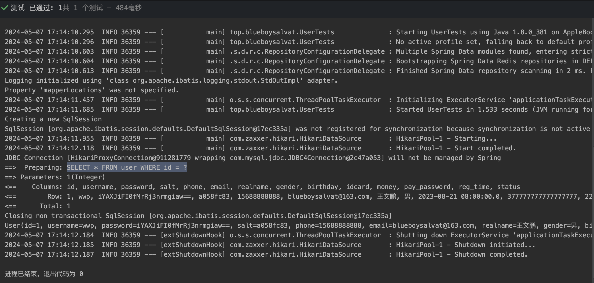
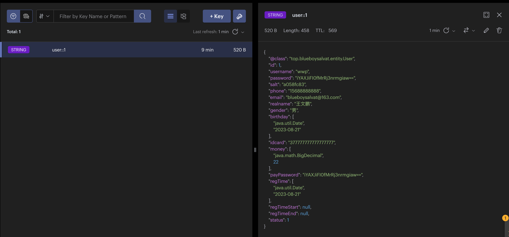
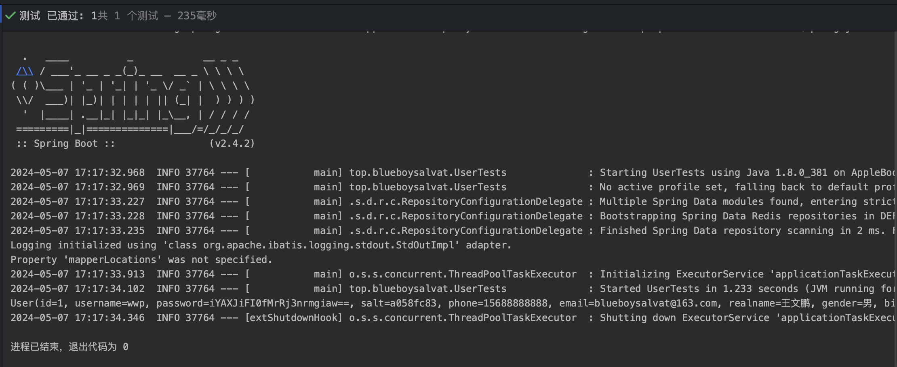
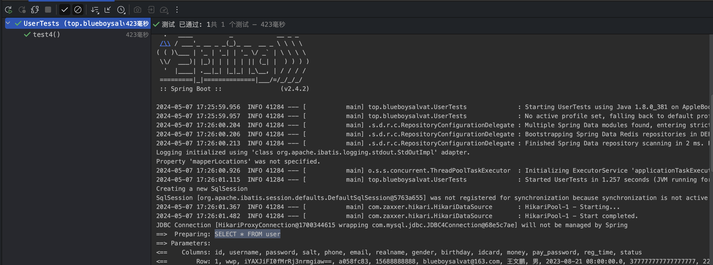
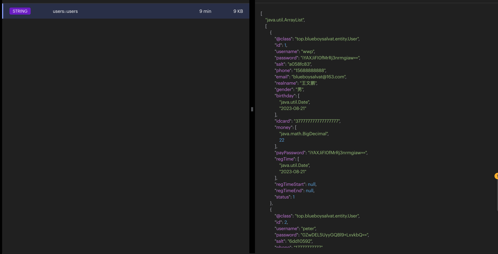
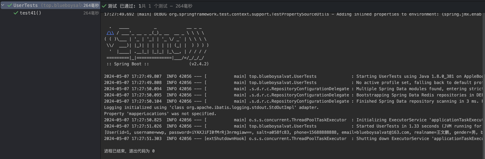
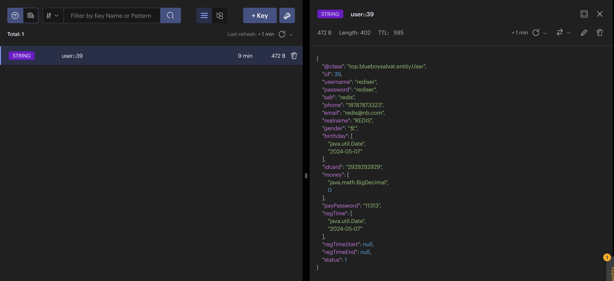
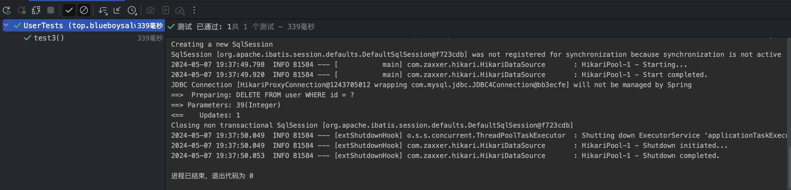

为了减少使用在业务层中使用取/设置缓存的相关命令，而造成的代码耦合度过高，所以在这里我们使用了 SpringCache，现在我们可以直接在业务层的类/方法上直接加注解，就可实现对 redis 缓存的相关设置了。

## 步骤
### 导入依赖项
`pom.xml`
```xml
<?xml version="1.0" encoding="UTF-8"?>  
<project xmlns="http://maven.apache.org/POM/4.0.0" xmlns:xsi="http://www.w3.org/2001/XMLSchema-instance"  
         xsi:schemaLocation="http://maven.apache.org/POM/4.0.0 https://maven.apache.org/xsd/maven-4.0.0.xsd">  
    <modelVersion>4.0.0</modelVersion>  
    <groupId>top.blueboysalvat</groupId>  
    <artifactId>SpringCache</artifactId>  
    <version>0.0.1-SNAPSHOT</version>  
    <name>redisCache</name>  
    <description>SpringCache</description>  
    <properties>  
        <java.version>1.8</java.version>  
        <project.build.sourceEncoding>UTF-8</project.build.sourceEncoding>  
        <project.reporting.outputEncoding>UTF-8</project.reporting.outputEncoding>  
        <spring-boot.version>2.4.2</spring-boot.version>  
    </properties>  
    <dependencies>  
        <!-- 集成redis依赖  
          其中整合了lettuce客户端与链接池  
          -->  
        <dependency>  
            <groupId>org.springframework.boot</groupId>  
            <artifactId>spring-boot-starter-data-redis</artifactId>  
        </dependency>  
        <!-- spring cache，用来降使用redis造成低代码耦合度 -->  
        <dependency>  
            <groupId>org.springframework.boot</groupId>  
            <artifactId>spring-boot-starter-cache</artifactId>  
        </dependency>  
        <!-- web -->  
        <dependency>  
            <groupId>org.springframework.boot</groupId>  
            <artifactId>spring-boot-starter-web</artifactId>  
        </dependency>  
        <!-- mybatis -->  
        <dependency>  
            <groupId>org.mybatis.spring.boot</groupId>  
            <artifactId>mybatis-spring-boot-starter</artifactId>  
            <version>2.1.4</version>  
        </dependency>  
        <!-- 热部署 -->  
        <dependency>  
            <groupId>org.springframework.boot</groupId>  
            <artifactId>spring-boot-devtools</artifactId>  
            <scope>runtime</scope>  
            <optional>true</optional>  
        </dependency>  
        <!-- mysql驱动 -->  
        <dependency>  
            <groupId>mysql</groupId>  
            <artifactId>mysql-connector-java</artifactId>  
            <version>5.1.49</version>  
            <scope>runtime</scope>  
        </dependency>  
        <!-- lombook -->  
        <dependency>  
            <groupId>org.projectlombok</groupId>  
            <artifactId>lombok</artifactId>  
            <optional>true</optional>  
        </dependency>  
        <!-- 测试 -->  
        <dependency>  
            <groupId>org.springframework.boot</groupId>  
            <artifactId>spring-boot-starter-test</artifactId>  
            <scope>test</scope>  
        </dependency>  
    </dependencies>  
    <dependencyManagement>  
        <dependencies>  
            <dependency>  
                <groupId>org.springframework.boot</groupId>  
                <artifactId>spring-boot-dependencies</artifactId>  
                <version>${spring-boot.version}</version>  
                <type>pom</type>  
                <scope>import</scope>  
            </dependency>  
        </dependencies>  
    </dependencyManagement>  
  
    <build>  
        <plugins>  
            <plugin>  
                <groupId>org.apache.maven.plugins</groupId>  
                <artifactId>maven-compiler-plugin</artifactId>  
                <version>3.8.1</version>  
                <configuration>  
                    <source>1.8</source>  
                    <target>1.8</target>  
                    <encoding>UTF-8</encoding>  
                </configuration>  
            </plugin>  
            <plugin>  
                <groupId>org.springframework.boot</groupId>  
                <artifactId>spring-boot-maven-plugin</artifactId>  
                <version>${spring-boot.version}</version>  
                <configuration>  
                    <mainClass>top.blueboysalvat.RedisCacheApplication</mainClass>  
                    <skip>true</skip>  
                </configuration>  
                <executions>  
                    <execution>  
                        <id>repackage</id>  
                        <goals>  
                            <goal>repackage</goal>  
                        </goals>  
                    </execution>  
                </executions>  
            </plugin>  
        </plugins>  
    </build>  
  
</project>
```
### 配置全局配置
`application.properties`
```properties
## 应用服务 WEB 访问端口
server.port=8080
##下面这些内容是为了让MyBatis映射
##指定Mybatis的Mapper文件
mybatis.mapper-locations=classpath:mappers/*xml
## 给实体类起别名
mybatis.type-aliases-package=top.blueboysalvat.entity

## 配置redis
spring.redis.host=localhost
spring.redis.port=6379


## 配置连接池
spring.datasource.driver-class-name=com.mysql.jdbc.Driver
spring.datasource.url=jdbc:mysql://localhost:3306/applemall?useSSL=false
spring.datasource.username=root
spring.datasource.password=root

## mybatis配置
## 打印log信息
mybatis.configuration.log-impl=org.apache.ibatis.logging.stdout.StdOutImpl
## 开启驼峰命名法，自动将数据库的命名方式，映射成Java中的命名方式，开就完了
## 例如数据库中的字段名是stu_name，开启之后java实体类中写stuName就能匹配的上
mybatis.configuration.map-underscore-to-camel-case: true
```
### 配置启动类

```java
/*
SpringBootApplication组合注解的作用，相当于3个注解：
@Configuration: 标记该类是应用程序上下文(ApplicationContext)的一个配置类。
@EnableAutoConfiguration: 启用Spring Boot自动配置机制,根据你项目所依赖的jar包自动配置Spring容器。
@ComponentScan: 启用组件扫描,扫描被@Component、@Service、@Repository等注解标记的类,并将其注册为Spring容器中的Bean，
同时这个注解还能让xml中的别名不会被标出红色波浪线
*/

@SpringBootApplication(scanBasePackages = "top.blueboysalvat.**")
@MapperScan("top.blueboysalvat.mapper")
public class RedisCacheApplication {

    public static void main(String[] args) {
        SpringApplication.run(RedisCacheApplication.class, args);
    }

}
```

### 配置 redis 配置类
package top.blueboysalvat.config;
```java
@Configuration
@EnableCaching
public class RedisCacheConfig {
    @Bean
    public CacheManager cacheManager(RedisConnectionFactory redisConnectionFactory) {
        // 基本配置
        RedisCacheConfiguration defaultCacheConfiguration =
                RedisCacheConfiguration
                        .defaultCacheConfig()
                        //设置key为String
                        .serializeKeysWith(RedisSerializationContext.SerializationPair.fromSerializer(new StringRedisSerializer()))
                        //设置value为自动转Json的Object
                        .serializeValuesWith(RedisSerializationContext.SerializationPair.fromSerializer(new GenericJackson2JsonRedisSerializer()))
                        //不缓存null
                        .disableCachingNullValues()
                        //缓存数据保存10分钟
                        .entryTtl(Duration.ofMinutes(10));

        //创建一个redis缓存管理器
        RedisCacheManager redisCacheManager =
                RedisCacheManager.RedisCacheManagerBuilder
                        //Redis连接工厂
                        .fromConnectionFactory(redisConnectionFactory)
                        //缓存配置
                        .cacheDefaults(defaultCacheConfiguration)
                        .build();

        return redisCacheManager;
    }
}
```

### 编写 dao 层代码
package top.blueboysalvat.mapper;
```java
public interface UserMapper {  
    //查询所有  
    List<User> selectAll();  
  
    //根据ID查询  
    User selectById(Integer id);  
  
    //添加用户  
    void insert(User addItem);  
  
    //修改用户信息  
    void updateUserInfo(User updItem);  
  
    //删除  
    void delete(Integer id);  
      
}
```
`UserMapper.xml`
```xml
<?xml version="1.0" encoding="UTF-8" ?>
<!DOCTYPE mapper PUBLIC "-//mybatis.org//DTD Mapper 3.0//EN" "http://mybatis.org/dtd/mybatis-3-mapper.dtd" >
<mapper namespace="top.blueboysalvat.mapper.UserMapper">
    <insert id="insert" parameterType="user" useGeneratedKeys="true" keyColumn="id" keyProperty="id">
        INSERT INTO user
        <trim prefix="(" suffix=")" suffixOverrides=",">
            <if test="username != null and username != ''">
                username,
            </if>
            <if test="password != null and password != ''">
                password,
            </if>
            <if test="salt != null and salt != ''">
                salt,
            </if>
            <if test="phone != null and phone != ''">
                phone,
            </if>
            <if test="email != null and email != ''">
                email,
            </if>
            <if test="realname != null and realname != ''">
                realname,
            </if>
            <if test="gender != null and gender != ''">
                gender,
            </if>
            <if test="birthday != null">
                birthday,
            </if>
            <if test="idcard != null and idcard != ''">
                idcard,
            </if>
            <if test="money != null">
                money,
            </if>
            <if test="payPassword != null and payPassword != ''">
                pay_password,
            </if>
            reg_time,
            <if test="status != null">
                status,
            </if>
        </trim>
        VALUES (
        <trim prefix="" suffix="" suffixOverrides=",">
            <if test="username != null and username != ''">
                #{username},
            </if>
            <if test="password != null and password != ''">
                #{password},
            </if>
            <if test="salt != null and salt != ''">
                #{salt},
            </if>
            <if test="phone != null and phone != ''">
                #{phone},
            </if>
            <if test="email != null and email != ''">
                #{email},
            </if>
            <if test="realname != null and realname != ''">
                #{realname},
            </if>
            <if test="gender != null and gender != ''">
                #{gender},
            </if>
            <if test="birthday != null">
                #{birthday},
            </if>
            <if test="idcard != null and idcard != ''">
                #{idcard},
            </if>
            <if test="money != null">
                #{money},
            </if>
            <if test="payPassword != null and payPassword != ''">
                #{payPassword},
            </if>
            CURRENT_TIMESTAMP,
            <if test="status != null">
                #{status},
            </if>
        </trim>
        )
    </insert>
    <update id="updateUserInfo">
        UPDATE user
        <set>
            <if test="username != null and username.trim().length() > 0">
                username = #{username},
            </if>
            <if test="password != null and password.trim().length() > 0">
                password = #{password},
            </if>
            <if test="salt != null and salt.trim().length() > 0">
                salt = #{salt},
            </if>
            <if test="phone != null and phone.trim().length() > 0">
                phone = #{phone},
            </if>
            <if test="email != null and email.trim().length() > 0">
                email = #{email},
            </if>
            <if test="realname != null and realname.trim().length() > 0">
                realname = #{realname},
            </if>
            <if test="gender != null and gender.trim().length() > 0">
                gender = #{gender},
            </if>
            <if test="birthday != null">
                birthday = #{birthday},
            </if>
            <if test="idcard != null and idcard.trim().length() > 0">
                idcard = #{idcard},
            </if>
            <if test="money != null">
                money = #{money},
            </if>
            <if test="payPassword != null and payPassword.trim().length() > 0">
                pay_password = #{payPassword},
            </if>
        </set>
        WHERE id = #{id}
    </update>

    <delete id="delete">
        DELETE FROM user
        WHERE id = #{id}
    </delete>

    <select id="selectAll" resultType="user">
        SELECT *
        FROM user
    </select>
    <select id="selectById" resultType="user">
        SELECT *
        FROM user
        WHERE id = #{id}
    </select>
    
</mapper>
```

### 编写 service 层代码
package top.blueboysalvat.service;
```java
public interface UserService {  
    //添加  
    void add(User addItem) ;  
  
    //删除  
    void delete(Integer id);  
  
    //修改  
    void updateUserInfo(User updItem) ;  
  
    //根据ID查询  
    User findById(Integer id) ;  
  
    //查询所有  
    List<User> findAll();  
  
}
```

package top.blueboysalvat.service.impl;
```java
/**
 * @author wangwenpeng
 */
@Service
public class UserServiceImpl implements UserService {
    @Autowired
    private UserMapper userMapper;

    @Override
    @Cacheable(value = "user", key = "#id")
    /*
    * 首次调用此方法后，会在redis数据库中存储格式类似 key为user::用户ID value为 JSON格式的返回值数据
    * 第二次调用不会再从数据库中查，而是从redis数据库中取
    * */
    public User findById(Integer id) {
        return userMapper.selectById(id);
    }

    @Override
    @Cacheable(value = "users", key = "'users'")
    /*
     * 首次调用此方法后，会在redis数据库 key为users::users value为 JSON格式的返回值数据
     * 第二次调用不会再从数据库中差，而是从redis数据库中取
     * */
    public List<User> findAll() {
        return userMapper.selectAll();
    }

    @Override
    @Caching(
            evict = @CacheEvict(value = "users", key = "'users'")
    )
    /*
    *
    * evict，把缓存中key为users::users的记录删除
    * 增加了新对象，之前如果redis中有 存储所有用户的记录也就不是最新的了，所以删掉
    * */
    public void add(User addItem) {
        userMapper.insert(addItem);
    }

    @Caching(
            evict = {@CacheEvict(value = "users", key = "'users'"),
                    @CacheEvict(value = "user", key = "#id")}
    )
    /*
     *
     * evict，把缓存中key为users::users的记录删除
     * 之前如果redis中有缓存过当前对象的信息，删掉
     * */
    @Override
    public void delete(Integer id) {
        userMapper.delete(id);
    }

    @Caching(
            evict = {@CacheEvict(value = "users", key = "'users'"),
                    @CacheEvict(value = "user", key = "#updItem.id")}
    )
    /*
     * evict，把缓存中key为users::users的记录删除
     * 之前如果redis中有缓存过当前对象的信息，删掉
     * */
    @Override
    public void updateUserInfo(User updItem) {

        userMapper.updateUserInfo(updItem);
    }
}
```
### 测试结果
package top.blueboysalvat;
```java
@SpringBootTest
public class UserTests {
    @Autowired
    private UserService userService;

    //第一次查询，会在控制台中看到调用了数据库
    @Test
    public void test1() {
        System.out.println(userService.findById(1));
    }
    //第二次查询，看到得知并没有使用数据库
    @Test
    public void test11() {
        System.out.println(userService.findById(1));
    }

    //第一次查询，会在控制台中看到调用了数据库
    @Test
    public void test2() {
        System.out.println(userService.findAll());
    }

    //第二次查询，查看得知，并没有使用数据库
    @Test
    public void test21() {
        System.out.println(userService.findAll());
    }


    @Test
    public void test3() {
        User user = new User();
        user.setUsername("rediser");
        user.setPassword("rediser");
        user.setSalt("redis");
        user.setPhone("18787873323");
        user.setEmail("redis@nb.com");
        user.setRealname("REDIS");
        user.setBirthday(new Date());
        user.setGender("女");
        user.setIdcard("2929292929");
        user.setPayPassword("11313");
        user.setStatus(1);
        user.setMoney(BigDecimal.ZERO);
        userService.add(user);
    }

    @Test
    public void test4() {
        User user = new User();
        user.setId(25);
        user.setUsername("rrrrrrr");
        user.setPassword("rrrrr");
        userService.updateUserInfo(user);
    }

    @Test
    public void test5() {
        userService.delete(39);
    }

    @Test
    public void test6() {
        User user = new User();
        user.setId(24);
        user.setUsername("REDISER");
        user.setPassword("REDISER");
        user.setSalt("REDISER");
        user.setPhone("18787873323");
        user.setEmail("redis@nb.com");
        user.setRealname("REDIS");
        user.setBirthday(new Date());
        user.setGender("女");
        user.setIdcard("2929292929");
        user.setPayPassword("11313");
        user.setStatus(1);
        user.setMoney(BigDecimal.ZERO);
        userService.updateUserInfo(user);
    }
}

```

##### findById 执行结果
```java
    //第一次查询，会在控制台中看到调用了数据库
    @Test
    public void test1() {
        System.out.println(userService.findById(1));
    }
    //第二次查询，看到得知并没有使用数据库
    @Test
    public void test11() {
        System.out.println(userService.findById(1));
    }
```
在控制台中查看执行情况：


执行完后在 redis 图形客户端中查看到，已经把 id 为 1 的数据存储：


再执行 test 11 测试，发现控制台中没有和数据库调用相关的内容，这说明这次查询的数据是从 redis 中拿出的：


##### findAll 执行结果
>截图中的方法名和代码中的不一样，后面为了调整演示顺序修改了测试方法名，截图没换新的🤣，看关键部分就行。

```java
    //第一次查询，会在控制台中看到调用了数据库
    @Test
    public void test2() {
        System.out.println(userService.findAll());
    }

    //第二次查询，查看得知，并没有使用数据库
    @Test
    public void test21() {
        System.out.println(userService.findAll());
    }
```

执行 test 2 的控制台结果，可以看到使用了 `SELECT * FROM user`：


在 redis 图形客户端中查看数据库中的数据：


执行 test 21()的控制台结果，可以看到并没有查询语句的相关使用，这证明了数据是从 redis 中取得：


##### delete 执行结果

先执行一下查询，现在 redis 中有 39 号的缓存了：


执行删除，发现 redis 中关于 39 的缓存已经没有了：

空空如也：


##### add 的执行结果

后面的添加和删除和前面都是差不多的，我就不在这里演示了👀