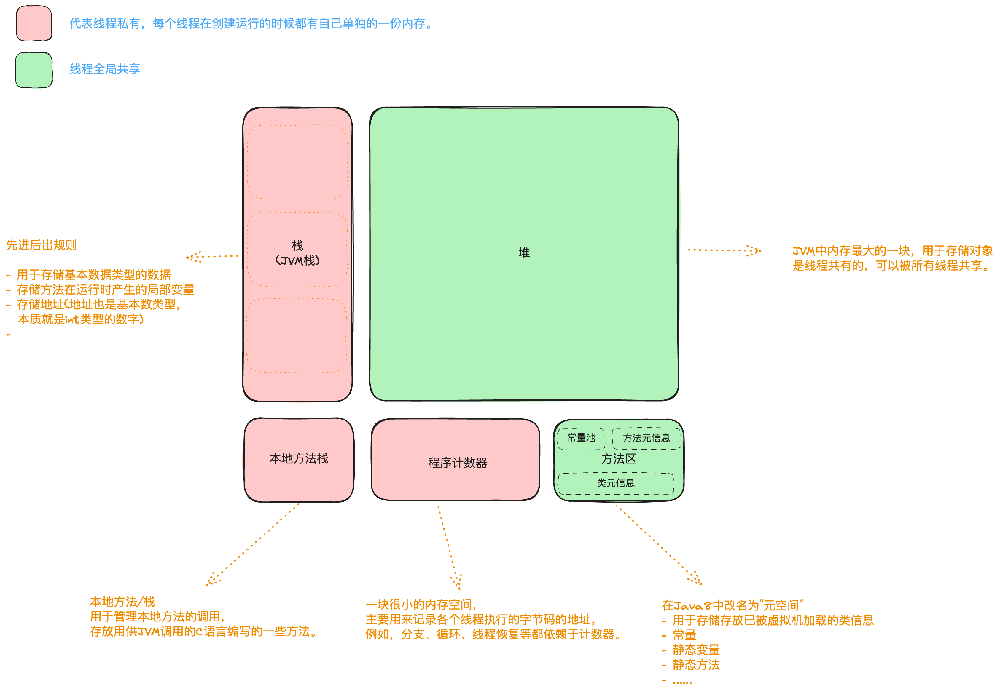
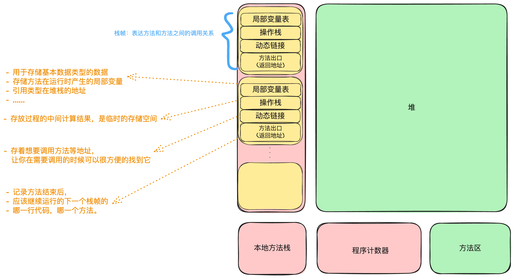
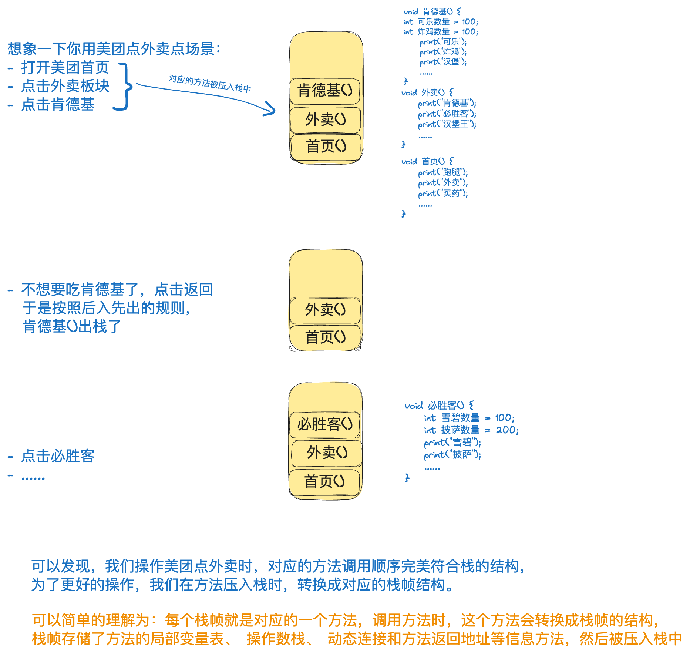

### 栈内存空间
>基本数据类型
引用（数组名、类名、接口名）

- 先进后出，后进先出  
- 存取速度比堆要快，仅次于寄存器，栈数据可以共享，但缺点是，存在栈中的数据大小与生存必须是确定的，缺乏灵活性

### 堆内存空间
> `new` 出来的内容（数组、对象）

- 堆可以动态地分配内存大小，生存期也不必事先告诉编译器，因为它是在运行时动态分配内存的，但缺点是，由于要在运行时动态分配内存，存取速度较慢。

## 图解 JVM 内存模型：

线程私有内存区：
- 随着线程的产生和消亡，编译时确定所需要的内存大小。

## 参考资料 ：
- [带你认识java中jvm虚拟机栈]( https://www.bilibili.com/video/BV1ET4y1Z711/ )
- [白话 JVM 内存结构，死也忘不了]( https://www.bilibili.com/video/BV1Q64y1h7PT )
- [jvm内存模型全面解析哔哩哔哩](https://www.bilibili.com/video/BV12t411u726/) 