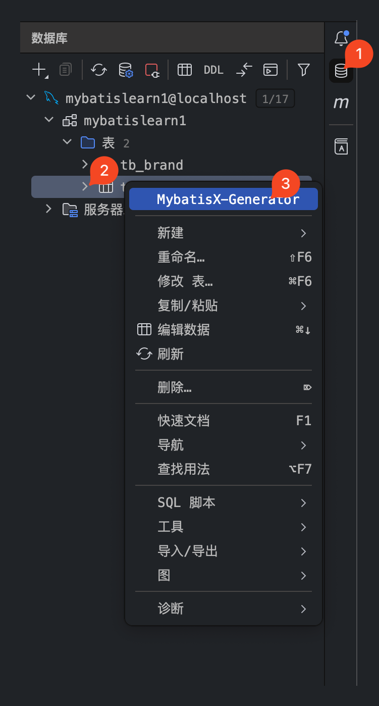
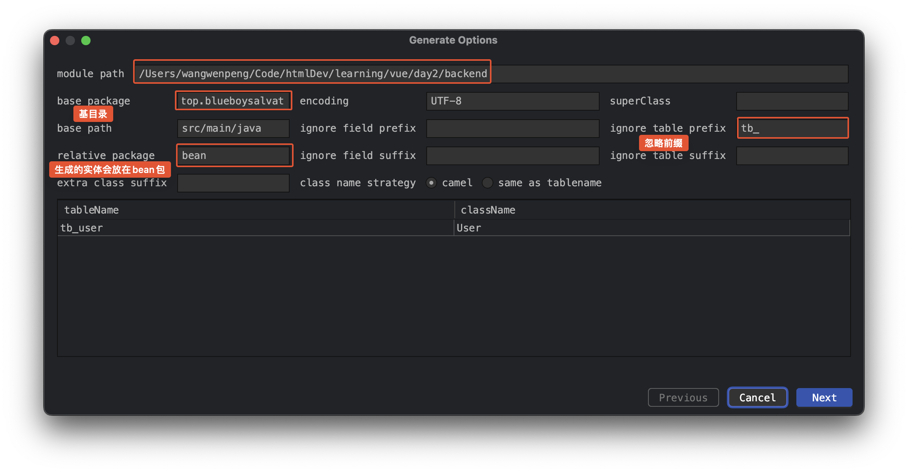
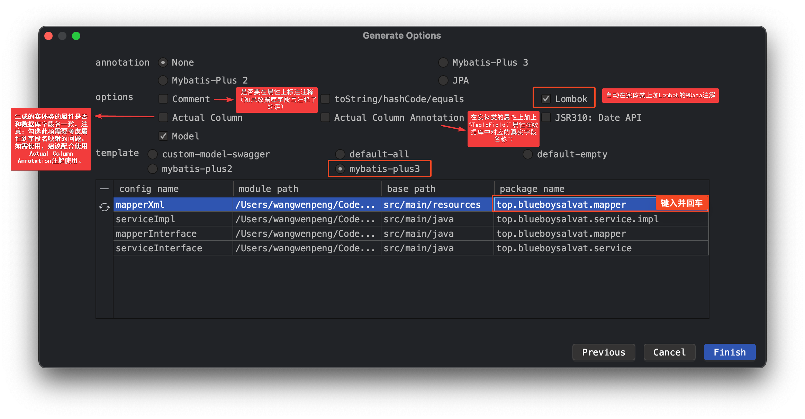
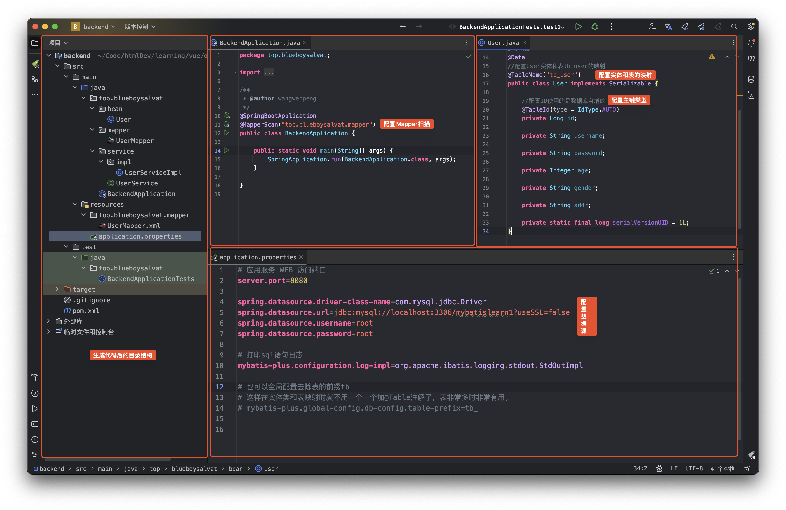
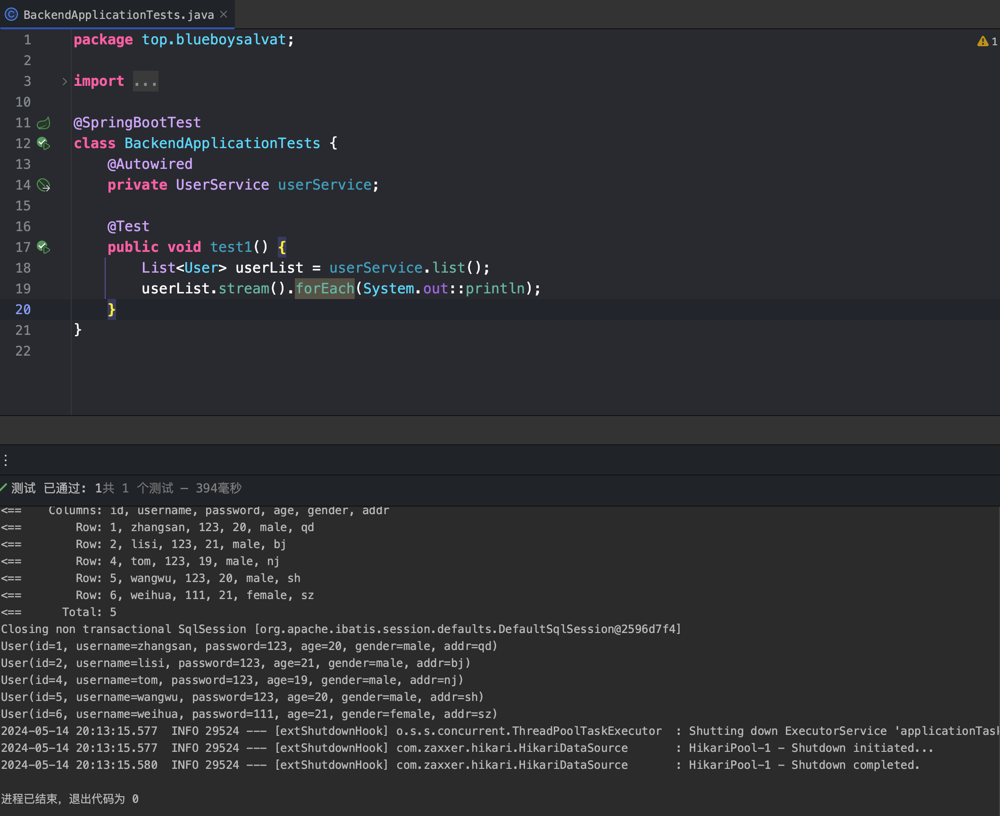

## 简介
`MyBatis-Plus`（简称`MP`）是一个`MyBatis`的**增强**工具，在`MyBatis`的基础上只做增强不做改变，为简化开发、提高效率而生。

官网：[MyBatis-Plus](https://baomidou.com/)
## 常用注解

| 注解          | 描述                                            |
| ----------- | --------------------------------------------- |
| @TableName  | 指定实体类对应的表名。如果类名与表名不一致，可以通过此注解指定表名。            |
| @TableId    | 标识主键字段，可以通过value属性指定表中的主键字段，通过type属性指定主键类型。   |
| @TableField | 指定属性对应的列名，特别是当实体类属性名与表字段名不一致时使用。              |
| @TableLogic | 用于标识逻辑删除属性，实现逻辑删除功能。在数据库中也要有对应属性的字段，并且要有默认值 0 |
`pom.xml`
```xml
<dependencies>  
    <dependency>  
        <groupId>org.springframework.boot</groupId>  
        <artifactId>spring-boot-starter</artifactId>  
    </dependency>  
  
    <dependency>  
        <groupId>org.springframework.boot</groupId>  
        <artifactId>spring-boot-devtools</artifactId>  
        <scope>runtime</scope>  
        <optional>true</optional>  
    </dependency>  
    <dependency>  
        <groupId>org.projectlombok</groupId>  
        <artifactId>lombok</artifactId>  
        <optional>true</optional>  
    </dependency>  
    <dependency>  
        <groupId>org.springframework.boot</groupId>  
        <artifactId>spring-boot-starter-test</artifactId>  
        <scope>test</scope>  
    </dependency>  
    <!-- 数据库驱动 -->  
    <dependency>  
        <groupId>mysql</groupId>  
        <artifactId>mysql-connector-java</artifactId>  
        <version>5.1.49</version>  
    </dependency>  
    <!-- MybatisPlus -->  
    <dependency>  
        <groupId>com.baomidou</groupId>  
        <!--SpringBoot2使用此版本-->  
        <artifactId>mybatis-plus-boot-starter</artifactId>  
        <version>3.5.6</version>  
    </dependency>  
    <!-- 分页 -->  
    <dependency>  
        <groupId>com.github.pagehelper</groupId>  
        <artifactId>pagehelper-spring-boot-starter</artifactId>  
        <version>2.1.0</version>  
    </dependency>  
</dependencies>
```
`application.properties`
```properties
spring.datasource.driver-class-name=com.mysql.jdbc.Driver  
spring.datasource.url=jdbc:mysql://localhost:3306/mybatisPlus?useSSL=false  
spring.datasource.username=root  
spring.datasource.password=root  
  
## 打印sql语句日志  
mybatis-plus.configuration.log-impl=org.apache.ibatis.logging.stdout.StdOutImpl  
  
## 全局配置去除表的前缀tb，  
## 这样在实体类和表映射时就不用一个一个加@Table注解了，表非常多时非常有用。  
## mybatis-plus.global-config.db-config.table-prefix=tb
```

`user.sql`
```sql
CREATE TABLE `user` (
  `id` bigint(20) NOT NULL COMMENT '主键ID',
  `name` varchar(30) DEFAULT NULL COMMENT '姓名',
  `age` int(11) DEFAULT NULL COMMENT '年龄',
  `email` varchar(50) DEFAULT NULL COMMENT '邮箱',
  `is_delete` int(1) DEFAULT '0',
  PRIMARY KEY (`id`)
) ENGINE=InnoDB DEFAULT CHARSET=utf8;
```
<font color="#00b0f0">User.java</font>
```java
@Data  
@NoArgsConstructor  
@AllArgsConstructor  
@TableName("user")  
public class User {  
    @TableId(type = IdType.AUTO)  
    private Long id;  
    private String name;  
    private Integer age;  
    private String email;  
    @TableLogic  
    private Integer isDelete;  
}
```
<font color="#00b050">UserMapper.java</font>
```java
public interface UserMapper extends BaseMapper<User> {  
  
}
```
<font color="#00b0f0">UserServiceImpl.java</font>
```java
@Service  
public class UserServiceImpl extends ServiceImpl<UserMapper, User> implements UserService  {  
  
}
```
## 基本操作
<font color="#00b0f0">Day1Tests.java</font>
```java
@SpringBootTest
public class Day1Tests {
    @Autowired
    private UserMapper userMapper;

    @Test
    public void selectAllTest() {
        List<User> users = userMapper.selectList(null);
        System.out.println(users);
    }

    @Test
    public void selectById() {
        System.out.println(userMapper.selectById(5));
    }

    @Test
    public void selectByIds() {
        ArrayList<Long> objects = new ArrayList<>();
        objects.add(4L);
        objects.add(5L);
        List<User> users = userMapper.selectBatchIds(objects);
        users.stream().forEach(System.out::println);
    }

    @Test
    public void selectByMap() {
        HashMap<String, Object> map = new HashMap<>();
        map.put("name", "王文鹏");
        map.put("email", "blueboysalvat@163.com");
        List<User> users = userMapper.selectByMap(map);
        users.stream().forEach(System.out::println);
    }

    @Test
    public void insertTest() {
        User user = new User();
        user.setName("王文鹏");
        user.setAge(24);
        user.setEmail("blueboysalvat@163.com");
        userMapper.insert(user);
    }

    @Test
    public void deleteByIdTest() {
        userMapper.deleteById(6L);
    }

    @Test
    public void deleteByIdsTest() {
        ArrayList<Long> objects = new ArrayList<>();
        objects.add(1L);
        objects.add(2L);
        userMapper.deleteBatchIds(objects);
    }

    @Test
    public void deleteByMapTest() {
        HashMap<String, Object> map = new HashMap<>();
        map.put("name", "王文鹏");
        map.put("email", "blueboysalvat@163.com");
        userMapper.deleteByMap(map);
    }

    @Test
    public void updateByIdTest() {
        User user = new User();
        user.setId(5L);
        user.setName("王文鹏");
        user.setAge(24);
        user.setEmail("blueboysalvat@163.com");
        userMapper.updateById(user);
    }

    /*--------------------------------------------------*/

    @Autowired
    private UserService userService;


    @Test
    public void saveTest() {
        User user = new User();
        user.setName("wangwenpeng");
        user.setAge(24);
        user.setEmail("blueboysalvat@163.com");
        userService.save(user);
    }

    @Test
    public void saveBatchTest() {
        List<User> userList = new ArrayList<>();
        User user1 = new User();
        user1.setName("spider-man");
        user1.setAge(24);
        user1.setEmail("peter@163.com");
        User user2 = new User();
        user2.setName("iron-man");
        user2.setAge(24);
        user2.setEmail("revenger@163.com");
        userList.add(user1);
        userList.add(user2);

        userService.saveBatch(userList);
    }

    @Test
    public void saveOrUpdateTest() {
        User user1 = new User();
        user1.setName("green-man");
        user1.setAge(24);
        user1.setEmail("biggreenman@163.com");
        userService.saveOrUpdate(user1);
    }

    @Test
    public void saveOrUpdateTest2() {
        User user1 = new User();
        user1.setId(11L);
        user1.setName("green-man");
        user1.setAge(666);
        user1.setEmail("biggreenman@163.com");
        userService.saveOrUpdate(user1);
    }

}
```
## 条件组合
<font color="#00b0f0">Day1Tests2.java</font>
```java
@SpringBootTest
public class Day1Tests2 {
    @Autowired
    private UserMapper userMapper;

    @Test
    public void selectByConditionTest1() {
        //创建一个user泛型的条件构造器
        QueryWrapper<User> wrapper = new QueryWrapper<>();
        //设置相关条件
        wrapper
                //查询列名name的值中有man的
                .like("name", "man")
                //年龄还得是18-35
                .between("age", 18, 35)
                //邮箱还不能为空
                .isNotNull("email");
        List<User> users = userMapper.selectList(wrapper);
        System.out.println(users);
    }

    @Test
    public void orderTest() {
        //创建一个user泛型的条件构造器
        QueryWrapper<User> wrapper = new QueryWrapper<>();
        //设置相关条件
        wrapper
                //按照年龄的降序排序
                .orderByDesc("age")
                //如果年龄相同就按照id的生序排序
                .orderByAsc("id");
        List<User> users = userMapper.selectList(wrapper);
        System.out.println(users);
    }

    @Test
    public void deleteTest() {
        //创建一个user泛型的条件构造器
        QueryWrapper<User> wrapper = new QueryWrapper<>();
        //设置相关条件
        wrapper
                //删除邮箱为空的记录
                .isNull("email");

        int affectRow = userMapper.delete(wrapper);
        System.out.println(affectRow);
    }

    @Test
    public void conditionTest() {
        QueryWrapper<User> queryWrapper = new QueryWrapper<>();
        //将（年龄大于20并且用户名中包含有a）或邮箱为null的用户信息修改
        //UPDATE user SET age=?, email=? WHERE is_deleted=0 AND (name LIKE ? AND age > ? OR email IS NULL)
        queryWrapper
                .like("name", "a")
                .gt("age", 20)
                .or()
                .isNull("email");

        //满足条件的修改为这个内容
        User user = new User();
        user.setAge(25);

        int result = userMapper.update(user, queryWrapper);
        System.out.println("受影响的行数：" + result);
    }

    @Test
    public void conditionTest2() {
        QueryWrapper<User> queryWrapper = new QueryWrapper<>();
        //将（年龄大于20或邮箱为null）并且用户名中包含有a的用户信息修改
        //UPDATE user SET age=?, email=? WHERE is_deleted=0 AND (name LIKE ? AND (age > ? OR email IS NULL))
        //lambda表达式内的逻辑优先运算
        queryWrapper
                .like("name", "a")
                .and(i -> i.gt("age", 20).or().isNull("email"));
        User user = new User();
        user.setAge(18);
        user.setEmail("user@ccc.com");
        int result = userMapper.update(user, queryWrapper);
        System.out.println("受影响的行数：" + result);
    }

    @Test
    public void selectMapByConditionTes2t() {
        //查询用户信息的uname和age字段
        //SELECT name,age FROM user WHERE is_delete=0
        QueryWrapper<User> queryWrapper = new QueryWrapper<>();
        queryWrapper.select("name", "age");
        //selectMaps()返回Map集合列表，通常配合select()使用，避免User对象中没有被查询到的列值为null
        List<Map<String, Object>> maps = userMapper.selectMaps(queryWrapper);
        maps.forEach(System.out::println);
    }

    @Test
    public void subSelectTest() {
        //查询年龄大于id为5的用户的年龄的所有用户信息
        //select * from user where age>(select age from tb_user where id=5)
        QueryWrapper<User> wrapper = new QueryWrapper<>();
        wrapper.gtSql("age", "select age from user where id=5");

        List<User> userList = userMapper.selectList(wrapper);
        userList.forEach(System.out::println);
    }

    @Test
    public void updateMapperTest() {
        //将（年龄大于20或邮箱为null）并且用户名中包含有a的用户信息修改

        UpdateWrapper<User> updateWrapper = new UpdateWrapper<>();
        updateWrapper
                //满足条件的会更新成这些值⬇️
                //年龄设置为18
                .set("age", 18)
                //邮箱设置为blueboysalvat@163.commm
                .set("email", "blueboysalvat@163.com")
                //满足条件的会更新成这些值⬆️️

                //条件⬇️
                //名字中要有a的
                .like("name", "a")
                //还得年龄大于20或者邮件为null的
                //lambda表达式内的逻辑优先运算
                .and(i -> i.gt("age", 20)
                        .or()
                        .isNull("email"));
        //条件⬆️️

        //UPDATE user SET age=?, email=? WHERE is_deleted=0 AND (name LIKE ? AND (age > ? OR email IS NULL))
        int result = userMapper.update(null, updateWrapper);
        System.out.println(result);
    }

    @Test
    public void updateMapperTest2() {
        //将（年龄大于20或邮箱为null）并且用户名中包含有a的用户信息修改

        UpdateWrapper<User> updateWrapper = new UpdateWrapper<>();
        updateWrapper
                //满足条件的会更新成这些值⬇️
                //年龄设置为18
                .set("age", 20)
                //邮箱设置为blueboysalvat@163.commm
                .set("email", "blueboysalvat@163.com")
                //满足条件的会更新成这些值⬆️️

                //条件⬇️
                //名字中要有a的
                .like("name", "a")
                //还得年龄大于20或者邮件为null的
                //lambda表达式内的逻辑优先运算
                .and(i -> i.gt("age", 20)
                        .or()
                        .isNull("email"));
        //条件⬆️️

        //在创建一个对象，设置属性，放到userMapper.update()中，相当于临时又添加了一个要更新字段：
        User user = new User();
        user.setName("张三");
        //UPDATE tb_user SET name=?, age=?,email=? WHERE is_deleted=0 AND (name LIKE ? AND (age > ? OR email IS NULL))
        int result = userMapper.update(user, updateWrapper);
        System.out.println(result);
    }

    @Test
    public void dynamicSelectTest1() {
        //模拟前端传过来的参数，有可能为null（用户未输入或未选择）
        String name = null;
        Integer ageBegin = 10;
        Integer ageEnd = 24;
        QueryWrapper<User> queryWrapper = new QueryWrapper<>();

        //这个条件不满足，不会使用这个条件
        if (name == null || name.isEmpty()) {
            queryWrapper.like("name", "a");
        }
        if (ageBegin != null) {
            queryWrapper.ge("age", ageBegin);
        }
        if (ageEnd != null) {
            queryWrapper.le("age", ageEnd);
        }
        //SELECT id, name, age, email, is_deleted FROM user WHERE is_deleted=0 AND (age >= ? AND age <= ?)
        List<User> users = userMapper.selectList(queryWrapper);
        users.forEach(System.out::println);
    }

    @Test
    public void dynamicSelectTest2() {
        //模拟前端传过来的参数，有可能为null（用户未输入或未选择）
        String name = null;
        Integer ageBegin = 10;
        Integer ageEnd = 24;
        QueryWrapper<User> queryWrapper = new QueryWrapper<>();

        queryWrapper
                .like(name == null || name.isEmpty(), "name", "a")
                .ge(ageBegin != null, "age", ageBegin)
                .le(ageEnd != null, "age", ageEnd);
        //SELECT id,name,age,email,is_deleted FROM tb_user WHERE is_deleted=0 AND (age >= ? AND age <= ?)
        List<User> users = userMapper.selectList(queryWrapper);
        users.forEach(System.out::println);

    }
}

```

## 分页
<font color="#00b0f0">Day1Tests3.java</font>
```java
@SpringBootTest  
public class Day1Tests3 {  
    @Autowired  
    private UserMapper userMapper;  
  
    @Test  
    public void selectByConditionTest1() {  
  
        PageHelper.startPage(1, 2);  
        List<User> users = userMapper.selectList(null);  
        PageInfo<User> pageInfo = new PageInfo<>(users);  
  
        System.out.println(pageInfo.getTotal());  
        System.out.println(pageInfo.getList());  
    }  
}
```

## 在 idea 中使用 mybatisPlus 生成代码

### 连接数据库


### 配置生成选项


### 项目结构及其配置

### 测试

