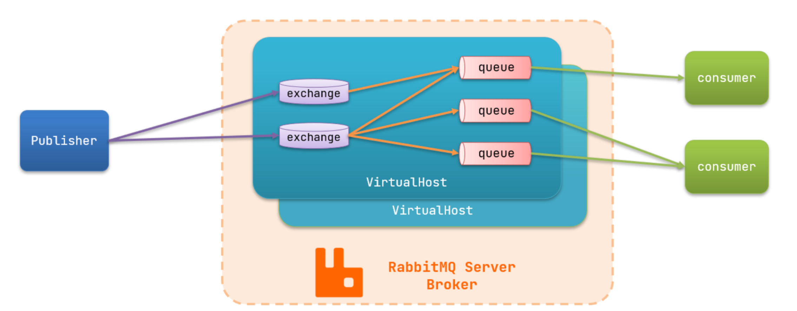

## 基本概念

### 同步调用
项目一变大同步就不大适用了：
- 可拓展性差。调用 A，再调用 B，再调用 C，后续拓展需要修改调用这部分的代码。
- 同步调用，调用者需要等待服务提供者执行完返回结果后，才能继续向下执行
- 容易出现级联失效的问题

### 异步调用

异步调用方式其实就是基于消息通知的方式。

- 消息发送者：投递消息的人
- 消息 Broker（消息代理）：管理、暂存、转发消息
- 消息接收者：接收和处理消息的人


### RabbitMQ 架构

- publisher：生产者，发送消息的一方
- consumer：消费者，消费消息的一方
- queue：队列，存储消息。生产者投递的消息会暂存在消息队列中，等待消费者处理
- exchange：交换机，负责消息路由。生产者发送的消息由交换机决定投递到哪个队列。
- virtual host：虚拟主机，起到数据隔离的作用。每个虚拟主机相互独立，有各自的 exchange、queue



## 一个简单的 RabbitMQ 服务

### RabbitMQ 服务类
```java
@Slf4j
@Service
public class RabbitmqServiceImpl implements RabbitmqService {

    @Autowired
    private NotifyService notifyService;

    @Value("${rabbitmq.switchFlag:false}")
    private String rabbitmqSwitchFlag;

    private final ExecutorService consumerExecutor = Executors.newFixedThreadPool(5);
    private final AtomicBoolean isRunning = new AtomicBoolean(false); // 用于控制消费者线程的运行状态
    private RabbitmqConnection consumerConnection;  // 消费者的连接
    private Channel consumerChannel; // 消费者的通道

    @PreDestroy
    public void destroy() {
        stopConsumer();
        if (consumerExecutor != null) {
            consumerExecutor.shutdown();
        }
    }

    @Override
    public boolean enabled() {
        return "true".equalsIgnoreCase(rabbitmqSwitchFlag);
    }

    @Override
    public void publishMsg(String exchange,
                           BuiltinExchangeType exchangeType,
                           String routingKey,
                           String message) {
        RabbitmqConnection rabbitmqConnection = null;
        Channel channel = null;

        try {
            // 获取连接
            rabbitmqConnection = RabbitmqConnectionPool.getConnection();
            Connection connection = rabbitmqConnection.getConnection();

            // 创建消息通道，实现发布/订阅（Pub/Sub）模式
            channel = connection.createChannel();

            // 声明exchange中的消息为可持久化，不自动删除
            channel.exchangeDeclare(exchange, exchangeType, true, false, null);

            // 发布消息
            channel.basicPublish(exchange, routingKey, null, message.getBytes());
            log.info("Published message: exchange={}, routingKey={}, message={}", exchange, routingKey, message);
        } catch (InterruptedException | IOException e) {
            log.error("RabbitMQ message publishing error: exchange={}, routingKey={}, message={}",
                    exchange, routingKey, message, e);
        } finally {
            // 释放资源
            closeChannel(channel);
            returnConnection(rabbitmqConnection);
        }
    }

    @Override
    public void processConsumerMsg() {
        log.debug("processConsumerMsg called, starting consumer...");
        startConsumer();
    }

    /**
     * 启动消费者
     */
    public void startConsumer() {
        if (isRunning.compareAndSet(false, true)) {
            consumerExecutor.submit(() -> runConsumer());
            log.info("RabbitMQ consumer started");
        } else {
            log.info("RabbitMQ consumer is already running");
        }
    }

    /**
     * 停止消费者
     */
    @Override
    public void stopConsumer() {
        if (isRunning.compareAndSet(true, false)) {
            closeChannel(consumerChannel);
            returnConnection(consumerConnection);
            consumerChannel = null;
            consumerConnection = null;
            log.info("RabbitMQ consumer stopped");
        }
    }

    /**
     * 消费者线程主体
     */
    private void runConsumer() {
        try {
            // 获取连接
            consumerConnection = RabbitmqConnectionPool.getConnection();
            Connection connection = consumerConnection.getConnection();

            // 创建消息通道
            consumerChannel = connection.createChannel();

            // 在此消息通道中设置队列，交换机，路由键等参数，并注册消费者
            setupConsumer(consumerChannel,
                    CommonConstants.EXCHANGE_NAME_DIRECT,
                    CommonConstants.QUERE_NAME_PRAISE,
                    CommonConstants.QUERE_KEY_PRAISE);

            // 持续运行，直到被停止
            /*
            *
            * 保持线程活跃，确保 Channel 和消费者不被垃圾回收
            * 提供一个可控的退出点（通过 isRunning 标志）
            * 允许在出现异常或服务关闭时优雅地停止消费者
            * */
            while (isRunning.get()) {
                try {
                    // 监控消息堆积情况
                    long messageCount = getQueueMessageCount(CommonConstants.QUERE_NAME_PRAISE);
                    if (messageCount > 1000) { // 假设 1000 条为堆积阈值
                        log.warn("High message backlog detected: {} messages in queue", messageCount);
                         adjustThreadPoolSize(messageCount); // 动态扩展线程池
                    }

                    Thread.sleep(1000); // 避免频繁检查
                } catch (InterruptedException e) {
                    Thread.currentThread().interrupt();
                    break;
                }
            }
        } catch (Exception e) {
            log.error("Error in consumer thread", e);
            // 如果出错，尝试等待一段时间后重新启动消费者
            if (isRunning.get()) {
                stopConsumer();
                try {
                    // 避免立即重试，导致过多报错，添加延迟
                    Thread.sleep(5000);
                } catch (InterruptedException ie) {
                    Thread.currentThread().interrupt();
                }
                // 仅当应用仍在运行时重试
                if (!Thread.currentThread().isInterrupted()) {
                    startConsumer();
                }
            }
        }
    }


    /**
     * 获取队列中的消息数量
     *
     * @param queueName 队列名称
     * @return 队列中的消息数量
     */
    public long getQueueMessageCount(String queueName) {
        try (Channel channel = RabbitmqConnectionPool.getConnection().getConnection().createChannel()) {
            AMQP.Queue.DeclareOk declareOk = channel.queueDeclarePassive(queueName);
            return declareOk.getMessageCount();
        } catch (Exception e) {
            throw new RuntimeException(e);
        }
    }

    private void adjustThreadPoolSize(long messageCount) {
        int currentPoolSize = ((java.util.concurrent.ThreadPoolExecutor) consumerExecutor).getCorePoolSize();
        int newPoolSize = Math.min(10, currentPoolSize + 1); // 最大线程数限制为 10

        if (messageCount > 1000 && currentPoolSize < newPoolSize) {
            log.info("Increasing consumer thread pool size from {} to {}", currentPoolSize, newPoolSize);
            ((java.util.concurrent.ThreadPoolExecutor) consumerExecutor).setCorePoolSize(newPoolSize);
        }
    }

    /**
     * 设置消费者
     */
    private void setupConsumer(Channel channel, String exchange, String queueName, String routingKey)
            throws IOException {
        // 声明队列（队列名称，是否持久化，是否独占队列，是否自动删除，队列参数）
        channel.queueDeclare(queueName, true, false, false, null);

        // 绑定队列到交换机
        channel.queueBind(queueName, exchange, routingKey);

        // 创建消费者
        Consumer consumer = new DefaultConsumer(channel) {
            @Override
            public void handleDelivery(String consumerTag, Envelope envelope, AMQP.BasicProperties properties,
                                       byte[] body) throws IOException {
                String message = new String(body, "UTF-8");
                try {
                    log.info("Received message: {}", message);

                    // 处理消息
                    UserFootDO userFoot = JsonUtil.toObj(message, UserFootDO.class);
                    notifyService.saveArticleNotify(userFoot, NotifyTypeEnum.PRAISE);

                    // 确认消息
                    channel.basicAck(envelope.getDeliveryTag(), false);
                } catch (Exception e) {
                    log.error("Error processing message: {}", message, e);
                    // 消息处理失败

                    // 消息的唯一标识符、是否批量处理否定确认、是否将消息重新入队
                    channel.basicNack(envelope.getDeliveryTag(), false, true);
                }
            }
        };

        // 设置预取计数
        channel.basicQos(1);

        // 注册消费者，取消自动确认
        channel.basicConsume(queueName, false, consumer);
        log.info("Consumer registered for queue: {}", queueName);
    }

    /**
     * 安全关闭Channel
     */
    private void closeChannel(Channel channel) {
        if (channel != null && channel.isOpen()) {
            try {
                channel.close();
            } catch (IOException | TimeoutException e) {
                log.error("Error closing Channel", e);
            }
        }
    }

    /**
     * 安全归还连接
     */
    private void returnConnection(RabbitmqConnection connection) {
        if (connection != null) {
            try {
                RabbitmqConnectionPool.returnConnection(connection);
            } catch (Exception e) {
                log.error("Error returning connection to pool", e);
            }
        }
    }
}
```

### 对 RabbitMQ 原生连接的简单封装
```java
public class RabbitmqConnection {

    private Connection connection;

    public RabbitmqConnection(String host, int port, String userName, String password, String virtualhost) {
        ConnectionFactory connectionFactory = new ConnectionFactory();
        connectionFactory.setHost(host);
        connectionFactory.setPort(port);
        connectionFactory.setUsername(userName);
        connectionFactory.setPassword(password);
        connectionFactory.setVirtualHost(virtualhost);
        try {
            connection = connectionFactory.newConnection();
        } catch (IOException | TimeoutException e) {
            e.printStackTrace();
        }
    }

    /**
     * 获取链接
     *
     * @return
     */
    public Connection getConnection() {
        return connection;
    }

    /**
     * 关闭链接
     *
     */
    public void close() {
        try {
            connection.close();
        } catch (IOException e) {
            e.printStackTrace();
        }
    }
}

```

### 管理连接的 RabbitMQ 连接池
```java
public class RabbitmqConnectionPool {

    private static BlockingQueue<RabbitmqConnection> pool;

    public static void initRabbitmqConnectionPool(String host, int port, String userName, String password,
                                             String virtualhost,
                                           Integer poolSize) {
        pool = new LinkedBlockingQueue<>(poolSize);
        for (int i = 0; i < poolSize; i++) {
            pool.add(new RabbitmqConnection(host, port, userName, password, virtualhost));
        }
    }

    public static RabbitmqConnection getConnection() throws InterruptedException {
        return pool.take();
    }

    public static void returnConnection(RabbitmqConnection connection) {
        pool.add(connection);
    }

    public static void close() {
        pool.forEach(RabbitmqConnection::close);
    }
}

```