## 简介
简化在 SSM 开发中繁琐的配置，在 SpringBoot 中遵循约定大于配置，按照约定进行开发，能大大减少你的工作量。
## 快速入门

### 创建方式
#### 使用 IDE 创建
>创建过程和使用脚手架网页相似，区别是在 idea 中创建会自动下载然后解压打开。

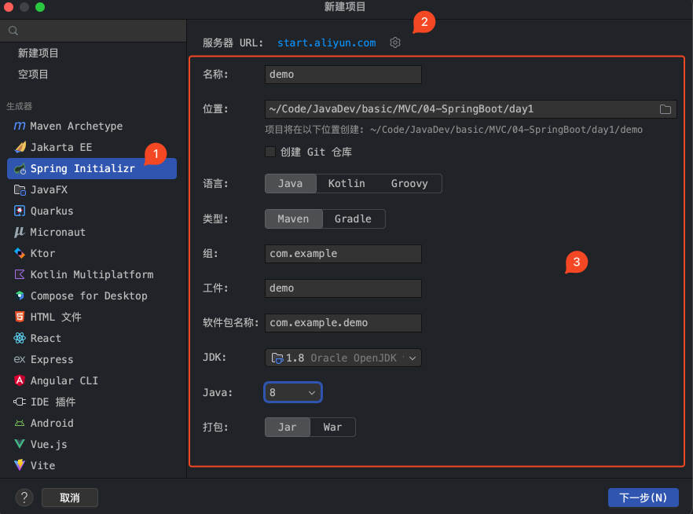

#### 使用网站创建
##### 使用官方脚手架
###### 打开网址，填写信息
> [Spring Initializr](https://start.spring.io/) 或者 [Spring Initializr](https://start.springboot.io)

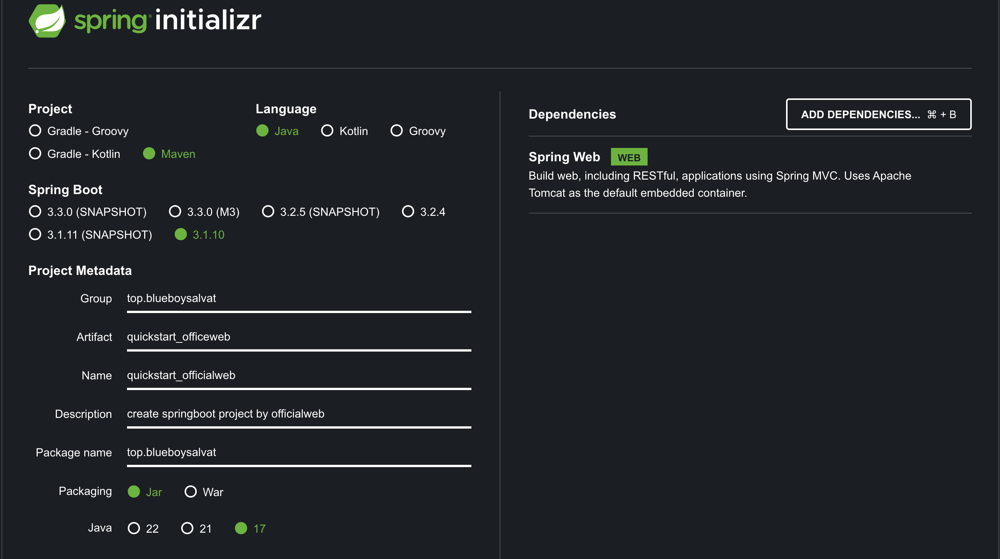

###### 下载解压
>解压并删除不需要的文件，只留下 `src` 和 `pom.xml`

###### 修改版本
`pom.xml`
```xml
<?xml version="1.0" encoding="UTF-8"?>  
<project xmlns="http://maven.apache.org/POM/4.0.0" xmlns:xsi="http://www.w3.org/2001/XMLSchema-instance"  
    xsi:schemaLocation="http://maven.apache.org/POM/4.0.0 https://maven.apache.org/xsd/maven-4.0.0.xsd">  
    <modelVersion>4.0.0</modelVersion>  
    <parent>  
       <groupId>org.springframework.boot</groupId>  
       <artifactId>spring-boot-starter-parent</artifactId>  
       <!-- 修改为2.4.13 -->  
       <version>2.4.13</version>  
       <relativePath/>  
    </parent>  
    <groupId>top.blueboysalvat</groupId>  
    <artifactId>quickstart_officeweb</artifactId>  
    <version>0.0.1-SNAPSHOT</version>  
    <name>quickstart_officialweb</name>  
    <description>create springboot project by officialweb</description>  
    <properties>  
       <!-- 修改jdk版本为 1.8 -->       
       <java.version>1.8</java.version>  
    </properties>  
    <dependencies>  
       <dependency>  
          <groupId>org.springframework.boot</groupId>  
          <artifactId>spring-boot-starter-web</artifactId>  
       </dependency>  
  
       <dependency>  
          <groupId>org.springframework.boot</groupId>  
          <artifactId>spring-boot-starter-test</artifactId>  
          <scope>test</scope>  
       </dependency>  
    </dependencies>  
  
    <build>  
       <plugins>  
          <plugin>  
             <groupId>org.springframework.boot</groupId>  
             <artifactId>spring-boot-maven-plugin</artifactId>  
             <configuration>  
                <image>  
                   <builder>paketobuildpacks/builder-jammy-base:latest</builder>  
                </image>  
             </configuration>  
          </plugin>  
       </plugins>  
    </build>  
  
</project>

```
###### 在 idea 中打开
> `pom.xml` 在 idea 中作为项目打开 

###### 编写测试代码
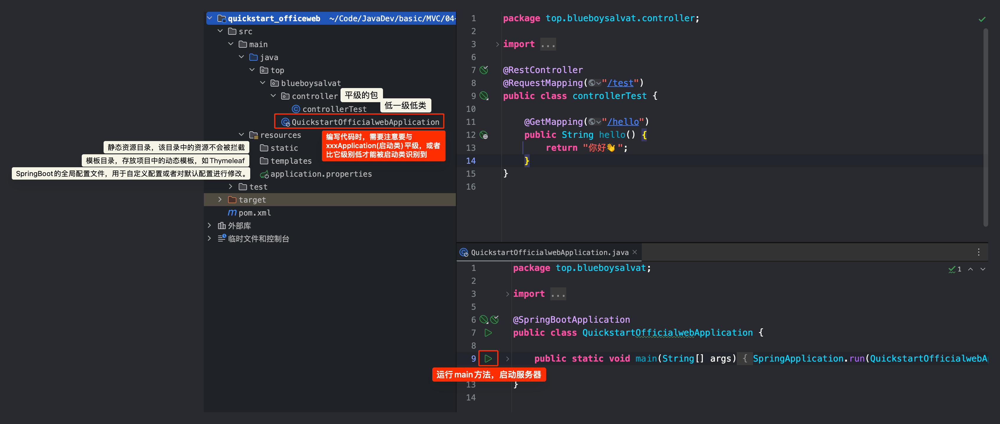
补充： 放在 static 下的文件，在访问时，路径中不需要写 static。

####### 全局配置文件
`application.properties`
```properties
## 应用名  
spring.application.name=quickstart_officialweb  
## 端口  
server.port=8081  
## 访问时的应用名  
server.servlet.context-path=/start
```

`SpringBoot` 应用自带 `Servlet` 容器（`Tomcat`）,因此无需进行额外的服务器配置，运行启动类即可启动一个 `SpringBoot` 应用。


启动服务器，访问网址：`http://localhost:8081/start/test/hello`

##### 使用第三方脚手架
###### 打开网址，填写信息
> [Cloud Native App Initializer](https://start.aliyun.com/)

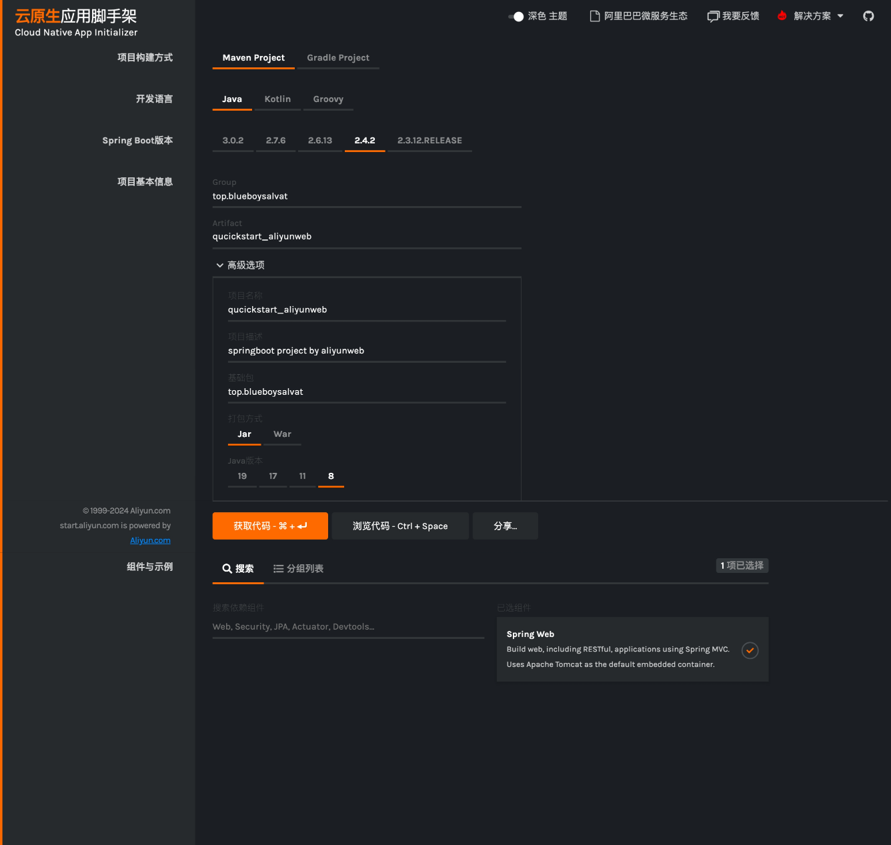

###### 下载解压
>解压并删除不需要的文件，只留下 `src` 和 `pom.xml`

###### 在 idea 中打开
> `pom.xml` 在 idea 中作为项目打开 

####### 编写测试代码
<font color="#00b0f0">controller.java</font>
```java
package top.blueboysalvat.controller;

@RestController
@RequestMapping("/test")
public class controllerTest {
    @GetMapping("/hello")
    public String hello() {
        return "你好阿里云";
    }
}
```

####### 全局配置文件
`application.properties`
```properties
## 应用服务 WEB 访问端口  
server.port=8080
```
``
`SpringBoot` 应用自带 `Servlet` 容器（`Tomcat`）,因此无需进行额外的服务器配置，运行启动类即可启动一个 `SpringBoot` 应用。

启动服务器，访问网址：`http://localhost:8080/test/hello`


注意：以上两种方式打开之后可能都需要在项目结构中重新选择一下 8 版本的 java。

## 自定义 Banner

- 使用 [Text to ASCII Art Generator (TAAG)](https://patorjk.com/software/taag/) 生成艺术字
例如：
```
 _     _            _                           _            _   
| |__ | |_   _  ___| |__   ___  _   _ ___  __ _| |_   ____ _| |_ 
| '_ \| | | | |/ _ \ '_ \ / _ \| | | / __|/ _` | \ \ / / _` | __|
| |_) | | |_| |  __/ |_) | (_) | |_| \__ \ (_| | |\ V / (_| | |_ 
|_.__/|_|\__,_|\___|_.__/ \___/ \__, |___/\__,_|_| \_/ \__,_|\__|
                                |___/
```

- 在 `resources` 下创建 `banner.txt` 并将艺术字写入
- 重启服务器，在启动时查看控制台打印。
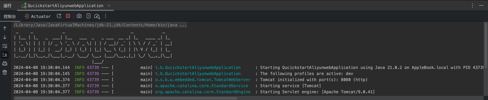


## 全局配置文件
>- 全局配置文件支持两种语法配置：
    - `properties`键值对配置
    - `yaml`语法的配置
### 在全局配置文件中自定义属性
#### 在全局配置文件中定义属性
方式 1: `application.properties`
```properties
test.stuname=wangwenpeng  
test.age=24
```
方式 2:`application.yml`
```yml
## 配置自定义属性  
test:  
  stuname: wangwenpeng  
  age: 24
```

yml 方式和 properties 方式只能任选其一。例如不用 `application.properties` 时就可以改个名，例如加个横线就不会被 SpringBoot 识别了。

#### 测试
<font color="#00b0f0">CutomizePropTest.java</font>
```java
package top.blueboysalvat.controller;

@RestController
@RequestMapping("/test")
public class CutomizePropTest {

    @Value("${test.stuname}")
    private String name;
    @Value("${test.age}")
    private String age;

    @GetMapping("/helloWwp")
    public String hello() {
        return "你好," +  age + "的"+name;
    }
}
```

启动服务器并访问： `http://localhost:8080/test/helloWwp`

### 在全局配置文件中进行全局配置
举例 1：
方式 1: `application.properties`
```properties
server.port=9999  
server.servlet.context-path=/demo1

```
方式 2: `application.yml`
```yml
server:
  port: 9999
  servlet:
    context-path: /demo1
```

举例 2:
方式 1: `application.properties`
```properties
## 配置数据源  （key必须按照SpringBoot的要求）
spring.datasource.driver-class-name=com.mysql.jdbc.Driver
spring.datasource.url=jdbc:mysql://localhost:3306/mybatis?characterEncoding=utf-8
spring.datasource.username=root
spring.datasource.password=admin123

## 配置映射文件路径及实体类的包名
mybatis.mapper-locations=classpath:mappers/*Mapper.xml
mybatis.type-aliases-package=tech.code2048.springboot.demo.entity

```
方式 2: `application.yml`
```yml
spring:
  datasource:
    url: jdbc:mysql://localhost:3306/db_2mybatis?characterEncoding=utf-8
    driver-class-name: com.mysql.jdbc.Driver
    username: root
    password: admin123

mybatis:
  mapper-locations: classpath:mappers/*Mapper.xml
  type-aliases-package: tech.code2048.springboot.demo.entity
```

注意：按照规范开发，默认是不需要配置映射文件路径的。

### 在全局配置文件中切换生产环境
>在不同的场景下，可能需要不同的配置。例如在开发应用时连接的是自己的数据库，交给测试人员时用的时测试人员的数据库以及账号密码，真正上线时连接的可能时真正的业务数据库，所以就涉及到了频繁切换到场景。

以 properties 配置方式举例：
`application-dev.properties`
开发时的生产环境
```properties
server.servlet.context-path=/devpath
```

`application-prod.properties`
上线时的生产环境
```properties
server.servlet.context-path=/prodpath
```

`application-test.properties`
测试时的生产环境
```properties
server.servlet.context-path=/testpath
```

`application.properties`
在主配置文件配置公共内容，在需要切换生产环境时指定就行。
```properties
## 应用服务 WEB 访问端口
server.port=8080
## 使用dev的生产环境
spring.profiles.active=dev
```

重新启动服务器并测试：
`http://localhost:8080/devpath/test/hello`


## SpringBoot 原理
### 简化依赖包的配置

例如我们想要使用
- `Spring Web`
我们就需要在 pom 文件中引入它对应的 `starter`
-  `spring-boot-starter-web`

`pom` 文件中引入的 `starter` 除了导入依赖，还引入了配置
- 配置用被 `@Configuration` 标注的配置类表示，配置在配置类中进行配置
- 配置类中有被 `@Bean` 标注的方法，用来生成特定的对象并让 `SpringIOC` 容器进行管理

通过以上的操作，大部分配置用户就不用自己进行配置了。

以后的开发中，如果需要用到哪个模块，就去导入对应的 `starter`。

双击 shift 搜索：`WebMvcAutoConfiguration`，我们可以看到已经导入了诸多配置类，并且有 `@Configuration` 修饰
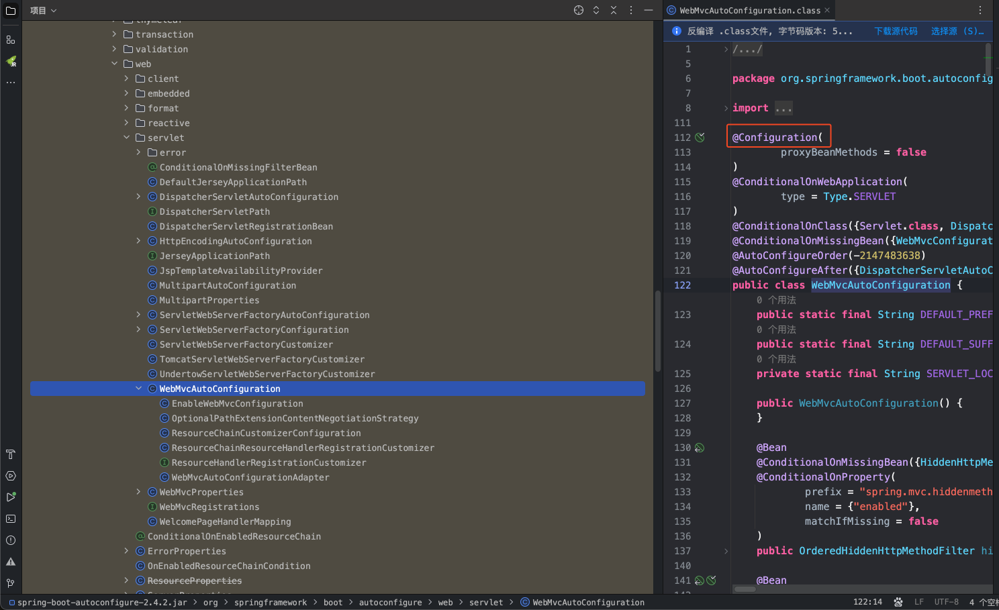

### 简化依赖包的版本管理
#### 基与官方脚手架创建的项目
`pom.xml`
```xml
<parent>  
    <groupId>org.springframework.boot</groupId>  
    <artifactId>spring-boot-starter-parent</artifactId>  
    <version>2.4.13</version>  
    <relativePath/>  
</parent>
```

1. 在 `pom.xml` 中定义了一个 `parent` ，表示当前工程继承了一个父工程，是通过 GAV 坐标来找到这个父工程的。继承了父工程之后就能够使用父工程中的“配置”；
2. 按住 ctrl 或者 cmd 键，进入父工程 `spring-boot-starter-parent`发现它还继承了 `spring-boot-dependencies`；
3. 进入 `spring-boot-dependencies`，发现里面有 `dependencyManagement`。

`dependencyManagement`的作用？
1. 用来规定项目引入的依赖的版本；
2. 如果在项目的 `pom.xml` 引入依赖时 ` dependency ` 标签中没有指定版本，那么就使用 ` dependencyManagement ` 中规定的版本；
3. `dependencyManagement`只是规定依赖的版本，并没有引入依赖；
4. 如果`dependencyManagement`中定义的版本不合适，就需要自己在依赖中指定版本。


#### 基于阿里云脚手架创建的项目
`pom.xml`
```xml
	<properties>  
	    <java.version>1.8</java.version>  
	    <project.build.sourceEncoding>UTF-8</project.build.sourceEncoding>  
	    <project.reporting.outputEncoding>UTF-8</project.reporting.outputEncoding>  
	    <spring-boot.version>2.4.2</spring-boot.version>  
	</properties>

    <dependencyManagement>
        <dependencies>
            <dependency>
                <groupId>org.springframework.boot</groupId>
                <artifactId>spring-boot-dependencies</artifactId>
                <version>${spring-boot.version}</version>
                <type>pom</type>
                <scope>import</scope>
            </dependency>
        </dependencies>
    </dependencyManagement>
```

阿里云脚手架中的 `pom.xml` 是直接在文件中使用 `dependencyManagement` 来进行依赖版本的管理，
我们按住 ctrl 或者 cmd 键点击 `spring-boot-dependencies`，我们就可以发现在这里面声明了大量的版本信息。

如果我们在 `pom.xml` 中导入依赖的时候没有特别指定版本，就使用这里面的版本。

总结：简单理解一下，官方的是 `pom.xml` 继承然后再继承，在这里面使用 `dependencyManagement` 来进行版本管理的。阿里云的是直接 `pom.xml` 中使用 `dependencyManagement` 管理，但是在其中还是引入了一个外部文件,具体的管理信息在这里面。


## SpringBoot 整合 JSP
> `SpringBoot`应用默认支持的动态网页技术是`Thymeleaf`，并不支持`JSP`；因此在`SpringBoot`应用想要使用`JSP`需要通过手动整合来实现。

#### 添加依赖

```
<dependency>
    <groupId>org.apache.tomcat.embed</groupId>
    <artifactId>tomcat-embed-jasper</artifactId>
    <version>9.0.45</version>
</dependency>
<dependency>
    <groupId>javax.servlet</groupId>
    <artifactId>jstl</artifactId>
    <version>1.2</version>
</dependency>
```

#### 创建 JSP 页面

> 修改`pom`文件打包方式为`war`；
> 
> 在`src/main`下新建`webapp`目录；
> 
> 在`webapp`创建`.jsp`页面。

#### 将JSP页面放在webapp中的访问

> 将`JSP`文件存放到`webapp`目录；
> 
> 在`application.yml`文件配置`SpringMVC`视图解析方式：

```
spring:
  mvc:
    view:
      prefix: /
      suffix: .jsp
```

> 创建`TestController`

```
@Controller
public class TestController {

    @RequestMapping("/test")
    public String test() {
        return "test";
    }
}
```

> 如果使用静态资源，静态资源需要放在`resource/static`目录下。

## 基于 SpringBoot 的 SSM 整合

创建完项目之后手动导入一下 mysql 驱动。
```xml
<dependency>  
    <groupId>mysql</groupId>  
    <artifactId>mysql-connector-java</artifactId>  
    <version>5.1.49</version>  
</dependency>
```


## SpringBoot 参数校验
>实际项目中不仅仅前端需要做必填项等校验，为防止非法参数对业务造成影响，后端也需要对相关参数做校验。

### 引入依赖
> 如果`Springboot`版本小于`2.3.x`，`spring-boot-starter-web`会自动传入`hibernate-validator`依赖。如果`Springboot`版本大于`2.3.x`，则需要手动引入依赖

```xml
<dependency>
    <groupId>org.springframework.boot</groupId>
    <artifactId>spring-boot-starter-validation</artifactId>
</dependency>
```


## SpringBoot 热部署
>项目首次部署、服务启动之后，如果应用发生了变化、而且`IDEA`感知到了应用的变化，就自动的完成`jar`的更新，无需手动再次启动服务器，就可以访问应用的更新。

我使用 idea 版本 IntelliJ IDEA 2023.2.2 (Ultimate Edition)
- 设置 --- 构建、执行、部署 --- 自动构建项目✅
- 在 `pom.xml` 中引入
```xml
<dependency>
    <groupId>org.springframework.boot</groupId>
    <artifactId>spring-boot-devtools</artifactId>
</dependency>
```

## API 文档的生成
>以下两个工具任选其一，建议使用 `knife4j`，其 UI 界面相对美观。
### 使用 swagger
#### 引入依赖包
>要和 springboot 版本对应，这里使用的是`2.4.2`

`pom.xml`
```xml
<!-- swagger2 -->
        <dependency>
            <groupId>io.springfox</groupId>
            <artifactId>springfox-swagger2</artifactId>
            <version>2.9.2</version>
        </dependency>
        <!-- swagger-ui -->
        <dependency>
            <groupId>io.springfox</groupId>
            <artifactId>springfox-swagger-ui</artifactId>
            <version>2.9.2</version>
        </dependency>
```

主配置文件和其他环境的配置文件
```properties
## application.properties
## 应用服务 WEB 访问端口  
spring.profiles.active=test

## application-dev.properties
## 应用服务 WEB 访问端口  
server.port=8081

## application-prod.properties
## 应用服务 WEB 访问端口  
server.port=8080

## application-test.properties
## 应用服务 WEB 访问端口  
server.port=8082
```

#### 配置 swagger
##### 配置文档描述和扫描
<font color="#00b0f0">SwaggerConfig.java</font>
```java
package top.blueboysalvat.config;
//设置为配置类
@Configuration
//启动swagger2
@EnableSwagger2
public class SwaggerConfig {
    //配置文档信息
    private ApiInfo apiInfo() {
        Contact contact = new Contact("王文鹏", "blueboysalvat.top", "blueboysalvat@163.com");
        return new ApiInfo(
                "Swagger学习", // 标题
                "描述：学习演示如何配置Swagger", // 描述
                "v1.0", // 版本
                "http://terms.service.url/组织链接", // 组织链接
                contact, // 联系人信息
                "Apach 2.0 许可", // 许可
                "许可链接", // 许可连接
                new ArrayList<>()// 扩展
        );
    }

    //通过配置Docket实例来配置Swaggger2
    @Bean
    public Docket docket(Environment environment) {

        return new Docket(DocumentationType.SWAGGER_2).apiInfo(apiInfo())
                .apiInfo(apiInfo())//关联apiInfo
                .select()// 通过.select()方法，去配置扫描接口,RequestHandlerSelectors配置如何扫描接口
                .apis(RequestHandlerSelectors.basePackage("top.blueboysalvat.controller"))//对哪个包的内容生成文档
                .build();
    }
}
```
##### 配置特定环境下开启文档生成
<font color="#00b0f0">SwaggerConfig.java</font>
```java
package top.blueboysalvat.config;
//设置为配置类
@Configuration
//启动swagger2
@EnableSwagger2
public class SwaggerConfig {
    //配置文档信息
    private ApiInfo apiInfo() {
        Contact contact = new Contact("王文鹏", "blueboysalvat.top", "blueboysalvat@163.com");
        return new ApiInfo(
                "Swagger学习", // 标题
                "描述：学习演示如何配置Swagger", // 描述
                "v1.0", // 版本
                "http://terms.service.url/组织链接", // 组织链接
                contact, // 联系人信息
                "Apach 2.0 许可", // 许可
                "许可链接", // 许可连接
                new ArrayList<>()// 扩展
        );
    }

    //通过配置Docket实例来配置Swaggger2
    @Bean
    public Docket docket(Environment environment) {
        //设置要显示swagger的环境
        Profiles of = Profiles.of("dev","test");//配置为开发和测试环境开启api文档
        //判断当前是否处于该环境
        //通过enable()接收此参数判断是否要显示
        boolean flag = environment.acceptsProfiles(of);

        return new Docket(DocumentationType.SWAGGER_2).apiInfo(apiInfo())
                .apiInfo(apiInfo())//关联apiInfo
                .enable(flag) //禁用Swagger,配置是否启用Swagger，如果是false，在浏览器将无法访问
                .select()// 通过.select()方法，去配置扫描接口,RequestHandlerSelectors配置如何扫描接口
                .apis(RequestHandlerSelectors.basePackage("top.blueboysalvat.controller"))//对哪个包的内容生成文档
                .build();
    }
}
```
#### 编写 controller
<font color="#00b0f0">AutoGenDocumentTest.java</font>
```java
package top.blueboysalvat.controller1;
@RestController  
@RequestMapping("/autogen")  
public class AutoGenDocumentTest {  
  
    @GetMapping("/hello")  
    public String hello() {  
        return "hello";  
    }  
}
```

#### 访问文档
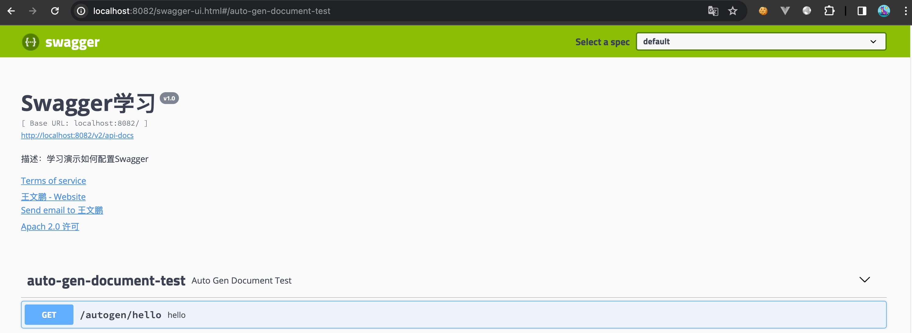

#### 配置分组
>如果项目比较大，可能需要配置多个分组，以便更方便的查看。
如果没有配置分组，默认是 `default`。

如果需要多个分组，只需要写多个 docket
>注意，包名要有明显的区分，例如 controller 和 controller 2 可能会出现文档中组 1 把这两个包都生成注解的情况。配置为 controller 1 和 controller 2 再去再 swagger 配置中配置扫描就完全区分到不同的组里了。

``
<font color="#00b0f0">SwaggerConfig.java</font>
```java
package top.blueboysalvat.config;
//设置为配置类
@Configuration
//启动swagger2
@EnableSwagger2
public class SwaggerConfig {
    //配置文档信息
    private ApiInfo apiInfo() {
        Contact contact = new Contact("王文鹏", "blueboysalvat.top", "blueboysalvat@163.com");
        return new ApiInfo(
                "Swagger学习", // 标题
                "描述：学习演示如何配置Swagger", // 描述
                "v1.0", // 版本
                "http://terms.service.url/组织链接", // 组织链接
                contact, // 联系人信息
                "Apach 2.0 许可", // 许可
                "许可链接", // 许可连接
                new ArrayList<>()// 扩展
        );
    }

    //通过配置Docket实例来配置Swaggger2
    @Bean
    public Docket docket(Environment environment) {
        //设置要显示swagger的环境
        Profiles of = Profiles.of("dev","test");//配置为开发和测试环境开启api文档
        //判断当前是否处于该环境
        //通过enable()接收此参数判断是否要显示
        boolean flag = environment.acceptsProfiles(of);

        return new Docket(DocumentationType.SWAGGER_2).apiInfo(apiInfo())
                .groupName("分组1")
                .apiInfo(apiInfo())//关联apiInfo
                .enable(flag) //禁用Swagger,配置是否启用Swagger，如果是false，在浏览器将无法访问
                .select()// 通过.select()方法，去配置扫描接口,RequestHandlerSelectors配置如何扫描接口
                .apis(RequestHandlerSelectors.basePackage("top.blueboysalvat.controller1"))
                .build();
    }

    @Bean
    public Docket docket2(Environment environment) {
        //设置要显示swagger的环境
        Profiles of = Profiles.of("dev","test");//配置为开发和测试环境开启api文档
        //判断当前是否处于该环境
        //通过enable()接收此参数判断是否要显示
        boolean flag = environment.acceptsProfiles(of);

        return new Docket(DocumentationType.SWAGGER_2).apiInfo(apiInfo())
                .groupName("分组2")
                .apiInfo(apiInfo())//关联apiInfo
                .enable(flag) //禁用Swagger,配置是否启用Swagger，如果是false，在浏览器将无法访问
                .select()// 通过.select()方法，去配置扫描接口,RequestHandlerSelectors配置如何扫描接口
                .apis(RequestHandlerSelectors.basePackage("top.blueboysalvat.controller2"))
                .build();
    }
}

```

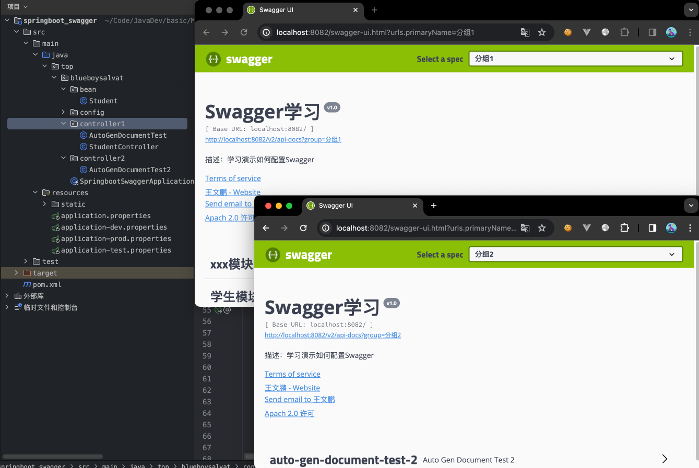

### 使用 knife4j
>注意，记得把 pom 中的 swagger 的相关依赖包注释掉，以及删除 swagger 的配置类或者注释掉配置类的注解。
#### 引入依赖包 
`pom.xml`
```xml
<dependency>
    <groupId>com.github.xiaoymin</groupId>
    <artifactId>knife4j-openapi2-spring-boot-starter</artifactId>
    <version>4.0.0</version>
</dependency>
```

#### 配置
<font color="#00b0f0">Knife4jConfiguration.java</font>
```java
package top.blueboysalvat.config;

@Configuration
@EnableSwagger2WebMvc
public class Knife4jConfiguration {
    @Bean(value = "defaultApi2")
    public Docket defaultApi2() {
        Docket docket=new Docket(DocumentationType.SWAGGER_2)
                .apiInfo(new ApiInfoBuilder()
                        .title("swagger-bootstrap-ui-demo RESTful APIs")
                        .description("# swagger-bootstrap-ui-demo RESTful APIs")
                        .termsOfServiceUrl("http://www.xx.com/")
                        .contact("xx@qq.com")
                        .version("1.0")
                        .build())
                //分组名称
                .groupName("2.X版本")
                .select()
                //这里指定Controller扫描包路径
                .apis(RequestHandlerSelectors.basePackage("top.blueboysalvat.controller1"))
                .paths(PathSelectors.any())
                .build();
        return docket;
    }
}
```

#### 访问文档
启动`Spring Boot`工程，在浏览器中访问：`http://localhost:8080/doc.html`

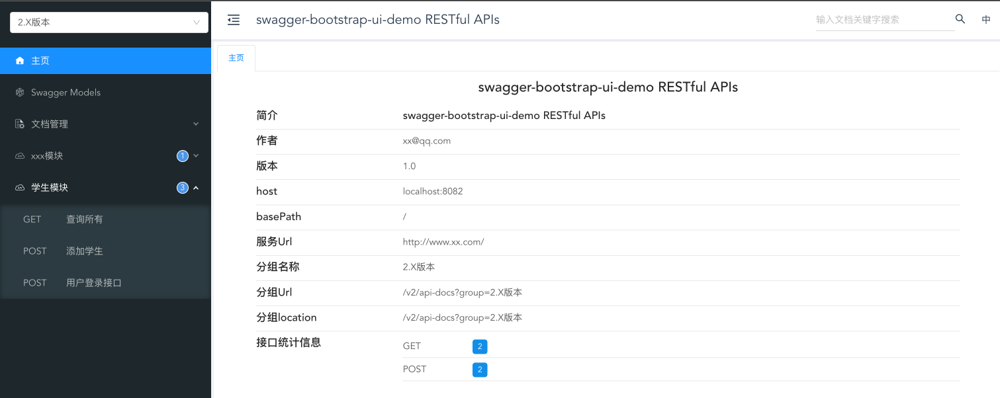

## 为类/属性添加注释
>前端人员查看文档时能更清楚的了解到后端相关属性是什么意思。


> `Swagger`的所有注解定义在`io.swagger.annotations`包下
> 
> 下面列一些经常用到的，未列举出来的可以另行查阅说明：

| Swagger注解                                           | 说明                                  |
| --------------------------------------------------- | ----------------------------------- |
| Api(tags = "xxx模块说明")                               | 描述`Controller`的作用                   |
| @ApiOperation("xxx接口说明")                            | 描述一个类中的一个方法                         |
| @ApiModel("xxxPOJO说明")                              | 作用在模型类上：如VO、BO                      |
| @ApiModelProperty(value = "xxx属性说明",hidden = true)` | 作用在类方法和属性上，`hidden`设置为`true`可以隐藏该属性 |
| @ApiImplicitParams()                                | 作用在参数、方法和字段上，类似 `@ApiModelProperty` |
| @ApiParam("xxx 参数说明")                               |                                     |

### 举例 
<font color="#00b0f0">Student.java</font>
```java
package top.blueboysalvat.bean;
@Data
@NoArgsConstructor
@AllArgsConstructor
@ApiModel("student bean")
public class Student {
    @ApiModelProperty("学生姓名")
    private String name;
    @ApiModelProperty("学生性别")
    private String gender;
    @ApiModelProperty("学生的年龄")
    private Integer age;
}
```

<font color="#00b0f0">controller 1.java</font>
```java
package top.blueboysalvat.controller1;
@RestController
@RequestMapping("/student")
@Api(tags = "学生模块")
public class StudentController {

    @GetMapping
    @ApiOperation("查询所有")
    public List<Student> findAll() {
        //模拟数据
        List<Student> all = new ArrayList<>();
        Student stu1 = new Student("张三", "男", 24);
        Student stu2 = new Student("李四", "男", 18);
        return all;
    }

    @PostMapping
    @ApiOperation("添加学生")
    public String add(@RequestBody Student stuAdd) {
        return "add" + stuAdd +"ok";
    }
}
```

Models 中对实体类有了相关文档解释
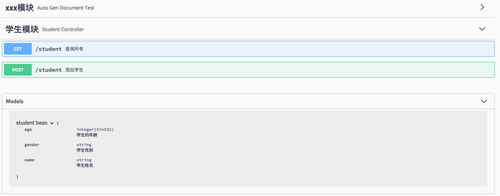

方法的文档解释也有了相关解释
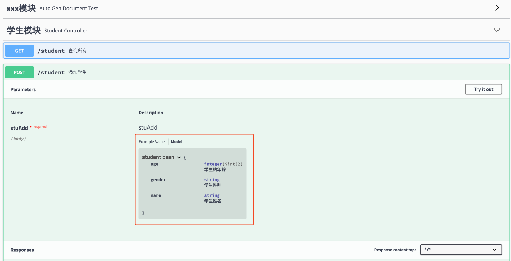

直接在它提供的模板中填空就可以方便的测试了：
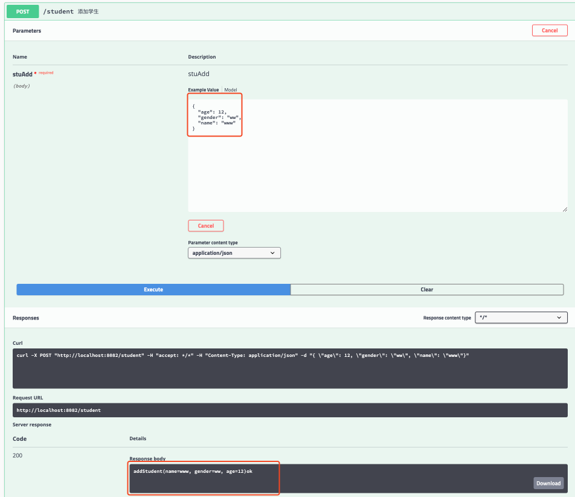

修改一下，给形参上加个文档解释（@ApiParam 适用于给形参接收 JSON 的参数加解释）
<font color="#00b0f0">controller 1.java</font>
```java
package top.blueboysalvat.controller1;
@PostMapping  
@ApiOperation("添加学生")  
public String add(@RequestBody @ApiParam("要添加的学生对象") Student stuAdd) {  
    return "add" + stuAdd +"ok";  
}
```

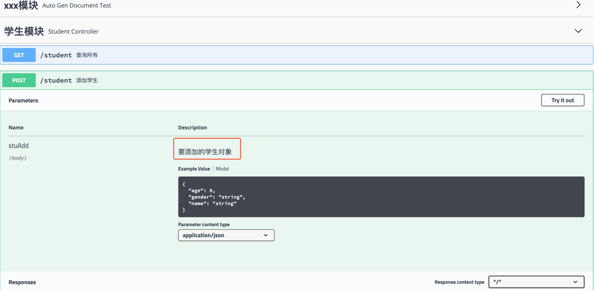

<font color="#00b0f0">controller 1.java</font>
```java
package top.blueboysalvat.controller1;
@ApiOperation("用户登录接口")  
@ApiImplicitParams({  
        @ApiImplicitParam(dataType = "string",name = "username", value = "用户登录账号",required = true),  
        @ApiImplicitParam(dataType = "string",name = "password", value = "用户登录密码",required = false,defaultValue = "123456")  
})  
@PostMapping("/login")  
public String login(@RequestParam("username") String name,  
                    @RequestParam(value = "password",defaultValue = "123456") String pwd){  
    return "login ok";  
}
```

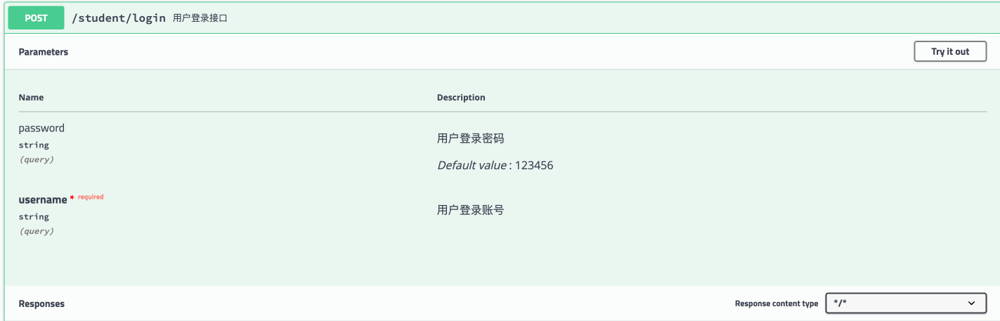

