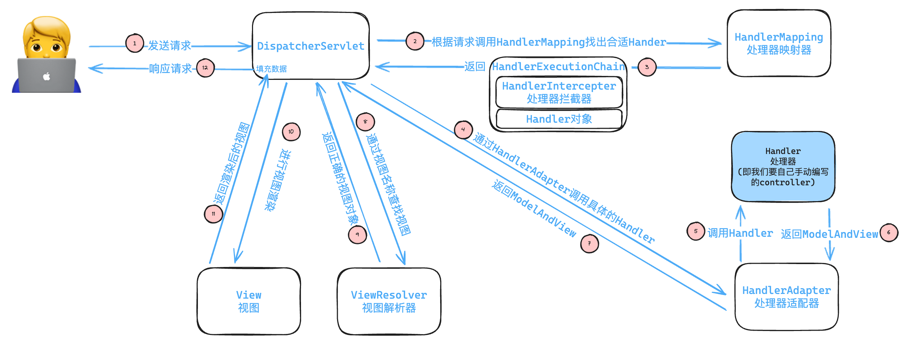
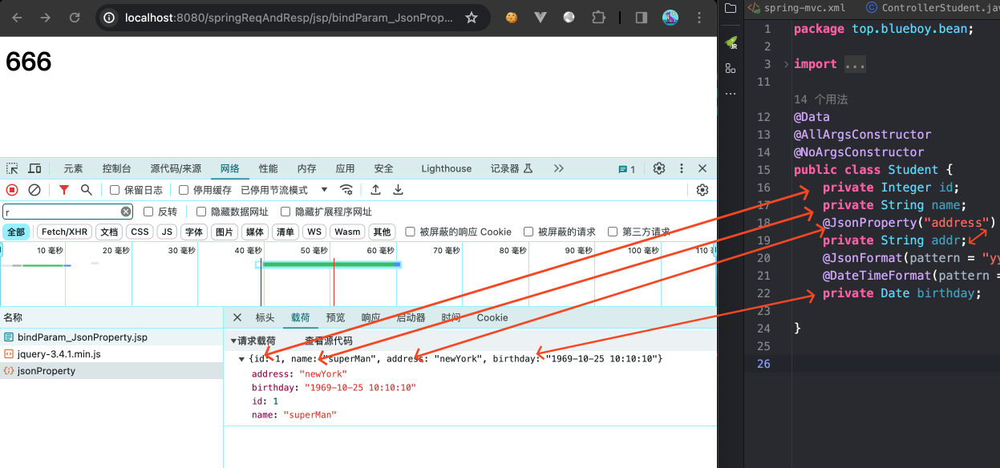
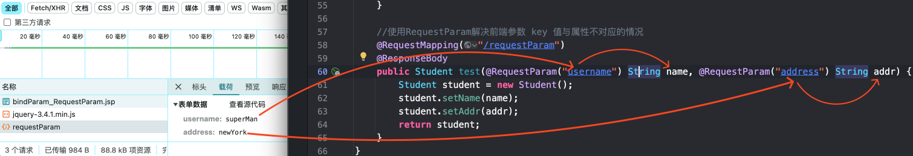
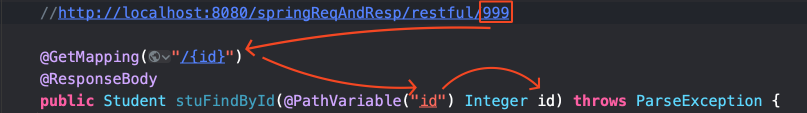

## 快速入门
`web.xml`
>Tomcat 作为一个 Servlet 容器，会根据 web.xml 文件中的配置来加载和初始化 Web 应用程序的相关组件。
- 创建了一个调度 Servlet，来源是 org.springframework...
- 使用 init-param 给它初始化一些参数
- tomcat 启动时就把它创建出来

- 拦截所有请求
- 把这些请求都交给 dispatcherServlet 的东西处理，即 springmvc 处理
```xml
<?xml version="1.0" encoding="UTF-8"?>  
<web-app xmlns="http://xmlns.jcp.org/xml/ns/javaee"  
         xmlns:xsi="http://www.w3.org/2001/XMLSchema-instance"  
         xsi:schemaLocation="http://xmlns.jcp.org/xml/ns/javaee 
         http://xmlns.jcp.org/xml/ns/javaee/web-app_4_0.xsd"  
         version="4.0">  
  
    <servlet>  
        <servlet-name>dispatcherServlet</servlet-name>  
        <servlet-class>org.springframework.web.servlet.DispatcherServlet</servlet-class>  
        <init-param>  
            <!-- 配置SpringMVC配置文件，使SpringMVC核心控制器能够加载 -->  
            <param-name>contextConfigLocation</param-name>  
            <param-value>classpath:spring-mvc.xml</param-value>  
        </init-param>  
        <!-- tomcat启动就加载 -->  
        <load-on-startup>1</load-on-startup>  
    </servlet>  
    <!-- 配置所有的请求都被springmvc给接管 -->  
    <servlet-mapping>  
        <servlet-name>dispatcherServlet</servlet-name>  
        <url-pattern>/</url-pattern>  
    </servlet-mapping>  
  
</web-app>
```

`spring-mvc.xml`
```xml
<?xml version="1.0" encoding="UTF-8"?>
<beans xmlns="http://www.springframework.org/schema/beans"
       xmlns:xsi="http://www.w3.org/2001/XMLSchema-instance"
       xmlns:context="http://www.springframework.org/schema/context"
       xsi:schemaLocation="http://www.springframework.org/schema/beans
       http://www.springframework.org/schema/beans/spring-beans.xsd
       http://www.springframework.org/schema/context
       http://www.springframework.org/schema/context/spring-context.xsd">

    <!--
        配置包扫描
        use-default-filters该属性的默认值为true,
        扫描所有@Component注解修饰的Java类，
        关掉然后指定扫描的位置。
    -->
    <context:component-scan base-package="top.blueboy" use-default-filters="false">
        <!-- 指定扫包规则，只扫描使用@Controller注解修饰的Java类 -->
        <context:include-filter type="annotation" expression="org.springframework.stereotype.Controller"/>
    </context:component-scan>

</beans>
```

`hello.jsp`
```jsp
<%@ page contentType="text/html;charset=UTF-8" language="java" %>  
<html>  
<head>  
    <title>hello</title>  
</head>  
<body>  
<p>hello123</p>  
</body>  
</html>
```

<font color="#00b0f0">HelloController.java</font>
```java
@Controller  
@RequestMapping("/hello")  
public class HelloController {  
  
    @RequestMapping("/hello")  
    public String hello() {  
        System.out.println("666");  
        return "/hello.jsp";  
    }  
}
```

## 流程


- DispatcherServlet(前端控制器)：接收/响应用户请求。它的存在降低了组件之间的耦合性。
- HanlerMapping（处理器映射器）：请求映射，确定应该调用哪个 Handler，也就是哪个 Controller 中的方法，来处理请求，最终返回对应的 `Handler`（Controller）。
- HandlerAdapter（处理器适配器）：通过它对 `Handler` 进行执行，负责真正执行 `Handler`。
- Handler（处理器）：最终是通过 `HandlerAdapter` 调用的里面真正处理相关请求的方法。
- ViewResolver（视图解析器）：控制器处理完毕之后，通常封装成一个 `ModelAndView` 对象，由 `ViewResolver` 解析成视图对象。ViewResolver负责将这个逻辑视图名称解析为实际的视图对象，这样就可以进行视图渲染了。
- View：视图是用于呈现用户界面的部分。在Spring MVC中，视图可以是JSP、Thymeleaf、Freemarker等模板引擎生成的HTML页面，也可以是JSON、XML等数据格式。视图使用从Controller传递过来的模型数据来渲染最终的页面。


- HandlerExceptionResolver:调用控制器中出现异常，由 HandlerExceptionResolver 来处理

- HandlerInterceptor 拦截器可以在处理器执行前后、异常处理等时机进行预处理、后处理等操作。

- HandlerMapping 为什么能找到对应并返回的 Handler？因为我们在 `spring-mvc.xml` 配置过扫描注解，扫描到加了注解的 Controller 归容器管理了。

- 第 8 步，在快速入门案例中，我们编写的 `HelloController` 中最后只不过返回的是一个字符串，而第 8 步说的就是把这个字符串解析成真正的我们要用的 `hello.jsp`

## 数据响应的方式

基本环境准备
`pom.xml`
```xml
<packaging>war</packaging>
<dependencies>  
    <dependency>  
        <groupId>javax.servlet</groupId>  
        <artifactId>javax.servlet-api</artifactId>  
        <version>4.0.1</version>  
    </dependency>  
    <dependency>  
        <groupId>javax.servlet.jsp</groupId>  
        <artifactId>javax.servlet.jsp-api</artifactId>  
        <version>2.3.3</version>  
    </dependency>  
    <dependency>  
        <groupId>org.springframework</groupId>  
        <artifactId>spring-webmvc</artifactId>  
        <version>5.2.10.RELEASE</version>  
    </dependency>  
</dependencies>
```
`web.xml`
```xml
<?xml version="1.0" encoding="UTF-8"?>  
<web-app xmlns="http://xmlns.jcp.org/xml/ns/javaee"  
         xmlns:xsi="http://www.w3.org/2001/XMLSchema-instance"  
         xsi:schemaLocation="http://xmlns.jcp.org/xml/ns/javaee 
         http://xmlns.jcp.org/xml/ns/javaee/web-app_4_0.xsd"  
         version="4.0">  
  
    <servlet>  
        <servlet-name>dispatcherServlet</servlet-name>  
        <servlet-class>org.springframework.web.servlet.DispatcherServlet</servlet-class>  
        <init-param>  
            <!-- 配置SpringMVC配置文件，使SpringMVC核心控制器能够加载 -->  
            <param-name>contextConfigLocation</param-name>  
            <param-value>classpath:spring-mvc.xml</param-value>  
        </init-param>  
        <!-- tomcat启动就加载 -->  
        <load-on-startup>1</load-on-startup>  
    </servlet>  
    <!-- 配置所有的请求都被springmvc给接管 -->  
    <servlet-mapping>  
        <servlet-name>dispatcherServlet</servlet-name>  
        <url-pattern>/</url-pattern>  
    </servlet-mapping>  
  
</web-app>
```
`spring-mvc.xml`
```xml
<?xml version="1.0" encoding="UTF-8"?>  
<beans xmlns="http://www.springframework.org/schema/beans"  
       xmlns:xsi="http://www.w3.org/2001/XMLSchema-instance"  
       xmlns:context="http://www.springframework.org/schema/context"  
       xsi:schemaLocation="http://www.springframework.org/schema/beans  
       http://www.springframework.org/schema/beans/spring-beans.xsd       
       http://www.springframework.org/schema/context       
       http://www.springframework.org/schema/context/spring-context.xsd">  
  
    <!--  
       配置包扫描  
       use-default-filters该属性的默认值为true,  
       扫描所有@Component注解修饰的Java类，  
       关掉然后指定扫描的位置。   
	-->  
    <context:component-scan base-package="top.blueboy" use-default-filters="false">  
        <!-- 指定扫包规则，只扫描使用@Controller注解修饰的Java类 -->  
        <context:include-filter type="annotation" expression="org.springframework.stereotype.Controller"/>  
    </context:component-scan>  
  
    <bean id="viewResolver" class="org.springframework.web.servlet.view.InternalResourceViewResolver">  
        <!-- 配置视图名称前缀 -->  
        <property name="prefix" value="/abc/" />  
        <!-- 配置视图名称后缀 -->  
        <property name="suffix" value=".jsp" />  
    </bean>  
  
</beans>
```

### 响应页面
#### 直接返回字符串
>直接返回字符串：此种方式会将返回的字符串与视图解析器的前后缀拼接后跳转。

`webapp/abc/hello.jsp`
```jsp
<%@ page contentType="text/html;charset=UTF-8" language="java" %>  
<html>  
<head>  
    <title>hello</title>  
</head>  
<body>  
<p>hello123</p>  
</body>  
</html>
```
`webapp/abc/helloabc.jsp`
```jsp
<%@ page contentType="text/html;charset=UTF-8" language="java" %>  
<html>  
<head>  
    <title>hello</title>  
</head>  
<body>  
<p>helloABC</p>  
</body>  
</html>
```
<font color="#00b0f0">HelloController.java</font>
```java
@Controller
@RequestMapping("/hello")
public class HelloController {

    @GetMapping ("/hello0")
    public String hello0() {
        System.out.println("666");
        return "helloabc";
    }

    /**
     * 使用转发时需要写全
     */
    @GetMapping("/hello1")
    public String hello1() {
        return "forward:/abc/helloabc.jsp";
    }

    /**
     * 使用重定向需要写全
     */
    @GetMapping("/hello2")
    public String hello2() {
        return "redirect:/abc/helloabc.jsp";
    }
}
```

#### 返回 ModalAndView
`webapp/abc/helloWwp.jsp`
```jsp
<%@ page contentType="text/html;charset=UTF-8" language="java" %>  
<html>  
<head>  
    <title>hello</title>  
</head>  
<body>  
<p>hello</p>  
<h4><%=request.getAttribute("age")%></h4>岁的  
<h4><%=request.getAttribute("name")%></h4>  
</body>  
</html>
```
`webapp/abc/helloWwp2.jsp`
```jsp
<%@ page contentType="text/html;charset=UTF-8" language="java" %>  
<html>  
<head>  
    <title>hello</title>  
</head>  
<body>  
<p>hello</p>  
<h4><%=application.getAttribute("gender")%></h4>  
<h4><%=session.getAttribute("age")%></h4>岁的  
<h4><%=request.getAttribute("name")%></h4>  
</body>  
</html>
```
<font color="#00b0f0">HelloController2.java</font>
```java
@Controller  
@RequestMapping("/helloctl")  
public class HelloController2 {  
  
    //返回modelAndView 方式1  
    //解析逻辑视图的名称，把物理视图返回，并且使用域对象进行了数据填充  
    @GetMapping ("/hello")  
    public ModelAndView hello() {  
        /*  
        Model:模型 作用封装数据  
        View：视图 作用展示数据  
        */        ModelAndView mv = new ModelAndView();  
        mv.addObject("name", "王文鹏");  
        mv.addObject("age", "24");  
        mv.setViewName("helloWwp");  
  
        return mv;  
    }  
  
    //返回modelAndView 方式2  
    //解析逻辑视图的名称，把物理视图返回，并且使用域对象进行了数据填充  
    @GetMapping ("/hello2")  
    public ModelAndView hello2(ModelAndView mv) {  
        /*  
        Model:模型 作用封装数据  
        View：视图 作用展示数据  
        */        mv.addObject("name", "WangWenPeng");  
        mv.addObject("age", "24");  
        mv.setViewName("helloWwp");  
  
        return mv;  
    }  
  
    //返回modelAndView 方式3  
    //获取ServletAPI  
    //TODO  
    @RequestMapping("/hello3")  
    public void hello3(HttpServletRequest request, HttpSession session, HttpServletResponse response) throws ServletException, IOException {  
        request.setAttribute("name", "WangWenPeng666");  
        session.setAttribute("age", "24");  
  
        ServletContext context = request.getServletContext();  
        context.setAttribute("gender", "男");  
  
        request.getRequestDispatcher("/abc/helloWwp2.jsp").forward(request, response);  
    }  
}
```

### 响应数据
#### 直接返回字符串
##### 返回普通字符串
```java
@Controller  
@RequestMapping("/helloctl3")  
public class HelloController3 {  
  
    @RequestMapping("/helloWrold")  
    public void testHW(HttpServletResponse response) throws IOException {  
        PrintWriter out = response.getWriter();  
        out.println("<p style=\"border:1px solid #dddddd;color:blue;\">hello world</p>");  
    }  
  
    @RequestMapping("/helloSpringMVC")  
    @ResponseBody  
    public String testSMVC() {  
        return "hello SpringMVC";  
    }   
}
```
##### 返回 JSON 字符串
- 手动使用 `JackSon` 进行转换
<font color="#00b0f0">HelloController3.java</font>
```java
@Controller  
@RequestMapping("/helloctl3")  
public class HelloController3 {  
    @RequestMapping("/helloZhansan")  
    @ResponseBody  
    public String testManualJson() {  
        return "{'username' : 'ZhangSan', 'age' : 10}";  
    }  
  
    @RequestMapping("/helooJackSon")  
    @ResponseBody  
    public String testJackSon() throws JsonProcessingException {  
        Student student = new Student(1, "wwp", "qd", new Date());  
        ObjectMapper mapper = new ObjectMapper();  
        String s = mapper.writeValueAsString(student);  
  
        return s;  
    }  
  
}
```

#### 返回对象或集合
##### 配置转换器(了解)

```xml
<?xml version="1.0" encoding="UTF-8"?>
<beans xmlns="http://www.springframework.org/schema/beans"
       xmlns:xsi="http://www.w3.org/2001/XMLSchema-instance"
       xmlns:context="http://www.springframework.org/schema/context"
       xsi:schemaLocation="http://www.springframework.org/schema/beans
       http://www.springframework.org/schema/beans/spring-beans.xsd
       http://www.springframework.org/schema/context
       http://www.springframework.org/schema/context/spring-context.xsd">


    <!--
		配置包扫描
		use-default-filters该属性的默认值为true,
		扫描所有@Component注解修饰的Java类，
		关掉然后指定扫描的位置。
	-->
    <context:component-scan base-package="top.blueboy" use-default-filters="false">
        <!-- 指定扫包规则，只扫描使用@Controller注解修饰的Java类 -->
        <context:include-filter type="annotation" expression="org.springframework.stereotype.Controller"/>
    </context:component-scan>

    <bean id="viewResolver" class="org.springframework.web.servlet.view.InternalResourceViewResolver">
        <!-- 配置视图名称前缀 -->
        <property name="prefix" value="/abc/" />
        <!-- 配置视图名称后缀 -->
        <property name="suffix" value=".jsp" />
    </bean>

    <!-- 声明了一个 Spring MVC 的请求处理适配器 -->
    <bean class="org.springframework.web.servlet.mvc.method.annotation.RequestMappingHandlerAdapter">
        <!-- 设置消息转换器属性，用于处理请求和响应的消息 -->
        <property name="messageConverters">
            <!-- 声明了一个列表，可用于存放多个消息转换器 -->
            <list>
                <!-- 使用由Spring提供的JSON转换器，实现JSON数据与JAVA对象的互相转换 -->
                <bean class="org.springframework.http.converter.json.MappingJackson2HttpMessageConverter"/>
            </list>
        </property>
        </bean>
    </beans>
```
##### 配置 mvc:annotation-driven
- 配置 `spring-mvc.xml`，使得 Spring 可以自动帮我们进行对象与 JSON 之间的转换。
	- 例如在方法返回对象时自动转 JSON
	- 接收前端发送的 JSON 数据时，使用@RequestBoday 映射到形参对象中
```xml
<?xml version="1.0" encoding="UTF-8"?>
<beans xmlns="http://www.springframework.org/schema/beans"
       xmlns:xsi="http://www.w3.org/2001/XMLSchema-instance"
       xmlns:context="http://www.springframework.org/schema/context"
       xmlns:mvc="http://www.springframework.org/schema/mvc"
       xsi:schemaLocation="http://www.springframework.org/schema/beans
       http://www.springframework.org/schema/beans/spring-beans.xsd
       http://www.springframework.org/schema/context
       http://www.springframework.org/schema/context/spring-context.xsd
       http://www.springframework.org/schema/mvc
       http://www.springframework.org/schema/mvc/spring-mvc.xsd">

    <!-- 1开启 Spring MVC 注解驱动 -->
    <mvc:annotation-driven />

    <!-- 2配置扫描 Controller 包 -->
    <context:component-scan base-package="top.blueboy.controller" />


    <!--
		配置包扫描
		use-default-filters该属性的默认值为true,
		扫描所有@Component注解修饰的Java类，
		关掉然后指定扫描的位置。
	-->
    <context:component-scan base-package="top.blueboy" use-default-filters="false">
        <!-- 指定扫包规则，只扫描使用@Controller注解修饰的Java类 -->
        <context:include-filter type="annotation" expression="org.springframework.stereotype.Controller"/>
    </context:component-scan>

    <bean id="viewResolver" class="org.springframework.web.servlet.view.InternalResourceViewResolver">
        <!-- 配置视图名称前缀 -->
        <property name="prefix" value="/abc/" />
        <!-- 配置视图名称后缀 -->
        <property name="suffix" value=".jsp" />
    </bean>
</beans>
```
第一种写法：
>适用于对方法有选择的设置为返回 JSON 数据。
<font color="#00b0f0">JsonController.java</font>
```java
@Controller
@RequestMapping("/jsonctll")
public class JsonController {

    /**
     * 在spring-mvc.xml中进行配置自动转换，
     * 返回对象，自动将返回值的对象转换成JSON。
     */
    @RequestMapping("/test1")
    @ResponseBody
    public Student test1()  {
        Student stu = new Student(1, "Spider-man", "PeterDepartment", new Date());

        return stu;
    }

    /**
     * 返回对象，自动将将返回值的对象转换成JSON
     */
    @RequestMapping("/test2")
    @ResponseBody
    public List<Student> test2() {
        Student stu1 = new Student(1, "Iron-Man", "qd", new Date());
        Student stu2 = new Student(2, "Bat-Man", "qd", new Date());
        Student stu3 = new Student(3, "Green-Man", "qd", new Date());

        ArrayList<Student> list = new ArrayList<>();
        list.add(stu1);
        list.add(stu2);
        list.add(stu3);

        return list;
    }

    /**
     * 返回对象，自动将将返回值的对象转换成JSON
     */
    @RequestMapping("/test3")
    @ResponseBody
    public Map<String, String> test3() {
        Map<String, String> map = new HashMap<>();
        map.put("birthday", new Date().toString());
        map.put("tomorrow", new Date().toString());

        return map;
    }

    /**
     * 返回对象，自动将将返回值的对象转换成JSON
     */
    @RequestMapping("/test4")
    @ResponseBody
    public Set<Student> test4() {
        Student stu1 = new Student(1, "Caption American", "qd", new Date());
        Student stu2 = new Student(2, "Optimus Prime", "qd", new Date());
        Student stu3 = new Student(3, "J·A·V·R·S", "qd", new Date());

        HashSet<Student> set = new HashSet<>();
        set.add(stu1);
        set.add(stu2);
        set.add(stu3);

        return set;
    }
}
```
```xml

```
第二种写法：
>适用于对这个类中的所有方法的返回值都作为 JSON 返回（提前开启注解驱动）
<font color="#00b0f0">JsonController2.java</font>
```java
//相当于 Controller + 所有方法都加了ResponseBody  
@RestController  
@RequestMapping("/jsonctl2")  
public class JsonController2 {  
    @GetMapping("/XMAN")  
    public Set<Student> test1() {  
        Student stu1 = new Student(1, "Caption American", "qd", new Date());  
        Student stu2 = new Student(2, "Optimus Prime", "qd", new Date());  
        Student stu3 = new Student(3, "J·A·V·R·S", "qd", new Date());  
  
        HashSet<Student> set = new HashSet<>();  
        set.add(stu1);  
        set.add(stu2);  
        set.add(stu3);  
  
        return set;  
    }  
}
```

## 数据请求的处理

相关注解:

| 注解              |     |                                      |     |                                                                                                |
| --------------- | --- | ------------------------------------ | --- | ---------------------------------------------------------------------------------------------- |
| @Controller     |     |                                      |     |                                                                                                |
| @RequestMapping |     | 配置访问路径                               |     | - 放在类上，表示请求当前类中的所有方法斗要加前缀路径<br>- 放在方法上，表示当前方法的请求路径                                             |
| @ResponseBody   |     | 把返回值作为响应体进行响应                        |     | - 放在类上，表示当前类中的所有方法都返回都作为响应体<br>- 放在方法上，表示当前方法的返回值为响应体<br>- 若做了相关 JSON 配置，则返回时会自动转 JSON 再向前端返回。 |
| @RestController |     | 相当于 Controller+ResponseBody          |     |                                                                                                |
| @RequestBoday   |     | 解析前端发送到 JSON 数据，并且根据 key 和形参对象属性进行映射 |     | 需要前端发送的数据是 JSON 类型的数据<br>[使用 ajax 发送 JSON 数据](#使用%20ajax%20发送%20JSON%20数据)                     |
|                 |     |                                      |     |                                                                                                |


### 普通请求数据-->简单类型参数
```java
@Controller
@RequestMapping("/stu1")
public class ControllerStudent {

    @RequestMapping("/simpleParam")
    @ResponseBody
    public String testSimpleParam(String name, String addr) {
        return name + addr;
    }
}
```

```request
http://localhost:8080/springReqAndResp/stu1/simpleParam?name=wwwp&addr=qe
```

```response
wwwpqe
```


### 普通请求数据-->对象类型参数
```java
@Controller
@RequestMapping("/stu1")
public class ControllerStudent {

	@RequestMapping("/toBean")  
	@ResponseBody  
	public Student testToBean(Student stu) {  
	    return stu;  
	}

}
```

```request
http://localhost:8080/springReqAndResp/stu1/toBean?birthday=2000-12-10 12:12:12&name=wwp&id=666
```

```response
{
    "id": 666,
    "name": "wwp",
    "addr": null,
    "birthday": "2000-12-10 12:12:12"
}
```


### 普通请求数据-->数组类型参数
```java
@Controller
@RequestMapping("/stu1")
public class ControllerStudent {

	@RequestMapping("/toArray")  
	@ResponseBody  
	public String[] testToArray(String[] hobbys) {  
	    return hobbys;  
	}

}
```

```request
http://localhost:8080/springReqAndResp/stu1/toArray?hobbys=game&hobbys=sleep&hobbys=music
```

```response
[
    "game",
    "sleep",
    "music"
]
```


### JSON 请求数据-->对象类型参数
```java
@Controller
@RequestMapping("/stu1")
public class ControllerStudent {

    @RequestMapping("/jsonToOjb")
    @ResponseBody
    public Student testJsonToOjb(@RequestBody Student stu) {
        return stu;
    }

}
```

```request
http://localhost:8080/springReqAndResp/stu1/jsonToOjb

Body
raw JSON
{
    "id" : 1,
    "name" : "wwp666",
    "addr" : "qd",
    "birthday" : "2000-12-01 12:12:12"
}

```

```response
{
    "id": 1,
    "name": "wwp666",
    "addr": "qd",
    "birthday": "2000-12-01 12:12:12"
}
```

### JSON 请求数据-->对象数组类型参数
```java
@Controller
@RequestMapping("/stu1")
public class ControllerStudent {

    @RequestMapping("/jsonToOjbArray")
    @ResponseBody
    public Student[] testJsonToOjbArray(@RequestBody Student[] stuArr) {
        return stuArr;
    }

}
```

```request
http://localhost:8080/springReqAndResp/stu1/jsonToOjbArray

Body
raw JSON
[
    {
        "id": 1,
        "name": "spider-Man",
        "addr": "qd",
        "birthday": "2000-10-11 19:10:11"
    },
    {
        "id": 2,
        "name": "iron-Man",
        "addr": "jn",
        "birthday": "2001-09-11 20:10:10"
    },
    {
        "id": 3,
        "name": "green-Man",
        "addr": "wf",
        "birthday": "2002-11-11 10:10:05"
    },
    {
        "id": 4,
        "name": "bat-Man",
        "addr": "yt",
        "birthday": "2001-01-20 11:10:20"
    }
]

```

```response
[
    {
        "id": 1,
        "name": "spider-Man",
        "addr": "qd",
        "birthday": "2000-10-11 19:10:11"
    },
    {
        "id": 2,
        "name": "iron-Man",
        "addr": "jn",
        "birthday": "2001-09-11 20:10:10"
    },
    {
        "id": 3,
        "name": "green-Man",
        "addr": "wf",
        "birthday": "2002-11-11 10:10:05"
    },
    {
        "id": 4,
        "name": "bat-Man",
        "addr": "yt",
        "birthday": "2001-01-20 11:10:20"
    }
]
```

### JSON 请求数据-->集合类型参数
```request
http://localhost:8080/springReqAndResp/stu1/jsonToOjbList

Body
raw JSON

[
    {
        "id": 1,
        "name": "spider-Man",
        "addr": "qd",
        "birthday": "2000-10-11 19:10:11"
    },
    {
        "id": 2,
        "name": "iron-Man",
        "addr": "jn",
        "birthday": "2001-09-11 20:10:10"
    },
    {
        "id": 3,
        "name": "green-Man",
        "addr": "wf",
        "birthday": "2002-11-11 10:10:05"
    },
    {
        "id": 4,
        "name": "bat-Man",
        "addr": "yt",
        "birthday": "2001-01-20 11:10:20"
    }
]
```

```response
[
    {
        "id": 1,
        "name": "spider-Man",
        "addr": "qd",
        "birthday": "2000-10-11 19:10:11"
    },
    {
        "id": 2,
        "name": "iron-Man",
        "addr": "jn",
        "birthday": "2001-09-11 20:10:10"
    },
    {
        "id": 3,
        "name": "green-Man",
        "addr": "wf",
        "birthday": "2002-11-11 10:10:05"
    },
    {
        "id": 4,
        "name": "bat-Man",
        "addr": "yt",
        "birthday": "2001-01-20 11:10:20"
    }
]
```


### 配置全局乱码过滤器
`web.xml`
```xml
<!-- 解决中文乱码的Filter  最好放在前面 -->
<filter>
    <filter-name>CharacterEncodingFilter</filter-name>
    <filter-class>org.springframework.web.filter.CharacterEncodingFilter</filter-class>
    <init-param>
        <param-name>encoding</param-name>
        <param-value>utf-8</param-value>
    </init-param>
    <init-param>
        <param-name>forceEncoding</param-name>
        <param-value>true</param-value>
    </init-param>
</filter>
<filter-mapping>
    <filter-name>CharacterEncodingFilter</filter-name>
    <url-pattern>/*</url-pattern>
</filter-mapping>
```


### 参数绑定注解

| 注解              |     |                                                                                                                   |     |                                                                                       |
| --------------- | --- | ----------------------------------------------------------------------------------------------------------------- | --- | ------------------------------------------------------------------------------------- |
| @JsonProperty   |     | 解决前端数据 key 值和后端对象属性名不一致的问题，<br>配置后可以实现接收前端 JSON 数据转后端对象时，<br>以及后端对象返回前端 JSON 数据时的双向映射。                            |     |                                                                                       |
| @RequestParam   |     | 解决前端普通数据 key 与后端方法形参名不一致的问题。                                                                                      |     |                                                                                       |
| @JsonFormat     |     | - 将前端的 JSON 值按照 pattern 映射到对应的属性<br>- 将服务器响应的数据按照 pattern 转换成 JSON                                                |     | 主要应用场景：<br>前后端传输数据时用 JSON 传输时，使用该注解从 JSON 数据中拿日期字符串进行属性映射；返回数据时根据该注解规则映射到响应 JSON 数据中。 |
| @DateTimeFormat |     | - 将前端传过来的日期字符串（如 url-String 格式、Form-Data 格式，不能处理 JSON）<br>按照 pattern 转化为对应的 Date 类型<br>- 不会影响服务器返回前端的时间类型数据格式<br> |     | 主要应用场景：<br>前端不使用 JSON 类型进向后端数据传输时，前端传输日期字符串时，需要使用该注解，实现字符串转成 Date 类型的属性。              |
|                 |     |                                                                                                                   |     |                                                                                       |
|                 |     |                                                                                                                   |     |                                                                                       |
#### JSON 转换与解析时的参数绑定 
>即前端向后段传输 JSON 数据时，如何解析 JSON 数据中的 key 到封装类中，以及封装类转换成 JSON 向前端返回时如何将属性和 JSON key 对应。
<font color="#00b0f0">Student.java</font>
```java
@Data
@AllArgsConstructor
@NoArgsConstructor
public class Student {
    private Integer id;
    private String name;
    @JsonProperty("address")
    private String addr;
    /*
    功能：
        1.将前端的JSON值按照pattern映射到对应的属性
        2.将服务器响应的数据按照pattern转换成JSON
    */
    @JsonFormat(pattern = "yyyy-MM-dd HH:mm:ss", timezone = "GMT+8")
    /*
    功能：
        1.将前端传过来的日期字符串（如url-String格式、Form-Data格式，不能处理JSON）按照pattern转化为对应的Date类型
        2.不会影响服务器返回前端的时间类型数据格式
    */
    @DateTimeFormat(pattern = "yyyy-MM-dd HH:mm:ss")
    private Date birthday;

}
```
<font color="#00b0f0">ControllerStudent.java</font>
```java
@Controller
@RequestMapping("/stu1")
public class ControllerStudent {

    //使用JsonProperty解决前端参数 key 值与属性不对应的情况
    @RequestMapping("/jsonProperty")
    @ResponseBody
    public Student testJsonProperty(@RequestBody Student stu) {
        return stu;
    }

}
```
`bindParam_JsonProperty.jsp`
```jsp
<script>
    $.ajax({
        url : "${pageContext.request.contextPath}/stu1/jsonProperty",
        type : "POST",  //请求方式是POST
        data : JSON.stringify({id : 1, name  : "superMan", address : "newYork", birthday : "1969-10-25 10:10:10"}), //stu转成JSON
        contentType: "application/json;charset=utf-8",  //发送的数据是JSON类型
        dataType : "JSON",   //返回的数据类型是JSON
        success: function (resp) {//请求成功返回后的回掉函数
            console.log(resp);  //打印返回的数据
        }
    });
</script>
```

大致流程：
- 访问 `http://localhost:8080/springReqAndResp/jsp/bindParam_JsonProperty.jsp`，执行 script 标签中的内容，接着 ajax 携带数据向服务器发出请求。
- 被 `ControllerStudent.java` 中的 `testJsonProperty()` 捕获到，然后进行数据的转换和封装。
- 根据 JSON 中对象的属性名与形参中的对象属性名进行一一，如果对映上则把对应值进行封装
- 在到 JSON 中的 address 属性名时，发现对象属性中没有叫这个名字的属性
- 但是与一个属性上的注解对应上，于是把 JSON address 的值放到这里。

反之，在将 Student 对象转换成 JSON 数据返回给前端时，查看到对象中 addr 属性标注了注解，于是转换成 JSON 时，根据注解的要求进行转换。



#### 普通参数的解析
>即前端不用 JSON 传输时，如何将前端传输的参数中 key 值对应到后端形参中。

<font color="#00b0f0">Student.java</font>
```java
@Data
@AllArgsConstructor
@NoArgsConstructor
public class Student {
    private Integer id;
    private String name;
    private String addr;
    @JsonFormat(pattern = "yyyy-MM-dd HH:mm:ss", timezone = "GMT+8")
    @DateTimeFormat(pattern = "yyyy-MM-dd HH:mm:ss")
    private Date birthday;
}
```

<font color="#00b0f0">ControllerStudent.java</font>
```java
@Controller
@RequestMapping("/stu1")
public class ControllerStudent {

    //使用RequestParam解决前端参数 key 值与属性不对应的情况
    @RequestMapping("/requestParam")
    @ResponseBody
    public Student test(@RequestParam("username") String name, @RequestParam("address") String addr) {
        Student student = new Student();
        student.setName(name);
        student.setAddr(addr);
        return student;
    }

}
```





## Restful 风格编程
>一种设计风格，基于这个风格设计的软件可以更简洁，更有层级，更易实现缓存机制等。

| 注解             |     |                 |     |     |
| -------------- | --- | --------------- | --- | --- |
| @GetMapping    |     | 接收 get 类型的请求    |     |     |
| @PostMapping   |     | 接收 post 类型的请求   |     |     |
| @PutMapping    |     | 接收 put 类型的请求    |     |     |
| @DeleteMapping |     | 接收 delete 类型的请求 |     |     |
| @PathVariable  |     | 配合路径参数从路径中获取变量值 |     |     |
|                |     |                 |     |     |


- `GET`：用于获取资源
- `POST`：用于新建资源
- `PUT`：用于更新资源
- `DELETE`：用于删除资源

例如:

| 路径        | 请求方式     | 功能            |
| --------- | -------- | ------------- |
| `/user/1` | `GET`    | `得到id=1的user` |
| `/user/1` | `DELETE` | `删除id=1的user` |
| `/user/1` | `PUT`    | `更新id=1的user` |
| `/user`   | `POST`   | `新增user`      |

### GET
<font color="#00b0f0">ControllerRestFull.java</font>
```java
@Controller
@RequestMapping("/restful")
public class ControllerRestFull {

    @GetMapping
    @ResponseBody
    public List<Student> stuFindAll() throws ParseException {
        //模拟从数据库查询回来的全部学生的集合
        ArrayList<Student> list = new ArrayList<>();
        Student student = new Student();
        student.setId(1);
        student.setName("wwp");
        student.setAddr("qingdao");
        SimpleDateFormat dateFormat = new SimpleDateFormat("yyyy-MM-dd HH:mm:ss");
        Date date = dateFormat.parse("2000-12-12 12:12:12");
        student.setBirthday(date);
        Student student1 = new Student();
        student1.setId(2);
        student1.setName("spider-,an");
        student1.setAddr("peterDepartment");
        Date date1 = dateFormat.parse("2000-10-11 11:11:11");
        student1.setBirthday(date1);
        list.add(student);
        list.add(student1);

        return list;

    }

	//注:GetMapping中使用{}的叫路径占位符，它和和@PathVariable对应，叫一样的名字。
    @GetMapping("/{id}")
    @ResponseBody
    public Student stuFindById(@PathVariable("id") Integer id) throws ParseException {
        //从路径中获取的变量是可以用的
        //eg: xxxService.findById(id)

        //模拟从数据库中根据id查询，返回对应id的student对象
        Student student = new Student();
        student.setId(id);//在这里使用一下
        student.setName("wwp");
        student.setAddr("qingdao");
        SimpleDateFormat dateFormat = new SimpleDateFormat("yyyy-MM-dd HH:mm:ss");
        Date date = dateFormat.parse("2000-12-12 12:12:12");
        student.setBirthday(date);

        return student;
    }
}
```

```request
GET http://localhost:8080/springReqAndResp/restful
```

```response
[
    {
        "id": 1,
        "name": "wwp",
        "addr": "qingdao",
        "birthday": "2000-12-12 12:12:12"
    },
    {
        "id": 2,
        "name": "spider-,an",
        "addr": "peterDepartment",
        "birthday": "2000-10-11 11:11:11"
    }
]
```

```request
GET http://localhost:8080/springReqAndResp/restful/999
```

```response
{
    "id": 999,
    "name": "wwp",
    "addr": "qingdao",
    "birthday": "2000-12-12 12:12:12"
}
```



### POST
<font color="#00b0f0">ControllerRestFull.java</font>
```java
@Controller
@RequestMapping("/restful")
public class ControllerRestFull {

    @PostMapping
    @ResponseBody
    public String stuAdd(@RequestBody Student student) {
        // xxxService.add(student)

        //模拟返回信息
        return "'msg' : add" + student + "ok}";
    }

    @PutMapping
    @ResponseBody
    public String stuUpd(@RequestBody Student student) {
        // xxxService.add(student)

        return "'msg' : update" + student + "ok}";
    }


}
```

```request
POST http://localhost:8080/springReqAndResp/restful

Body
raw JSON

{
    "id" : 666,
    "name" : "wangwenpeng",
    "addr" : "qingdao",
    "birthday" : "2000-12-01 12:12:12"
}

```

```response
'msg' : addStudent(id=666, name=wangwenpeng, addr=qingdao, birthday=Fri Dec 01 12:12:12 CST 2000)ok}
```

### PUT
<font color="#00b0f0">ControllerRestFull.java</font>
```java
@Controller
@RequestMapping("/restful")
public class ControllerRestFull {

    @PutMapping
    @ResponseBody
    public String stuUpd(@RequestBody Student student) {
        // xxxService.update(student)

        return "'msg' : update" + student + "ok}";
    }

}
```

```request
PUT http://localhost:8080/springReqAndResp/restful

Body
raw JSON

{
    "id" : 666,
    "name" : "wangwenpeng",
    "addr" : "qingdao",
    "birthday" : "2000-12-01 12:12:12"
}

```

```response
'msg' : updateStudent(id=666, name=wangwenpeng, addr=qingdao, birthday=Fri Dec 01 12:12:12 CST 2000)ok}
```


### DELETE
<font color="#00b0f0">ControllerRestFull.java</font>
```java
@Controller
@RequestMapping("/restful")
public class ControllerRestFull {

    @DeleteMapping("/{id}")
    @ResponseBody
    public String stuDelete(@PathVariable("id") Integer id) throws ParseException {

        //调用相关方法
        //xxxService.delete(id)

        //模拟返回数据
        return "'msg' : delete id" + id + "ok}";
    }

}
```

```request
DELETE http://localhost:8080/springReqAndResp/restful/1
```

```response
'msg' : delete id1ok}
```


## 配置放行静态资源
>在 springMVC 的核心配置中配置。默认情况下，会吧所有的请求，包括对静态资源的请求都会交给 spring 处理，但是这肯定是不行的。

`spring-mvc.xml`
```xml
    <!--
        配置静态资源的访问
        不配置默认情况下静态资源也会被拦截，
        然后在HandlerMapper中寻找，自然是不对的。
     -->
    <mvc:default-servlet-handler/>
```

## 使用 ajax 发送 JSON 数据
```jsp
<script>
    $.ajax({
        url : "${pageContext.request.contextPath}/stu1/jsonProperty",
        type : "POST",  //请求方式是POST
        data : JSON.stringify({id : 1, name  : "superMan", address : "newYork", birthday : "1969-10-25 10:10:10"}), //stu转成JSON
        contentType: "application/json;charset=utf-8",  //发送的数据是JSON类型
        dataType : "JSON",   //返回的数据类型是JSON
        success: function (resp) {//请求成功返回后的回掉函数
            console.log(resp);  //打印返回的数据
        }
    });
</script>
```

- date 中的 `JSON.stringify()`
- contentType : `application/json;charset=utf-8`

这样才能配合 `@RequestBody` 注解，从而实现形参接收并且解析 JSON，自动封装到形参中。

## 拦截器

登入案例
`spring-mvc.xml`
```xml
<?xml version="1.0" encoding="UTF-8"?>
<beans xmlns="http://www.springframework.org/schema/beans"
       xmlns:xsi="http://www.w3.org/2001/XMLSchema-instance"
       xmlns:context="http://www.springframework.org/schema/context"
       xmlns:mvc="http://www.springframework.org/schema/mvc"
       xsi:schemaLocation="http://www.springframework.org/schema/beans
       http://www.springframework.org/schema/beans/spring-beans.xsd
       http://www.springframework.org/schema/context
       http://www.springframework.org/schema/context/spring-context.xsd
       http://www.springframework.org/schema/mvc
       http://www.springframework.org/schema/mvc/spring-mvc.xsd">


    <!-- 视图解析器
     简化书写路径
     -->
    <bean id="viewResolver" class="org.springframework.web.servlet.view.InternalResourceViewResolver">
        <property name="prefix" value="/WEB-INF/" />
        <property name="suffix" value=".jsp" />
    </bean>

    <!-- 配置一个访问路径和非controller资源的映射
     放在WEB-INF中的资源是无法直接被访问的，
     但是我们可以访问 controller
     
     我们使用 controller当作跳板来进行间接访问。
     相当于：
     配置了一个 controller ，@RequestMapping("/admin/index")
     return /WEB-INF/admin/index.jsp，
   
     -->
    <mvc:view-controller path="/admin/index" view-name="admin/index" />
    <mvc:view-controller path="/" view-name="login" />

    <!-- 配置拦截器(只拦截请求controller的请求) -->
    <mvc:interceptors>
        <!-- 配置一个拦截器 -->
        <mvc:interceptor>
            <!-- 配置拦截器要拦截的请求路径
             这里配置为拦截请求路径为/admin/下的任意内容都被拦截
             -->
            <mvc:mapping path="/admin/**"/>
            <!-- 拦截器的根在哪里 -->
            <bean class="top.blueboy.Interceptor.AdminLoginInterceptor"/>
        </mvc:interceptor>
    </mvc:interceptors>


    <!--
        配置允许静态资源的访问
        不配置默认情况下静态资源也会被拦截然后在HandlerMapper中寻找，自然是不对的。
     -->
    <mvc:default-servlet-handler/>

    <!-- 开启 Spring MVC 注解驱动
    在返回对象时，
    使得 Spring 可以自动帮我们进行对象与 JSON 之间的转换。
     -->
    <mvc:annotation-driven />

    <!--
		配置包扫描
		use-default-filters该属性的默认值为true,
		扫描所有@Component注解修饰的Java类，
		关掉然后指定扫描的位置。
		防止spring 和springmvc扫到同一个地方。
	-->
    <context:component-scan base-package="top.blueboy" use-default-filters="false">
        <!-- 指定扫包规则，只扫描使用@Controller注解修饰的Java类 -->
        <context:include-filter type="annotation" expression="org.springframework.stereotype.Controller"/>
    </context:component-scan>

    </beans>
```
<font color="#00b0f0">AdminController.java</font>
```java
@Controller
public class AdminController {
    @PostMapping("/login")
    public String login(String username, String password, HttpSession session, Model m) {
        if (username.equals("root") && password.equals("root")) {
            session.setAttribute("username", username);
            return "admin/index";
        } else {
            //相当于在request域中存放信息
            m.addAttribute("errMsg", "用户名或密码错误，请重新登入!");
            return "login";
        }
    }

    @GetMapping("/logout")
    public String logout(HttpSession session) {
        //设置session实现
        session.invalidate();
        //跳转到登入页面
        return "login";
    }
}
```
<font color="#00b0f0">AdminLoginInterceptor.java</font>
```java
public class AdminLoginInterceptor implements HandlerInterceptor {

    public boolean preHandle(HttpServletRequest request, HttpServletResponse response, Object handler) throws Exception {
        System.out.println("preHandle...");
        //获取session
        HttpSession session = request.getSession();
        //判断用户是否已经登入（登入后session中名为username的key不为null）
        Object username = session.getAttribute("username");
        //如果 username 为 null
        if (username == null) {
            request.setAttribute("errMsg","请先登入");
            //重定向到 login.jsp
            response.sendRedirect(request.getContextPath() + "/");
            //不放行
            return false;
        }

        //放行
        return true;
    }
}
```
`login.jsp`
```jsp
<%@ page contentType="text/html;charset=UTF-8" language="java" %>
<html>
<head>
    <title>登入</title>
</head>
<body>
<h1>欢迎登入</h1>
<form action="${pageContext.request.contextPath}/login" method="post">
    <span>${pageContext.request.getAttribute("errMsg")}</span>
    <input type="text" name="username" id="username">
    <input type="text" name="password" id="password">
    <button type="submit">登入</button>
</form>
</body>
</html>
```
`/admin/index.jsp`
```jsp
<%@ page contentType="text/html;charset=UTF-8" language="java" %>
<html>
<head>
    <title>首页</title>
</head>
<body>
<!-- 使用EL表达式获取session域中的值 -->
<h1>欢迎!!</h1>
<h1>welcome   ${pageContext.session.getAttribute("username")}</h1>
<button type="button" id="logoutBtn">退出</button>

<script type="text/javascript" src="${pageContext.request.contextPath}/js/jquery-3.4.1.min.js"></script>
<script>
    $("#logoutBtn").click(function () {
        $.ajax({
            url : "${pageContext.request.contextPath}/logout",
            type: "GET",
            success: function (resp) {
                console.log("退出成功");
            },
        });
    });
</script>
</body>
</html>
```

小问题：退出不跳转

## 异常处理
### 控制器中处理
<font color="#00b0f0">TestController.java</font>
```java
@Controller
public class TestController {

    //定义了两个异常处理，一个是专门处理算术异常，一个是处理Exception异常
    //controller处理算数异常，并返回页面和数据
    @ExceptionHandler(ArithmeticException.class)
    public ModelAndView ArithmeticExceptionHandler(ArithmeticException e) {
        ModelAndView mv = new ModelAndView();

        mv.setViewName("error.jsp");
        mv.addObject("msg", e.getMessage());

        return mv;
    }

    //controller处理异常，并返回JSON数据
    @ResponseBody
    @ExceptionHandler(Exception.class)
    public RespBean ExceptionHandler(Exception e) {
        System.out.println(e.getClass().getName());
        return RespBean.error(e.getClass().getName());
    }

    //测试

    @RequestMapping("ae")
    public String testArithmeticException() {
        int a = 100/0;
        return "success.jsp";
    }

    @RequestMapping("ee")
    public String testException() {
        //模拟抛出异常
        if (true) {
            throw new NullPointerException();
        }
        return "success.jsp";
    }
}
```

### 全局异常处理
<font color="#00b0f0">WebExceptionHandler.java</font>
```java
@ControllerAdvice
public class WebExceptionHandler {
    /**
     * 全局异常处理，处理Exception
     * 返回JSON
     */
    @ExceptionHandler(Exception.class)
    @ResponseBody
    public String handleRuntimeException(Exception e) {
        return "{'msg':'出错了', 'date'" + e.getClass().getName() + "}";
    }
}
```

`spring-mvc.xml`
记得在 springMVC 核心配置文件中把它扫进来
```xml
    <context:component-scan base-package="top.blueboy" use-default-filters="false">
        <!-- 指定扫包规则，只扫描使用@Controller注解修饰的Java类 -->
        <context:include-filter type="annotation" expression="org.springframework.stereotype.Controller"/>
        <context:include-filter type="annotation" expression="org.springframework.web.bind.annotation.ControllerAdvice"/>
    </context:component-scan>
```

<font color="#00b0f0">TestController2.java</font>
```java
@Controller
public class TestController2 {

    //测试

    @RequestMapping("aaee")
    public String testArithmeticException()  {
        int a = 100/0;
        return "success.jsp";
    }

    @RequestMapping("eeee")
    public String testException() {
        //模拟抛出异常
        if (true) {
            throw new NullPointerException();
        }
        return "success.jsp";
    }
}
```

```request
http://localhost:8080/springMVCException/aaee
```

```request
{'msg':'???', 'date'java.lang.ArithmeticException}
```