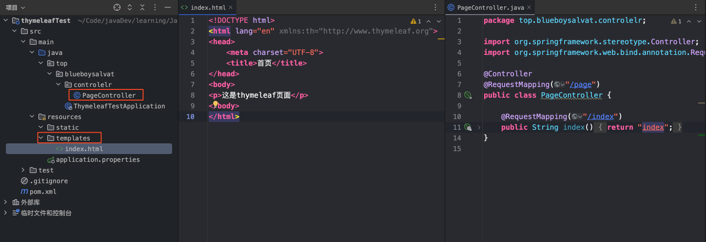
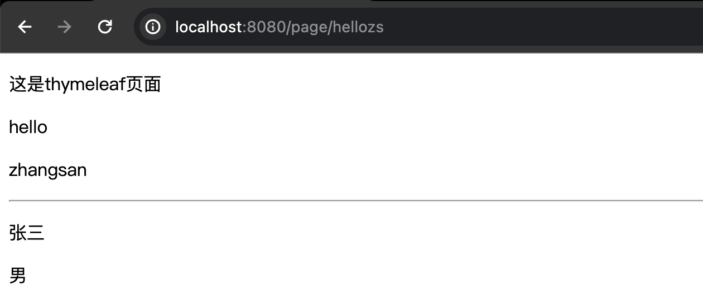
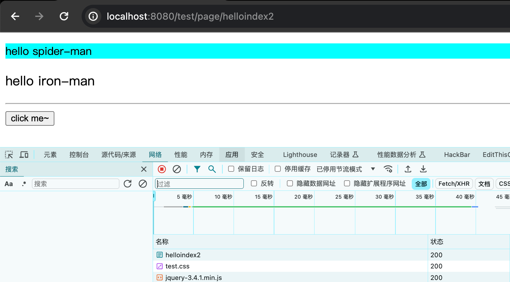

## 简介
JSP必须依赖Tomcat运行，不能直接运行在浏览器中

HTML可以直接运行在浏览器中，但是不能接收控制器传递的数据

Thymeleaf是一种既保留了HTML的后缀能够直接在浏览器运行的能力、又实现了JSP显示动态数据的功能——静能查看页面效果、动则可以显示数据


## 新建项目
>新建项目时添加 thymeleaf 的 start 或者直接引入

`pom.xml`
```xml
<dependency>
    <groupId>org.springframework.boot</groupId>
    <artifactId>spring-boot-starter-thymeleaf</artifactId>
</dependency>
```


## 快速启动

Thymeleaf模板就是HTML文件；

SpringBoot 应用中 resources/templates 目录就是用来存放页面模板的

重要说明：

static目录下的资源被定义静态资源，SpringBoot应用默认放行，如果将HTML页面创建static目录是可以直接访问的

templates目录下的文件会被定义为动态网页模板，SpringBoot应用会拦截templates中定义的资源；如果将HTML文件定义在templates目录，则必须通过控制器跳转访问。

在 templates 创建 HTML 页面模板，并导入命名空间

创建PageController，用于转发允许"直接访问"的页面请求




## 基本语法
### th:text
`index.html`
```html
<!DOCTYPE html>  
<html lang="en" xmlns:th="http://www.thymeleaf.org">  
<head>  
    <meta charset="UTF-8">  
    <title>首页</title>  
</head>  
<body>  
<p>这是thymeleaf页面</p>  
  
hello <p th:text="${name}"></p>  
<hr>  
<p th:text="${stu.name}"></p>  
<p th:text="${stu.gender}"></p>  
</body>  
</html>
```
<font color="#00b0f0">PageController.java</font>
```java
@Controller  
@RequestMapping("/page")  
public class PageController {  
  
    @RequestMapping("/hellozs")  
    public String hellozs(Model m){  
        m.addAttribute("name", "zhangsan");  
        return "index";  
    }  
 
}
```



### th:object
选择变量表达式，也叫星号变量表达式，使用`th:object`属性来绑定对象。

选择表达式首先使用 `th:object` 来绑定后台传来的 User 对象，然后使用 `*` 来代表这个对象，后面 `{}` 中的值是此对象中的属性。

选择变量表达式`*{...}`是另一种类似于标准变量表达式`${...}`表示变量的方法，选择变量表达式在执行时是在选择的对象上求解，而`${...}`是在上下文的变量 Model 上求解，这种写法比标准变量表达式繁琐，只需要大家了解即可

```
<div th:object="${user}">
    <p th:text="*{id}"></p>
    <p th:text="*{username}"></p>
    <p th:text="*{addr}"></p>
</div>
```

### 动态路径加载
`application.properties`
```properties
server.servlet.context-path=/test
```

`index2.html`
```html
<!DOCTYPE html>
<html lang="en" xmlns:th="http://www.thymeleaf.org">
<head>
    <meta charset="UTF-8">
    <title>首页</title>
    <link th:href="@{/css/test.css}" rel="stylesheet">
</head>
<body>

<p class="c1">hello spider-man</p>
<p class="c2">hello iron-man</p>
<hr>
<button id="btn">click me~</button>
<script th:src="@{/js/jquery-3.4.1.min.js}"></script>
<script>
    $("#btn").click(function () {
        console.log("666");
    });
</script>
</body>
</html>
```
<font color="#00b0f0">PageController.java</font>
```java
@Controller
@RequestMapping("/page")
public class PageController {

    @RequestMapping("/helloindex2")
    public String helloindex2(){
        return "index2";
    }
    
}
```
资源均正常引入了，无论你的应用上下文名是什么，可以简单理解为会自动的在 `@{/css/test.css}` 第一个 `/` 自动加上应用上下文名，这样无论在 `application.properties` 中应用上下文名怎么改，前端资源都不回莫名失效啦😆


与前端人员开发：
`<link th:href="@{/css/test.css}" rel="stylesheet">` 中仍然可以使用 html href ，这样前端开发者在本地打开时就用 html href 的饮用样式，而后端开发者使用 controller 访问时则是实用的 th:href 中的引用样式。

### th:each

```html
<table style="width: 600px" border="1" cellspacing="0">
    <caption>图书信息列表</caption>
    <thead>
        <tr>
            <th>id</th>
            <th>name</th>
            <th>addr</th>
        </tr>
    </thead>
    <tbody>
        <tr th:each="user:${userList}">
            <td th:text="${user.id}"></td>
            <td th:text="${user.username}"></td>
            <td th:text="${user.addr}"></td>
        </tr>
    </tbody>
</table>
```

```java
@Controller
@RequestMapping("/page")
public class PageController {

    @RequestMapping("/helloindex2")
    public String helloindex2(Model m){
	    ArrayList<User> userList = new ArrayList();
	    userList.add...
	    userList.add...
	    userList.add...
	    m.addAttribute("userList", userList); 
        return "index";
    }
    
}
```

### th:if

```html
<td th:if="${b.bookPrice}>40" style="color:red">太贵！！！</td> <!-- 大于40就渲染标签 -->
<td th:unless="${b.bookPrice}>40" style="color:red">可以的！！！</td><!-- 小于40就渲染标签 -->
```

th:switch
```html
<td th:switch="${b.bookPrice}/10">
    <label th:case="3">建议购买</label>
    <label th:case="4">价格合理</label>
    <label th:case="*">价格不合理</label><!-- *代表不是3和4时选它-->
</td>
```

```html
<td th:switch="${user.gender}">
    <label th:case="M">男</label>
    <label th:case="F">女</label>
    <label th:case="*">性别不详</label>
</td>
```

## 碎片
##### 1.5.2、碎片使用案例

> 定义碎片`th:fragment`
> 
> `header.html`

```html
<!DOCTYPE html>
<html lang="en" xmlns:th="http://www.thymeleaf.org">
<head>
    <meta charset="UTF-8">
    <title>Title</title>
</head>
<body>

<div th:fragment="fragment1">
    六六六！！！
</div>

</body>
</html>
```

> `footer.html`

```html
<!DOCTYPE html>
<html lang="en"  xmlns:th="http://www.thymeleaf.org">
<head>
    <meta charset="UTF-8">
    <title>Title</title>
</head>
<body>

<div th:fragment="fragment2"">
    Code2048.tech
</div>

</body>
</html>
```

> 引用碎片`th:include`和`th:replace`
> 
> `a.html`

```html
<!DOCTYPE html>
<html lang="en"  xmlns:th="http://www.thymeleaf.org">
<head>
    <meta charset="UTF-8">
    <title>Title</title>
</head>
<body>

<!--    <div th:include="header::fragment1"></div>-->
    <div th:replace="header::fragment1"></div>

    <div style="width: 100%; height: 500px">
        定义内容
    </div>

<!--    <div th:include="footer::fragment2"></div>-->
    <div th:replace="footer::fragment2"></div>
</body>
</html>
```