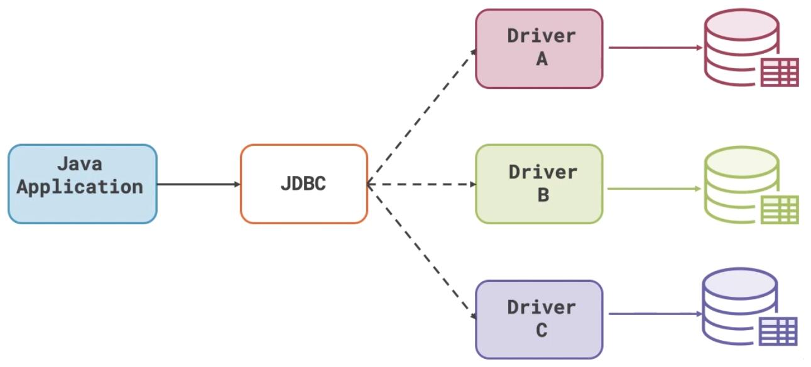

```
版本: Mysql57
操作系统: MacOS
```
安装部署参考链接: [macOSARM平台安装Mysql](https://www.sqlsec.com/2023/07/ventura.html#MySQL)
```bash
## 查看 M有SQL 服务状态
➜ brew services info mysql@5.7
➜ mysql.server status

## 启动 MySQL 服务
➜ brew services start mysql@5.7
➜ mysql.server start

## 重启 MySQL 服务
➜ brew services restart mysql@5.7
➜ mysql.server restart

## 停止 MySQL 服务
➜ brew services stop mysql@5.7
➜ mysql.server stop
```

## SQL 概述
>SQL：Structured Query Language（结构化查询语言）

SQL 语法：
- SQL语句可以在单行或多行书写，以分号结尾；
- 可使用空格和缩进来增强语句的可读性；
- MySQL不区分大小写，建议大写。

四个自带数据库：

|数据库名称|描述|
|---|---|
|information_schema|信息数据库，其中保存着关于所有数据库的信息（元数据），元数据是关于数据的数据，如数据库名或表名，列的数据类型，或访问权限等。|
|mysql|核心数据库，主要负责存储数据库的用户、权限设置、关键字等，以及需要使用的控制和管理信息，不可以删除。|
|performance_schema|性能优化的数据库，MySQL 5.5版本中新增的一个性能优化的引擎。|
|sys|系统数据库，MySQL5.7版本中新增的可以快速的了解元数据信息的系统库，便于发现数据库的多样信息，解决性能瓶颈问题。|

## SQL 分类
> DDL(Data Definition Language)数据定义语言：创建、删除、修改库与表结构；
> 
> DML(Data Manipulation Language)数据操作语言：增、删、改表记录；
> 
> TPL(Transaction Process Language)事务处理语言：用于对事务进行处理；
> 
> **DQL(Data Query Language)数据查询语言：用来查询记录；**
> 
> DCL(Data Control Language)数据控制语言：用来定义访问权限和安全级别。


## 数据类型
>约束数据时非常有帮助

数值类型

|类型|大小|范围（有符号）|范围（无符号）|用途|
|---|---|---|---|---|
|INT|4 字节|(-2 147 483 648，2 147 483 647)|(0，4 294 967 295)|大整数值|
|DOUBLE|8 字节|（-1.797E+308,-2.22E-308）|(0,2.22E-308,1.797E+308)|双精度浮点数值|
|DOUBLE(M,D)|8个字节，M表示长度，D表示小数位数|同上，受M和D的约束 DOUBLE(5,2) -999.99-999.99|同上，受M和D的约束|双精度浮点数值|
|DECIMAL(M,D)|DECIMAL(M,D)|依赖于M和D的值，M最大值为65|依赖于M和D的值，M最大值为65|小数值，和钱相关，不会出现精度缺失的问题|
字符串类型

|类型|大小|用途|
|---|---|---|
|CHAR|0-255字符|定长字符串CHAR(10)10个字符|
|VARCHAR|0-65535 字节|变长字符串VARCHAR(10)10个字符|
|BLOB（binary large object）|0-65535字节|二进制形式的长文本数据|
|TEXT|0-65535字节|长文本数据|
日期时间类型

|类型|大小|范围|格式|用途|
|---|---|---|---|---|
|DATE|3|1000-01-01/9999-12-31|YYYY-MM-DD|日期值|
|TIME|3|'-838:59:59'/'838:59:59'|HH:MM:SS|时间值或持续时间|
|YEAR|1|1901/2155|YYYY|年份值|
|DATETIME|8|1000-01-01 00:00:00/9999-12-31 23:59:59|YYYY-MM-DD HH:MM:SS|混合日期和时间值|
|TIMESTAMP|4|1970-01-01 00:00:00/2038 结束时间是第 **2147483647** 秒北京时间 **2038-1-19 11:14:07**，格林尼治时间 2038年1月19日 凌晨 03:14:07|YYYYMMDD HHMMSS|混合日期和时间值，时间戳|

## 三大范式
### 第一范式
>遵循原子性。即，**表中字段的数据，不可以再拆分**。


### 第二范式
>通俗点讲就是，**一个表只能描述一件事情**。

在满足第一范式的情况下，遵循唯一性，消除部分依赖。即，**表中任意一个主键或任意一组联合主键，可以确定除该主键外的所有的非主键值。**

### 第三范式
>**在任一主键都可以确定所有非主键字段值的情况下，不能存在某非主键字段 A 可以获取某非主键字段 B**。

[Mysql什么是三大范式](https://zhuanlan.zhihu.com/p/590135927)

## 数据库操作

关于条件：

- 条件必须是一个boolean类型的值或表达式；
- 运算符:=、!=、<>、>、<、>=、<=、between...and... 、in(...)、is null、not、or、and；

### DDL
- 创建
	- 创建数据库 `CREATE DATABASE xxx;`
	- 创建数据库 xxx，并且设定指定编码集 `CREATE DATABASE xxx CHARACTER SET utf8mb4;`
	- 创建数据库，如果 xxx 不存在 `CREATE DATABASE IF NOT EXISTS xxx`
	- 创建表
```sql
CREATE TABLE [IF NOT EXISTS] 表名（
	列名 数据类型 [约束],
	列名 数据类型 [约束],
	列名 数据类型 [约束]       //最后一列的末尾不加逗号
）[CHARSET=utf8];			//可根据需要指定表的字符编码集
```
- 查看
	- 查看有哪些数据库 `SHOW DATABASES;`
	- 切换使用数据库 `USE xxx;`
	- 查询当前使用的数据库 `SELECT database();`
	- 查看这个数据库中有哪些表 `SHOW TABLES;`
	- 查看创建数据库语句 `SHOW CREATE DATABASE xxx;`
	- 查看创建表语句 `SHOW CREATE TABLE xxx;`
	- 查看表结构信息 `DESC table_name`
- 修改数据库/表结构
	- 修改数据库的编码集 `ALTER DATABASE xxx CHARACTER SET gbk;`
	- 添加表中列 `ALTER xxx ADD (column_name1 column_type, column_name1 column_type);`
	- 修改表中列类型 `ALTER TABLE xxx MODIFY column_name column_type;`
	- 修改表中列名和列类型 `ALTER TABLE xxx CHANGE old_column_name new_column_name column_type;`
	- 删除表中某列 `ALTER TABLE xxx DROP column_name;`
	- 修改表名称 `ALTER TABLE old_table_name RENAME new_table_name;`
- 删除
	- 删除数据库 `DROP DATABASE xxx;`
	- 删除表 `DROP TABLE xxx;`


### DML
建库建表
```sql
## 创建数据库
CREATE DATABASE IF NOT EXISTS mydb;
## 切换数据库
USE mydb;

## 删除表
DROP TABLE IF EXISTS stu;
## 创建学生表
CREATE TABLE stu  (
  id int(11),
  name varchar(20),
  age int(11),
  gender varchar(5),
  addr varchar(30)
);
```
#### 插入数据
```sql
## 插入指定列
INSERT INTO stu(name, age) VALUES ('wwp', 24);

## 插入所有列
INSERT INTO stu(id, name, age, gender, addr) VALUES (2, '李四', 24, '男'， '青岛');
INSERT INTO stu VALUES (3, '李四', 24, '男'， '青岛');

## 一次插入多条数据

INSERT INTO stu VALUES (4, '王五', 30, '男', '济南'), (5, '赵6', 33, '男', '日照');
```
#### 修改数据
```sql
UPDATE `stu` SET `gender`='男' WHERE `name`='wwp';

UPDATE `stu` SET `addr`='qd' WHERE `addr` IS NULL;

UPDATE `stu` SET `addr`='青岛' WHERE `addr` IS NOT NULL;

UPDATE `stu` SET `addr`='北京' WHERE `name`='wwp' OR `name`='赵6';
UPDATE `stu` SET `addr`='南京' WHERE `name` IN('wwp','赵6');

```
#### 删除数据
```sql
## 删除满足条件的记录
DELETE FROM `stu` WHERE `name` ='李四';

## 删除表中所有数据
DELETE FROM `stu`;
```

### DQL
#### 单表查询
```sql
SELECT * FROM dept;
SELECT `deptno`, `dname` FROM dept WHERE `loc`='北京';
SELECT * FROM dept WHERE `loc`='北京';
SELECT DISTINCT `job` FROM emp;
## 列运算
SELECT `ename`,`sal`*1.5 FROM `emp`;

## 使用 ISNULL 解决 NULL和其他类型的数据运算后为 NULL的问题
SELECT `ename`,`sal`+IFNULL(`comm`,0) FROM `emp`;

## 起别名
SELECT `ename`,`sal`+IFNULL(`comm`,0) AS '总工资' FROM `emp`;

## 拼接字符串
SELECT `ename`,CONCAT(`sal`+IFNULL(`comm`,0),'$') '总工资' FROM `emp`;

## 排序
SELECT * FROM `emp` ORDER BY `sal` DESC;
##可以使用多个排序规则
SELECT * FROM `emp` ORDER BY `sal` DESC,`empno` ASC;

## 聚合函数
### 求工资和
SELECT SUM(`sal`) FROM `emp`;

### 求工资最大值最小值
SELECT MAX(`sal`) FROM `emp`;
SELECT MIN(`sal`) FROM `emp`;

### 求员工数量
SELECT COUNT(*) FROM `emp`;

### 求平均工资
SELECT AVG(sal) FROM `emp`;
SELECT AVG(sal) FROM `emp` WHERE `job`='工程师';


```
#### 分组查询
>哪个表？ 根据什么分组？ 我要获取分组后的什么信息？

分组查询只能查询组信息，也就是只能查询(分组列和聚合函数)
```sql
SELECT `job` '工种',AVG(sal) '平均工资',COUNT(1) '员工数量'  FROM `emp` GROUP BY `job`;
SELECT `job` '工种',AVG(sal) '平均工资' FROM `emp` WHERE `sal` > 15000 GROUP BY `job`;
## 分组后使用 HAVING 对分组后的信息进一步筛选，然后再选择我要查询的信息
SELECT `job` '工种',AVG(sal) '平均工资',COUNT(1) '员工数量' FROM `emp` WHERE `sal` > 15000 GROUP BY `job` HAVING COUNT(1) > 2;
```
#### 分页查询
```sql
LIMIT 多用于分页查询
LIMIT 起始索引，查询记录数
起始索引=（页数-1）* 每页记录数
```
```sql
## 从第1行开始 查询两条记录
SELECT * FROM emp LIMIT 0,2;
## 从第2行开始 查询两条记录
SELECT * FROM emp LIMIT 1,2;
```
#### 多表查询
##### 联合查询
```sql
要求 A表和 B表要有相同的列数，查询结果是两个表上下拼接
SELECT * FROM A UNION SELECT * FROM B;
使用 ALL 关键字，使最后的结果不用去重
SELECT * FROM A UNION ALL SELECT * FROM B;
```
##### 外连接
###### 内连接
>互相剔除另一个表对应不上的信息。
```sql
如果表1在表2中没有对应的匹配记录，则不会出现在结果表中，反之亦然。
Mysql特有语法
SELECT e.`ename`, d.`dname` FROM `emp` e, `dept` d;
使用条件过滤
SELECT e.`ename`, d.`dname` FROM `emp` e, `dept` d WHERE e.`deptno`=d.`deptno`;
符合SQL标准的语法
SELECT e.`ename`, d.`dname` FROM `emp` e  INNER JOIN `dept` d ON e.`deptno`=d.`deptno`;
```
###### 外连接
>为了解决内连接会损失信息的情况
####### 左外连接
>左表的信息一定是完整的，右表对应不上的地方填入 NULL
```sql
以 emp表 为主表，查询结果中 emp表 中的信息不会缺失。若 dept表 中没有的信息则填入 NULL。
SELECT e.`ename`, d.`dname` FROM `emp` e  LEFT JOIN `dept` d ON e.`deptno`=d.`deptno`;
```
####### 右外连接
>右表的信息一定是完整的，左表对应不上的地方填入 NULL
```sql
以 dept表 为主表，查询结果中 dept表 中的信息不会缺失。若 emp表 中没有的信息则填入 NULL。
SELECT e.`ename`, d.`dname` FROM `emp` e  RIGHT JOIN `dept` d ON e.`deptno`=d.`deptno`;
```
####### 全外连接
>右表对不上左表的地方填入 NULL，右表对不上左表的地方填入 NULL

语法
```sql
SELECT 列名 FROM 左表 FULL [OUTER] JOIN 右表 ON 左表.列名 条件运算符 右表.列名 [WHERE 条件]
```
MySQL 不支持这种语法，可以使用合并结果集进行模拟全外连接

```sql
找出所有员工的所有信息及其所在部门，没有部门的员工也要展示
找出所有部门的所有的员工，没有员工的部门也要展示
SELECT e.*, d.`dname` 
FROM `emp` e
LEFT JOIN `dept` d ON e.`deptno` = d.`deptno` 
UNION
SELECT e.*, d.`dname` 
FROM `emp` e
RIGHT JOIN `dept` d ON e.`deptno` = d.`deptno`;
```

### 约束

```sql
## 设置主键
CREATE TABLE 表名(
    列名 数据类型 PRIMARY KEY AUTO_INCREMENT,
	列名 数据类型,
	列名 数据类型
);


ALTER TABLE `stu` ADD PRIMARY KEY(`id`);
ALTER TABLE `stu` MODIFY `id` INT PRIMARY KEY;
ALTER TABLE 表名 CHANGE 原列名 新列名 列类型 PRIMARY KEY;

## 设置主键自增长
ALTER TABLE 表名 CHANGE 原列名 新列名 列类型 PRIMARY KEY AUTO_INCREMENT;
ALTER TABLE 表名 MODIFY 列名 列类型 PRIMARY KEY AUTO_INCREMENT;

```

```sql
## 唯一约束
CREATE TABLE 表名(
    列名 数据类型 UNIQUE,
	列名 数据类型,
	列名 数据类型
);

ALTER TABLE `stu` MODIFY `id` INT UNIQUE;
ALTER TABLE 表名 CHANGE 原列名 新列名 列类型 UNIQUE;
```

```sql
## 非空约束
CREATE TABLE 表名(
    列名 数据类型 NOT NULL,
	列名 数据类型,
	列名 数据类型
);

ALTER TABLE 表名 MODIFY 列名 列类型 NOT NULL;
ALTER TABLE 表名 CHANGE 原列名 新列名 列类型 NOT NULL;
```

```sql
## 默认值
CREATE TABLE 表名(
    列名 数据类型 DEFAULT 默认值,
	列名 数据类型,
	列名 数据类型
);

## 修改表时设置默认值
ALTER TABLE 表名 MODIFY 列名 列类型 DEFAULT 默认值;
ALTER TABLE 表名 CHANGE 原列名 新列名 列类型 DEFAULT 默认值;
```
### 引用完整性外键
```sql
## 创建表时指定外键约束
CREATE TABLE 表名(
    列名 数据类型,
	列名 数据类型,
	列名 数据类型,
    CONSTRAINT 约束名称 FOREIGN KEY(外键列名) REFERENCES 关联表(关联表的主键)
);

## 修改表时添加外键约束
ALERT TABLE 表名 ADD CONSTRAINT 约束名称 FOREIGN KEY(外键列名) REFERENCES 关联表(关联表的主键);

## 修改表时删除外键约束
ALTER TABLE 表名 DROP FOREIGN KEY 约束名称;
```
外键的特点：

- 外键必须是**另一表的主键**的值(外键要引用主键！)；
- 外键可以重复；
- 外键可以为空；
- 一张表中可以有多个外键。

注意现在一般不再使用外键，使用外键会造成数据库性能下降，现在一般使用 Java 代码维护数据间的关系。

### TPL
>一个操作序列，这些操作要么都执行，要么都不执行，它是一个不可分割的工作单位。
事务要处理的问题，把多个对数据库的操作绑定成一个事务，**要么都成功，要么都失败**。

#### 事务操作
```sql
## 开启事务
START TRANSACTION;

## 多个SQL操作

## 提交事务
COMMIT;
## 回滚
ROLLBACK;
```

在执行 `SQL` 语句之前，先执行 `START TRANSACTION`，这就开启了一个事务（事务的起点），然后可以去执行多条 `SQL` 语句;

后要结束事务，`COMMIT` 表示提交，即事务中的多条 `SQL` 语句所做出的影响会持久化到数据库中，或者 `ROLLBACK`，表示回滚，即回滚到事务的起点，之前做的所有操作都被撤消了；

#### 事务原理
数据库会为每一个客户端都维护一个空间独立的缓存区(回滚段)，一个事务中所有的增删改语句的执行结果都会缓存在回滚段中，只有当事务中所有SQL语句均正常结束（`COMMIT`），才会将回滚段中的数据同步到数据库。否则无论因为哪种原因失败，整个事务将回滚（`ROLLBACK`）

#### 事务特性
- **原子性（Atomicity）**：事务中所有操作作为一个整体，是**不可再分割**的原子单位。事务中所有操作要么全部执行成功，要么全部执行失败。
- **一致性（Consistency）**：事务执行后，数据库状态与其它业务规则保持一致。如转账业务，无论事务执行成功与否，参与转账的两个账号余额之和应该是不变的。
- **隔离性（Isolation）**：隔离性是指在并发操作中，不同事务之间应该隔离开来，使每个并发中的事务不会相互干扰。
- **持久性（Durability）**：一旦事务提交成功，事务中所有的数据操作都必须被持久化到数据库中，即使提交事务后，数据库马上崩溃，在数据库重启时，也必须能保证通过某种机制恢复数据。


#### 事务隔离
##### 事务并发读问题
在现代关系型数据库中，事务机制是非常重要的，假如在多个事务并发操作数据库时，如果没有有效的机制进行避免就会导致出现**脏读，不可重复读，幻读**。

**脏读**：

- 在事务A执行过程中，事务A对数据资源进行了修改，事务B读取了事务A修改后的数据；
- 由于某些原因，事务A并没有完成提交，发生了回滚操作，则事务B读取的数据就是脏数据。
- 这种读取到另一个事务未提交的数据的现象就是脏读。

|时间点|事务A|事务B|
|---|---|---|
|1|开启事务||
|2||开启事务|
|3|修改（update）数据||
|4||查询（select）数据|
|5|回滚||
 
 **不可重复读**：
 
 - 事务B读取了两次数据资源，在这两次读取的过程中事务A修改了数据，导致事务B在这两次读取出来的数据不一致；
 - 这种在同一个事务中，前后两次读取的数据不一致的现象就是不可重复读。
 
 |时间点|事务A|事务B|
 |---|---|---|
 |1|开启事务||
 |2||开启事务|
 |3||查询（select）数据|
 |4|修改（update）数据||
 |5|提交||
 |6||查询（select）数据|
 
 **幻读**：
 
- 幻读是针对数据**插入（INSERT）操作来说的。
- 事务A查询某条数据不存在，事务B插入该条数据并提交；
- A再次查询该数据仍然不存在，但是无法插入成功，让用户感觉很魔幻，感觉出现了幻觉，这就叫幻读。

|时间点|事务A|事务B|
|---|---|---|
|1|开启事务||
|2|查询（select）数据||
|3||开启事务|
|4||插入（insert）数据|
|5||提交|
|6|查询（select）数据，数据不存在||
|7|插入（insert）相同主键数据，不成功||
|8||查询（select）数据|
##### 四大隔离级别
为了解决以上的问题，主流的关系型数据库都会提供四种事务的隔离级别。事务隔离级别从低到高分别是：
 
 - 读未提交(READ UNCOMMITTED)
 - 读已提交(READ COMMITTED)
 - 可重复读(REPEATABLE READ)
 - 串行化(SERIALIZABLE)
 
 事务隔离级别等级越高，越能保证数据的一致性和完整性，但是执行效率也越低。所以在设置数据库的事务隔离级别时需要做一下权衡，**MySQL默认是可重复读（REPEATABLE READ）的级别**。
 
 下表展示了四种隔离级别对并发读问题的解决程度。
 
 |隔离级别|脏读|不可重复读|幻读|
 |---|---|---|---|
 |读未提交(READ UNCOMMITTED)|可能|可能|可能|
 |读已提交(READ COMMITTED)|不可能|可能|可能|
 |可重复读(REPEATABLE READ)|不可能|不可能|可能|
 |串行化(SERIALIZABLE)|不可能|不可能|不可能|


## 练习
### 练习 1
```sql
CREATE TABLE IF NOT EXISTS t_student (
	sid CHAR(5),
	sname VARCHAR(10),
	ssex CHAR(1),
	sbirthday DATETIME,
	stel VARCHAR(13),
	sclass INT(2)
);
```
```sql
CREATE TABLE IF NOT EXISTS t_teacher (
	tid CHAR(3),
	tname VARCHAR(10),
	tsex CHAR(2),
	tage INT,
	tjob VARCHAR(10)
);
```
```sql
CREATE TABLE IF NOT EXISTS t_course (
	cid CHAR(2),
	cname VARCHAR(20),
	ctype INT,
	chours INT
);
```
```sql
CREATE TABLE IF NOT EXISTS t_teachcourse (
	tid CHAR(3),
	cid CHAR(2)
);
```
```sql
CREATE TABLE IF NOT EXISTS t_score (
	sid CHAR(5),
	cid CHAR(2),
	score INT
);
```


### 练习 2
单表查询练习：
1. 查询出部门编号为 30 的所有员工
```sql
SELECT * FROM `emp` WHERE `deptno`=30;
```
2. 所有工程师的姓名、编号和部门编号。
```sql
SELECT `ename`, `empno`, `deptno` FROM `emp` WHERE `job`='工程师';
```
3. 找出奖金高于工资的员工。
```sql
SELECT * FROM `emp` WHERE `comm` > `sal`;
```
4. 找出奖金高于工资 60%的员工。
```sql
SELECT * FROM `emp` WHERE `comm` > `sal`*0.6;
```
5. 找出部门编号为 10 的所有经理，和部门编号为 20 的所有工程师的详细资料。
```sql
SELECT * FROM `emp` WHERE (`job`='工程师' AND `deptno`=20) OR (`job`='经理' AND `deptno`=10);
```
6. 找出部门编号为 10 中所有经理，部门编号为 20 中所有工程师，还有即不是经理又不是工程师但其工资大于或等于 20000 的所有员工详细资料。
```sql
SELECT * FROM `emp` WHERE (`job`='工程师' AND `deptno`=20) OR (`job`='经理' AND `deptno`=10) OR `sal`>20000;
```
7. 有奖金的工种。
```sql
SELECT DISTINCT `job` FROM `emp` WHERE `comm` IS NOT NULL AND `comm` !=0;
```
8. 无奖金或奖金低于 1000 的员工。
```sql
SELECT DISTINCT `job` FROM `emp` WHERE `comm` IS NULL OR `comm` !=0 OR `comm`<1000;
```
9. 查询名字由三个字组成的员工。
```sql
SELECT * FROM `emp` WHERE `ename` LIKE '___'
```
10. 查询 2011 年入职的员工。
```sql
SELECT * FROM `emp` WHERE `hiredate` LIKE '2011%';
SELECT * FROM `emp` WHERE YEAR(`hiredate`) = '2011';
```
11. 查询所有员工详细信息，用编号升序排序
```sql
SELECT * FROM `emp` ORDER BY `empno` ASC;
```
12. 查询所有员工详细信息，用工资降序排序，如果工资相同使用入职日期升序排序
```sql
SELECT * FROM `emp` ORDER BY `sal` DESC, `hiredate` ASC;
```
13. 查询每个部门的平均工资
```sql
SELECT `deptno`,AVG(`sal`) FROM `emp` GROUP BY `deptno`;
```
14. 查询每个部门的雇员数量。 
```sql
/*
查询每个部门的雇员数量。 

确定列：雇员数量
SELECT COUNT(*)

根据查询的相关列确定表
确定表：emp
SELECT COUNT(*) FROM `emp`

确定其他条件：每个部门的雇员数量
SELECT COUNT(*) FROM `emp` GROUP BY `deptno`

*/
SELECT `deptno`,COUNT(*) 
FROM `emp` 
GROUP BY `deptno`

```
15. 查询每种工作的最高工资、最低工资、人数
```sql
/*
查询每种工作的最高工资、最低工资、人数

确定列：最高工资 最低工资 人数
SELECT MAX(`sal`), MIN(`sal`), COUNT(*)

根据查询的相关列确定表
确定表：emp
SELECT MAX(`sal`), MIN(`sal`), COUNT(*) FROM `emp`

确定其他条件：每种工种
SELECT MAX(`sal`), MIN(`sal`), COUNT(*) FROM `emp` GROUP BY `job`

*/
SELECT `job`,MAX(`sal`), MIN(`sal`), COUNT(*) 
FROM `emp` 
GROUP BY `job`

```
16. 显示非研发人员(工程师，架构师)工作名称以及从事同一工作雇员的月工资的总和，并且要满足从事同一工作的雇员的月工资合计大于 50000，输出结果按月工资的合计升序排列
```sql
/*
显示非研发人员(工程师，架构师)工作名称以及从事同一工作雇员的月工资的总和，
并且要满足从事同一工作的雇员的月工资合计大于 50000，输出结果按月工资的合计升序排列

分析过程：
查询列：工作名称 月工资总和
根据查询列可以确定出 查询表：emp
SELECT `job`, SUM(`sal`) FROM `emp`;

根据修辞确定其他条件
条件1：从事同一工作雇员
SELECT `job`, SUM(`sal`) FROM `emp` GROUP BY `job`;
条件2：非研发人员
SELECT `job`, SUM(`sal`) FROM `emp` WHERE `job` NOT IN('工程师', '架构师') GROUP BY `job`;
条件3：筛选出分组后月工资合计 > 50000 记录
SELECT `job`, SUM(`sal`) FROM `emp` WHERE `job` NOT IN('工程师', '架构师') GROUP BY `job` HAVING `sal`>50000;
条件4：按月工资的合计生序排序
SELECT `job`, SUM(`sal`) FROM `emp` WHERE `job` NOT IN('工程师', '架构师') GROUP BY `job` HAVING `sal`>50000 ORDER BY SUM(`sal`) ASC;
*/
SELECT `job`, SUM(`sal`) 
FROM `emp` 
WHERE `job` NOT IN('工程师', '架构师') 
GROUP BY `job` 
HAVING SUM(`sal`)>50000 
ORDER BY SUM(`sal`) ASC;

```

多表查询练习:
1. 查出至少有一个员工的部门。显示部门编号、部门名称、部门位置、部门人数。
```sql
/*
查出至少有一个员工的部门。显示部门编号、部门名称、部门位置、部门人数。

确定列：deptno dname loc count(*)

确定表： dept emp 

先不考虑多表查询，先简化成单表查询:
查出至少有一个员工的部门。显示部门编号、部门人数。
SELECT e.`deptno`, COUNT(*) ct FROM `emp` e GROUP BY e.`deptno`;
SELECT d.`deptno`, COUNT(*) ct FROM `dept` d GROUP BY d.`deptno` HAVING ct>0;

查出至少有一个员工的部门。显示部门编号、部门名称、部门位置、部门人数。
SELECT d.`deptno`, d.`dname`, d.`loc`, ct 
FROM `dept` d ,(SELECT e.`deptno`, COUNT(*) ct FROM `emp` e GROUP BY e.`deptno` HAVING ct>0) z 
WHERE d.`deptno`=z.`deptno`;
*/
SELECT d.`deptno`, d.`dname`, d.`loc`, ct 
FROM `dept` d ,(SELECT e.`deptno`, COUNT(*) ct FROM `emp` e GROUP BY e.`deptno` HAVING ct>0) z 
WHERE d.`deptno`=z.`deptno`;
```
2. 列出薪金比周星驰高的所有员工。
```sql
/*
列出薪金比周星驰高的所有员工。

确定列：*

确定表： emp 

确定主干：所有员工
SELECT * FROM `emp;

确定修饰条件：
列出薪金比周星驰高的 所有员工。
SELECT * FROM `emp` WHERE `sal`>(SELECT `sal` FROM `emp` WHERE `ename`='周星驰')

*/
SELECT * FROM `emp` 
WHERE `sal`>(SELECT `sal` FROM `emp` WHERE `ename`='周星驰')
```
3. 列出所有员工的姓名及其直接上级的姓名。
```sql
/*
列出所有员工的姓名及其直接上级的姓名。

确定查询列：ename(员工) ename(上级)

确定表： emp emp 

确定关系：两个表做左连接，这样也可以保留没有上级的员工信息
SELECT e.`ename`, m.`ename` FROM `emp` e LEFT JOIN `emp` m ON e.`mgr`=m.`empno`;

进一步优化：
SELECT e.`ename` '员工', m.`ename` '上级' FROM `emp` e LEFT JOIN `emp` m ON e.`mgr`=m.`empno`;
*/
SELECT e.`ename` '员工', m.`ename` '上级' 
FROM `emp` e 
LEFT JOIN `emp` m ON e.`mgr`=m.`empno`;


```
4. 列出受雇日期早于直接上级的所有员工的编号、姓名、部门名称。
```sql
/*
列出受雇日期早于直接上级的所有员工的编号、姓名、部门名称。

确定查询列：员工编号 员工姓名 部门名称

确定表： emp dept

简化问题：
列出受雇日期早于直接上级的所有员工的编号、姓名、部门编号。
确定查询列：员工编号 员工姓名 部门名称
确定表： emp
SELECT e.`empno`,e.`ename`,e.`deptno` FROM `emp` e;

列出受雇日期早于直接上级的所有员工的编号、姓名、部门名称。
确定查询列：员工编号 员工姓名 部门名称
确定表： emp dept
SELECT e.`empno`,e.`ename`,d.`dname` FROM `emp` e LEFT JOIN `dept` d ON e.`deptno`=d.`deptno`;

实现修饰条件：受雇日期早于直接上级

增加表 emp ，使用左连接防止缺失信息
SELECT e.`empno`,e.`ename`,d.`dname` 
FROM `emp` e 
LEFT JOIN `dept` d ON e.`deptno`=d.`deptno`
LEFT JOIN `emp` m  ON e.`mgr`=m.`empno`;
筛选出满足条件的记录：
SELECT e.`empno`,e.`ename`,d.`dname` 
FROM `emp` e 
LEFT JOIN `dept` d ON e.`deptno`=d.`deptno`
LEFT JOIN `emp` m  ON e.`mgr`=m.`empno`
WHERE e.`hiredate`<m.`hiredate`;
*/
SELECT e.`empno`,e.`ename`,d.`dname` 
FROM `emp` e 
LEFT JOIN `dept` d ON e.`deptno`=d.`deptno`
LEFT JOIN `emp` m  ON e.`mgr`=m.`empno`
WHERE e.`hiredate`<m.`hiredate`;
```
5. 列出部门名称和这些部门的员工信息，同时列出那些没有员工的部门。
```sql
SELECT
	d.`dname`,
	e.* 
FROM
	`dept` d
LEFT JOIN `emp` e ON d.`deptno` = e.`deptno`
```
6. 列出所有文员的姓名及其部门名称，部门的人数。
```sql
/*
列出所有文员的姓名及其部门的名称，部门的人数。

确定列：ename dname count(*)

确定表： emp dept

先不考虑多表查询，先简化成单表查询:
列出部门的编号，部门的人数。
SELECT `deptno`,COUNT(*) FROM `emp` GROUP BY `deptno`;

列出所有文员的姓名及其部门的编号，部门的人数。
SELECT e.`ename`,e.`deptno`,z.`ct`
FROM `emp` e
INNER JOIN (SELECT `deptno`,COUNT(*) ct FROM `emp` GROUP BY `deptno`) z ON e.`deptno`=z.`deptno` 
WHERE `job`='文员';

列出所有文员的姓名及其部门的名称，部门的人数。
SELECT e.`ename`,d.`dname`,z.`ct`
FROM `emp` e
INNER JOIN (SELECT `deptno`,COUNT(*) ct FROM `emp` GROUP BY `deptno`) z ON e.`deptno`=z.`deptno` 
INNER JOIN `dept` d ON e.`deptno`=d.`deptno`
WHERE `job`='文员';

*/

SELECT e.`ename`,d.`dname`,z.`ct`
FROM `emp` e
INNER JOIN (SELECT `deptno`,COUNT(*) ct FROM `emp` GROUP BY `deptno`) z ON e.`deptno`=z.`deptno` 
INNER JOIN `dept` d ON e.`deptno`=d.`deptno`
WHERE `job`='文员';
```

```sql
/*
列出所有工程师的姓名及其部门名称，部门的人数。
1简化问题：
列出部门编号，部门的人数。
SELECT `deptno`,COUNT(*) FROM `emp` GROUP BY `deptno`;

加入 emp 表，以用来显示 员工姓名
列出(所有人的)姓名及其部门编号，部门的人数。
SELECT e.`ename`,e.`deptno`,z.`ct`
FROM `emp` e
INNER JOIN (SELECT `deptno`,COUNT(*) ct FROM `emp` GROUP BY `deptno`) z ON e.`deptno`=z.`deptno`;

列出工程师的姓名及其部门编号，部门的人数。
SELECT e.`ename`,e.`deptno`,z.`ct`
FROM `emp` e
INNER JOIN (SELECT `deptno`,COUNT(*) ct FROM `emp` GROUP BY `deptno`) z ON e.`deptno`=z.`deptno`
WHERE e.`job`='工程师';

再加入一个表 `dept`，以用来显示 部门名称
列出工程师的姓名及其部门名称，部门的人数。
SELECT e.`ename`,d.`dname`,z.`ct`
FROM `emp` e
INNER JOIN (SELECT `deptno`,COUNT(*) ct FROM `emp` GROUP BY `deptno`) z ON e.`deptno`=z.`deptno`
INNER JOIN `dept` d  ON e.`deptno`=d.`deptno`
WHERE e.`job`='工程师';
*/
SELECT e.`ename`,d.`dname`,z.`ct`
FROM `emp` e
INNER JOIN (SELECT `deptno`,COUNT(*) ct FROM `emp` GROUP BY `deptno`) z ON e.`deptno`=z.`deptno`
INNER JOIN `dept` d  ON e.`deptno`=d.`deptno`
WHERE e.`job`='工程师';
```


7. 列出最低薪金大于 15000 的各种工作及从事此工作的员工人数。
```sql
/*
列出最低薪金大于 15000 的各种工作及从事此工作的员工人数。

确定查询列：各种工作 每种工作的员工人数

确定表： emp

SELECT `job`,COUNT(*) FROM `emp` GROUP BY `job`;

实现修饰条件：最低薪金大于 15000
筛选出满足条件的记录：
SELECT `job`,COUNT(*) FROM `emp` GROUP BY `job` WHERE ;

*/
SELECT `job`,COUNT(*) 
FROM `emp` 
GROUP BY `job` 
HAVING MIN(`sal`)>15000;

```
8. 列出在研发部工作的员工的姓名，假定不知道研发部的部门编号。
```sql
/*
列出在研发部工作的员工的姓名，假定不知道研发部的部门编号。

确定查询列：员工的姓名

确定表： emp

SELECT `ename` FROM `emp`;

实现修饰条件：在研发部工作的
SELECT `ename` FROM `emp` WHERE `deptno`=('研发部');
实现子查询
SELECT `ename` FROM `emp` WHERE `deptno`=(SELECT `deptno` FROM `dept` WHERE `dname`='研发部');

*/
SELECT `ename` 
FROM `emp` 
WHERE `deptno`=(SELECT `deptno` FROM `dept` WHERE `dname`='研发部');
```
9. 列出薪金高于公司平均薪金的所有员工信息，所在部门名称，上级领导，工资等级。
```sql
/*
列出薪金高于公司平均薪金的所有员工信息，所在部门名称，上级领导，工资等级。

确定查询列：所有员工信息 所在部门名称 上级领导 工资等级。

确定表： emp(员工) emp(上级) dept salgrade

简化问题:
列出所有员工信息，所在部门编号
SELECT e.*,e.`deptno` FROM `emp` e;

列出所有员工信息，所在部门名称
确定表： emp dept
SELECT e.*,d.`dname` FROM `emp` e 
LEFT JOIN `dept` d ON e.`deptno`=d.`deptno`;

列出所有员工信息，所在部门名称 上级名称
SELECT e.*,d.`dname`, m.`ename`
FROM `emp` e 
LEFT JOIN `emp` m ON e.`mgr`=m.`empno`
LEFT JOIN `dept` d ON e.`deptno`=d.`deptno`;

列出所有员工信息，所在部门名称 上级名称 工资等级。
SELECT e.*,d.`dname`, m.`ename`, s.`salgrade`
FROM `emp` e 
LEFT JOIN `emp` m ON e.`mgr`=m.`empno`
LEFT JOIN `dept` d ON e.`deptno`=d.`deptno`
LEFT JOIN `salgrade` s ON e.`sal` BETWEEN s.`losal` AND s.`hisal`;

实现修饰条件：薪金高于公司平均薪金的
SELECT e.*,d.`dname`, m.`ename`, s.`grade`
FROM `emp` e 
LEFT JOIN `emp` m ON e.`mgr`=m.`empno`
LEFT JOIN `dept` d ON e.`deptno`=d.`deptno`
LEFT JOIN `salgrade` s ON e.`sal` BETWEEN s.`losal` AND s.`hisal`;
WHERE e.`sal`>(SELECT AVG(`sal` FROM `emp`));

*/
SELECT e.*,d.`dname`, m.`ename`, s.`grade`
FROM `emp` e 
LEFT JOIN `emp` m ON e.`mgr`=m.`empno`
LEFT JOIN `dept` d ON e.`deptno`=d.`deptno`
LEFT JOIN `salgrade` s ON e.`sal` BETWEEN s.`losal` AND s.`hisal`;
WHERE e.`sal`>(SELECT AVG(`sal` FROM `emp`));

```
10. 列出与 Tom 从事相同工作的所有员工及部门名称。
```sql
/*
列出与 Tom 从事相同工作的所有员工及部门名称。

确定查询列：员工名称 部门名称
确定表： emp dept 

SELECT e.`ename`,d.`dname` FROM `emp` e INNER JOIN `dept` d ON e.`deptno`=d.`deptno`;

实现修饰条件：与 Tom 从事相同工作的
SELECT e.`ename`,d.`dname` 
FROM `emp` e
NNER JOIN `dept` d ON e.`deptno`=d.`deptno` ;
WHERE e.`job`=(Tom的工作)
实现子查询
SELECT e.`ename`,d.`dname` 
FROM `emp` e
INNER JOIN `dept` d ON e.`deptno`=d.`deptno`
WHERE e.`job`=(SELECT `job` FROM `emp` WHERE `ename`='Tom');
*/
SELECT e.`ename`,d.`dname` 
FROM `emp` e
INNER JOIN `dept` d ON e.`deptno`=d.`deptno`
WHERE e.`job`=(SELECT `job` FROM `emp` WHERE `ename`='Tom');


```
11. 列出薪金高于在部门 30 工作的所有员工的薪金的员工姓名和薪金、部门名称。
```sql
/*
列出薪金高于在部门 30 工作的所有员工的薪金的员工姓名和薪金、部门名称。

确定查询列：员工姓名 员工薪金 部门名称
确定表： emp dept 

简化问题：
列出所有员工的薪金的员工姓名和薪金、部门编号。
SELECT e.`ename`,e.`sal`,e.`deptno` FROM `emp` e;

列出所有员工的薪金的员工姓名和薪金、部门名称。
SELECT e.`ename`,e.`sal`,d.`dname` FROM `emp` e LEFT JOIN `dept` d ON e.`deptno`=d.`deptno`;

实现修饰条件：薪金高于在部门 30 工作的
SELECT e.`ename`,e.`sal`,d.`dname` 
FROM `emp` e 
LEFT JOIN `dept` d ON e.`deptno`=d.`deptno`;
WHERE e.`sal`>(30部门的所有人的工资)
实现子查询
SELECT e.`ename`,e.`sal`,d.`dname` 
FROM `emp` e 
LEFT JOIN `dept` d ON e.`deptno`=d.`deptno`;
WHERE e.`sal`>ALL(SELECT `sal` FROM `emp` WHERE `deptno`=30);
*/
SELECT e.`ename`,e.`sal`,d.`dname` 
FROM `emp` e 
LEFT JOIN `dept` d ON e.`deptno`=d.`deptno`;
WHERE e.`sal`>ALL(SELECT `sal` FROM `emp` WHERE `deptno`=30);
```
12. 列出每个部门的员工数量、平均工资。
```sql
/*
列出每个部门的员工数量、平均工资。

确定列：dname count(*) AVG(`sal`)

确定表： emp dept

先不考虑多表查询，先简化成单表查询:
列出每个部门的平均工资、部门人数和部门"编号"
SELECT e.`deptno`, AVG(e.`sal`) avg, COUNT(*) ct FROM `emp` e GROUP BY e.`deptno`

列出每个部门的平均工资、部门人数和部门"名称"
SELECT d.`dname`, avg, z.`ct` 
FROM `dept` d, (SELECT e.`deptno`, AVG(e.`sal`) avg , COUNT(*) ct FROM `emp` e GROUP BY e.`deptno`) z 
WHERE d.`deptno`=z.`deptno`;

使用左连接进一步调整
SELECT d.`dname`, avg, z.`ct` 
FROM `dept` d LEFT JOIN (SELECT e.`deptno`, AVG(e.`sal`) avg , COUNT(*) ct FROM `emp` e GROUP BY e.`deptno`) z 
ON d.`deptno`=z.`deptno`;
*/
SELECT d.`dname`, avg, z.`ct` 
FROM `dept` d 
LEFT JOIN (SELECT e.`deptno`, AVG(e.`sal`) avg , COUNT(*) ct FROM `emp` e GROUP BY e.`deptno`) z 
ON d.`deptno`=z.`deptno`;
```


## JDBC
>Java 官方提供的一套接口(规范)名字叫 JDBC(Java Database Connectivity)，不同的数据库厂商实现这套接口，以实现类的形式呈现，这些实现类也被我们称作做驱动。这套协作机制使得 Java 可以通过 JDBC 可以连接非常多的数据库，厂商也在没有泄漏源代码的同时推广了自己的数据库，程序员只需要了解接口规范即可实现操作其他不同的数据库。


程序员做的就是编写实现左边的 `Java Application` ，同时调用 `JDBC` 对数据库操作。


使用 JDBC 准备
1. 新建 Java 项目；
2. 在项目下新建lib目录；
3. 将MySQL驱动jar包拷贝到lib目录下；
4. 选中lib目录右键Add as Library--单击OK。

### 使用操作
`SelectTest.java`
数据库厂商提供的驱动只有在运行的时候才会用到，编译阶段用不到。里面使用的一些方法是 JDBC 官方提供的。
```java
package jdbclearning;  
  
import java.sql.Connection;  
import java.sql.DriverManager;  
import java.sql.ResultSet;  
import java.sql.Statement;  
  
public class SelectTest {  
    public static void main(String[] args) throws Exception {  
        //驱动名  
        String driveName = "com.mysql.jdbc.Driver";  
        //链接数据库的URL  
        String url = "jdbc:mysql://localhost:3306/mydbjdbc?useSSL=false";  
        //链接数据库的用户名  
        String username = "root";  
        //链接数据库的密码  
        String passwd = "root";  
        //手动加载驱动类的字节码文件  
        Class.forName(driveName);  
        //待执行的SQL语句  
        String sql = "SELECT * FROM tb_stu WHERE";  
        //建立连接  
        Connection connection = DriverManager.getConnection(url, username, passwd);  
  
        //获取发送SQL的对象，用于发送SQL  
        Statement statement = connection.createStatement();  
        //使用 statement对象 发送SQL语句，返回值为一个结果集。  
        ResultSet results = statement.executeQuery(sql);  
  
        //处理结果  
        //每次调用 next()就会指向下一条记录  
        //一开始指针指向第一条数据的上面。所以一开始调用 next() 会指向第一行  
        while(results.next()) {  
            int sid = results.getInt("sid");  
            String sname = results.getString("sname");  
            int sage = results.getInt("sage");  
            String sgender = results.getString("sgender");  
            System.out.println(sid + "\t" + sname + "\t" + sage +  "\t" + sgender);  
        }  
  
        //释放资源  
        //先打开的后关闭  
        results.close();  
        statement.close();  
        connection.close();  
    }  
}
```
#### SQL 注入
`SqlInjectTest.java`
```java
package jdbclearning;  
  
import java.sql.Connection;  
import java.sql.DriverManager;  
import java.sql.ResultSet;  
import java.sql.Statement;  
  
public class SqlInjectTest {  
    public static void main(String[] args) throws Exception {  
        //驱动名  
        String driveName = "com.mysql.jdbc.Driver";  
        //链接数据库的URL  
        String url = "jdbc:mysql://localhost:3306/mydbjdbc?useSSL=false";  
        //链接数据库的用户名  
        String username = "root";  
        //链接数据库的密码  
        String passwd = "root";  
        //手动加载驱动类的字节码文件  
        Class.forName(driveName);  
        //待执行的SQL语句  
        //假设用户输入的数据  
        //String uname = "Peter";//正常输入  
        //String uname = "Peter' or 1=1 -- '";//非正常输入方式1，使用注释  
        String uname = "Peter' or '1'='1";//非正常输入方式2，使用单引号闭合  
  
        String upasswd = "123";  
  
        //SELECT * FROM user WHERE username = uname AND password = passwd;  
        //SELECT * FROM user WHERE username = 'Peter' AND password = '123';        //SELECT * FROM user WHERE username = 'Peter' or 1=1 -- ' AND password = '123';        String sql = "SELECT * FROM user WHERE username = '" + uname + "' AND password = '" + upasswd + "'";  
        //建立连接  
        Connection connection = DriverManager.getConnection(url, username, passwd);  
        //验证是否成功建立连接  
        System.out.println(connection);  
        //获取发送SQL的对象  
        Statement statement = connection.createStatement();  
        //使用 statement对象发送SQL语句，返回值为一个结果集。  
        ResultSet results = statement.executeQuery(sql);  
  
        //处理结果  
        while(results.next()) {  
            String sname = results.getString("username");  
            String spasswd = results.getString("password");  
            System.out.println(sname + "\t" + spasswd);  
        }  
  
        //释放资源  
        results.close();  
        statement.close();  
        connection.close();  
    }  
}
```
上面的问题是，存在潜在的 SQL 注入安全隐患。
`SqlInjectTest2.java`
使用 `prepareStatement` 预编译 SQL 语句，防止潜在的 SQL 注入，以及提升效率。
```java
package jdbclearning;  
  
import java.sql.*;  
  
public class SqlInjectTest2 {  
    public static void main(String[] args) throws Exception {  
        //驱动名  
        String driveName = "com.mysql.jdbc.Driver";  
        //链接数据库的URL  
        String url = "jdbc:mysql://localhost:3306/mydbjdbc?useSSL=false";  
        //链接数据库的用户名  
        String username = "root";  
        //链接数据库的密码  
        String passwd = "root";  
        //手动加载驱动类的字节码文件  
        Class.forName(driveName);  
        //待执行的SQL语句  
        //假设用户输入的数据  
        //String uname = "Peter";//正常输入  
        //String uname = "Peter' or 1=1 -- '";//非正常输入方式1，使用注释  
        String uname = "Peter' or '1'='1";//非正常输入方式2，使用单引号闭合  
  
        String upasswd = "123";  
  
        //SELECT * FROM user WHERE username = uname AND password = passwd;  
        //SELECT * FROM user WHERE username = 'Peter' AND password = '123';        //SELECT * FROM user WHERE username = 'Peter' or 1=1 -- ' AND password = '123';        String sql = "SELECT * FROM user WHERE username=? AND password=?";  
  
        //建立连接  
        Connection connection = DriverManager.getConnection(url, username, passwd);  
  
        //创建一个PreparedStatement对象，用于将预编译的SQL语句发送到数据库  
        PreparedStatement statement = connection.prepareStatement(sql);  
        //填入参数  
        statement.setString(1, uname);  
        statement.setString(2, upasswd);  
  
        //使用 statement对象发送SQL语句，返回值为一个结果集。  
        ResultSet results = statement.executeQuery();  
  
        //处理结果  
        while(results.next()) {  
            String sname = results.getString("username");  
            String spasswd = results.getString("password");  
            System.out.println(sname + "\t" + spasswd);  
        }  
  
        //释放资源  
        results.close();  
        statement.close();  
        connection.close();  
    }  
}
```
```java

```
### JDBCUtil
>封装经常会重复用到的代码，减少代码冗余

在 `src` 目录下
```Properties
jdbc.driverName=com.mysql.jdbc.Driver  
jdbc.url=jdbc:mysql://localhost:3306/mydbjdbc?useSSL=false  
jdbc.username=root  
jdbc.password=root
```

`JdbcUtil.java`
```java
package jdbclearning;  
  
import java.io.IOException;  
import java.io.InputStream;  
import java.sql.*;  
import java.util.Properties;  
  
public class JdbcUtil {  
    //定义成员变量用来保存四大参数  
    private static String driverName;  
    private static String url;  
    private static String username;  
    private static String password;  
  
    static {  
        try {  
            //读取配置文件到输入流  
            InputStream in = JdbcUtil.class.getResourceAsStream("/jdbc.properties");  
            Properties properties = new Properties();  
            //加载配置文件中的数据到Properties中  
            properties.load(in);  
  
            //获取四大参数  
            driverName = properties.getProperty("jdbc.driverName");  
            url = properties.getProperty("jdbc.url");  
            username = properties.getProperty("jdbc.username");  
            password = properties.getProperty("jdbc.password");  
  
            //加载驱动  
            Class.forName(driverName);  
        } catch (IOException e) {  
            e.printStackTrace();  
        } catch (ClassNotFoundException e) {  
            e.printStackTrace();  
        }  
    }  
  
    //获取连接  
    public static Connection getConnection() {  
        Connection connection = null;  
        try {  
            connection = DriverManager.getConnection(url, username, password);  
        } catch (SQLException throwables) {  
            throwables.printStackTrace();  
        }  
  
        return connection;  
    }  
  
    //释放资源  
    public static void close(Connection connection, Statement statement, ResultSet rSet) {  
        try {  
            if(rSet != null) {  
                rSet.close();  
            }  
  
            if(statement != null) {  
                statement.close();  
            }  
  
            if(connection != null) {  
                connection.close();  
            }  
        } catch (SQLException throwables) {  
            throwables.printStackTrace();  
        }  
    }  
}
```
`TestJdbc10.java`
工具类的使用
```java
package jdbclearning;  
  
import java.sql.Connection;  
import java.sql.PreparedStatement;  
import java.sql.ResultSet;  
import java.sql.SQLException;  
  
public class TestJdbc10 {  
    public static void main(String[] args) throws ClassNotFoundException, SQLException {  
        //建立连接 --- 使用工具类  
        Connection connection = JdbcUtil.getConnection();  
  
  
        //SQL语句  
        String sql = "SELECT * FROM tb_stu WHERE sgender=?";  
        //预编译SQL语句  
        PreparedStatement statement = connection.prepareStatement(sql);  
        //设置参数  
        statement.setString(1, "male");  
  
        //发送SQL语句  
        ResultSet resultSet = statement.executeQuery();  
  
        //处理结果  
        while(resultSet.next()) {  
            int sid = resultSet.getInt("sid");  
            String sname = resultSet.getString("sname");  
            int sage = resultSet.getInt("sage");  
            String sgender = resultSet.getString("sgender");  
            System.out.println(sid + "---" + sname + "---" + sage + "---" + sgender);  
        }  
  
  
  
        //释放资源 --- 使用工具类  
        JdbcUtil.close(connection, statement, resultSet);  
    }  
}
```
### 常见的报错
-  `java.lang.ClassNotFoundException: com.mysql.jdbc.Driver`
	- 原因：项目中没有添加 MySQL 驱动或驱动的名字写错
- `java.sql.SQLException: Access denied for user 'root'@'localhost' (using password: YES)`
	- 原因：用户名或密码错误
- `com.mysql.jdbc.exceptions.jdbc4.MySQLSyntaxErrorException: Unknown database 'mydbjdbc1'`
	- 原因：数据库名称不正确
- `com.mysql.jdbc.exceptions.jdbc4.CommunicationsException: Communications link failureThe last packet sent successfully to the server was 0 milliseconds ago`
	- 原因：MySQL 服务没有启动或网络故障

### 连接池
>连接池是一种管理连接的技术。
用连接池来管理Connection，可以重复使用连接。有了连接池，我们就不用自己来创建Connection，而是通过池来获取Connection对象。当使用完Connection后，调用Connection的close()方法也不会真的关闭Connection，而是把Connection**归还**给池。连接池就可以再利用这个Connection对象了。

#### Druid
>Druid是阿里巴巴开源的一个数据源，主要用于java数据库连接池

`JdbcUtil.java`
```java
package connectionpoll;  
  
import com.alibaba.druid.pool.DruidDataSourceFactory;  
import org.junit.Test;  
  
import javax.sql.DataSource;  
import java.io.IOException;  
import java.io.InputStream;  
import java.sql.Connection;  
import java.sql.ResultSet;  
import java.sql.SQLException;  
import java.sql.Statement;  
import java.util.Properties;  
  
public class JdbcUtil {  
    private static DataSource dataSource;  
  
    static {  
        try {  
            Properties prop = new Properties();  
            //读取配置文件  
            InputStream in = JdbcUtil.class.getResourceAsStream("/connectionpool.properties");  
            prop.load(in);  
  
            //创建DataSource  
            dataSource = DruidDataSourceFactory.createDataSource(prop);  
        } catch (IOException e) {  
            e.printStackTrace();  
        } catch (Exception e) {  
            e.printStackTrace();  
        }  
    }  
  
    //获取连接  
    public static Connection getConnection() {  
        Connection connection = null;  
        try {  
            //从连接池获取连接  
            connection = dataSource.getConnection();  
        } catch (SQLException throwables) {  
            throwables.printStackTrace();  
        }  
        return connection;  
    }  
  
    //释放资源  
    public static void close(Connection connection, Statement statement, ResultSet rSet) {  
        try {  
            if(rSet != null) {  
                rSet.close();  
            }  
  
            if(statement != null) {  
                statement.close();  
            }  
  
            if(connection != null) {  
                connection.close();  
            }  
        } catch (SQLException throwables) {  
            throwables.printStackTrace();  
        }  
    }  
    @Test  
    public void test() {  
        Connection connection = JdbcUtil.getConnection();  
        System.out.println(connection);  
    }  
  
}
```
`Test1.java`
```java
package connectionpoll;  
  
import com.alibaba.druid.pool.DruidDataSource;  
  
import java.sql.Connection;  
import java.sql.SQLException;  
  
public class Test1 {  
    public static void main(String[] args) throws SQLException {  
        //创建Druid连接池对象  
        DruidDataSource dataSource = new DruidDataSource();  
  
        //为Druid连接池设置参数  
        dataSource.setDriverClassName("com.mysql.jdbc.Driver");  
        dataSource.setUrl("jdbc:mysql://localhost:3306/mydbjdbc?useSSL=false");  
        dataSource.setUsername("root");  
        dataSource.setPassword("root");  
  
        //初始化连接数量  
        dataSource.setInitialSize(10);  
        //最大连接数量  
        dataSource.setMaxActive(100);  
        //最小空闲连接  
        dataSource.setMinIdle(5);  
  
        //从连接池中获取连接  
        Connection connection = dataSource.getConnection();  
        //打印连接  
        System.out.println(connection);  
          
        //归还连接  
        connection.close();  
    }  
}
```
`Test3.java`
```java
package connectionpoll;  
  
import java.sql.Connection;  
import java.sql.PreparedStatement;  
import java.sql.ResultSet;  
import java.sql.SQLException;  
  
public class Test3 {  
    public static void main(String[] args) throws SQLException {  
        //查询名字叫张三的所有学生的信息  
        String sql = "SELECT * FROM tb_stu WHERE sname=?";  
  
        //获取连接  
        Connection connection = JdbcUtil.getConnection();  
        //获取PreparedStatement  
        PreparedStatement statement = connection.prepareStatement(sql);  
        //设置参数  
        statement.setString(1, "张三");  
  
        //发送SQL语句  
        ResultSet rset = statement.executeQuery();  
  
        //处理结果  
        while(rset.next()) {  
            int sid = rset.getInt("sid");  
            String sname = rset.getString("sname");  
            int sage = rset.getInt("sage");  
            String sgender = rset.getString("sgender");  
            System.out.println(sid + "---" + sname + "---" + sage + "---" + sgender);  
        }  
  
        //释放资源  
        JdbcUtil.close(connection, statement, rset);  
    }  
}
```

## 三层架构

- 表示层（`View`）：
    - 命名：`XXXView`
    - 职责：收集用户的数据和需求、展示数据。
- 业务逻辑层（`Service`）：
    - 命名：`XXXServiceImpl`
    - 职责：数据加工处理、调用DAO完成业务实现、控制事务。
- 数据访问层（`Dao`）：
    - 命名：`XXXDaoImpl`
    - 职责：向业务层提供数据，将业务层加工后的数据同步到数据库。


- utils 包存放工具类（JdbcUtils）
- bean（Telephone）
- dao包存放Dao接口（TelephoneDao）
    - impl存放DAO接口实现类（TelephoneDaoImpl）
- service存放Service接口（TelephoneService）
    - impl存放Service接口实现类（TelephoneServiceImpl）
- view 存放程序启动类（main）
通讯录管理系统目录结构：


## JDBC 中处理事务
>一个操作序列，这些操作要么都执行，要么都不执行，它是一个不可分割的工作单位。
事务要处理的问题，把多个对数据库的操作绑定成一个事务，要么都成功，要么都失败。

### ThreadLocal 的使用

ThreadLocal 类只有三个方法：
- void set(T value)：保存值；
- T get()：获取值；
- void remove()：移除值。

ThreadLocal 内部用 Map 存储，我们只能操作 Map 中的 Value，Key 就是这个值对应的线程。

```java
public class MyTestThreadLocal {
    private static ThreadLocal<String> tl = new ThreadLocal<>();

    /**
     * set() 在当前线程中存放数据
     * get() 获取当前线程的数据 - 无法获取其他线程的数据
     * remove() 删除当前线程的数据
     * @param args
     */
    public static void main(String[] args) {
        //Runnable
        Thread th1 = new Thread(() -> {
            tl.set("哈哈哈哈.....");

            for (int i = 0; i < 100; i++) {
                if(i == 5) {
                    tl.remove();
                }
                System.out.println(Thread.currentThread().getName() + ":" + tl.get());
                try {
                    Thread.sleep(10);
                } catch (InterruptedException e) {
                    e.printStackTrace();
                }
            }
        });
        th1.setName("线程1");

        Thread th2 = new Thread(() -> {
            tl.set("嘿嘿嘿嘿.....");

            for (int i = 0; i < 100; i++) {
                System.out.println(Thread.currentThread().getName() + ":" + tl.get());
                try {
                    Thread.sleep(10);
                } catch (InterruptedException e) {
                    e.printStackTrace();
                }
            }
        });
        th2.setName("线程2");

        //启动线程
        th1.start();
        th2.start();
    }
}
```
### JdbcUtils
>使用 ThreadLocal 兼顾了多线程使用场景

```java
package com.blueboy.utils;  
  
import com.alibaba.druid.pool.DruidDataSourceFactory;  
  
import javax.sql.DataSource;  
import java.io.IOException;  
import java.io.InputStream;  
import java.sql.Connection;  
import java.sql.ResultSet;  
import java.sql.SQLException;  
import java.sql.Statement;  
import java.util.Properties;  
  
public class JdbcUtils {  
    //资源池  
    private static DataSource dataSource;  
    //一个抓门用于存储当前线程对应的 Connection对象的Map [{线程1:Connection对象1},{{线程2:Connection对象2}]  
    private static ThreadLocal<Connection> tl = new ThreadLocal<>();  
  
    //初始化配置文件，并且创建一个连接资源池  
    static {  
        try {  
            Properties prop = new Properties();  
            //读取配置文件  
            InputStream in = JdbcUtils.class.getResourceAsStream("/account.properties");  
            prop.load(in);  
  
            //创建DataSource  
            dataSource = DruidDataSourceFactory.createDataSource(prop);  
        } catch (IOException e) {  
            e.printStackTrace();  
        } catch (Exception e) {  
            e.printStackTrace();  
        }  
    }  
  
    //返回创建好的连接池对象  
    public static DataSource getDataSource() {  
        return dataSource;  
    }  
  
    //获取连接  
    public static Connection getConnection() throws SQLException {  
        Connection conn = tl.get(); //当前线程调用 getConnection方法时，会从 tl 中取出自己所对应的 Connection对象  
        if (conn != null) { //如果取出的conn非null  
            return conn;    //返回当前的conn  
        }  
        return dataSource.getConnection();//如果取出的conn是null，就从连接池中获取一个连接。  
    }  
  
    //开启事务  
    public static void StartTransaction() throws SQLException {  
        Connection conn = tl.get(); //获取当前线程对应的 conn        if (conn != null) { //如果线程之前开启过事务了，conn对象肯定非空，事务没有结束之前不能再开事务  
            throw new SQLException("事务已经开启，在没有结束当前事务时，不能再开启事务！");  
        }  
        conn = getConnection();//在开启事务过程中中，判断到当前线程对应的conn为空，于是给它从连接资源池中分配一个连接  
        conn.setAutoCommit(false);  //设置当前连接的事务禁止自动提交  
        tl.set(conn);   //设置当前线程所对应的 conn    }  
  
    //提交事务  
    public static void commitTransaction() throws SQLException {  
        Connection conn = tl.get(); //获取当前线程对应的 conn        if (conn == null) { //如果当前线程对应的conn肯空，则不能提交事务  
            throw new SQLException("事务未开启，不能提交启事务！");  
        }  
        conn.commit();  //提交事务，完成数据库中持久化的修改  
        conn.close();   //关闭当前线程使用的 conn连接,归还给连接池  
        tl.remove();    //在 tl 中移除当前线程对应的 conn，即当前线程对应的 value 为 null 了  
    }  
  
    //回滚事务  
    public static void rollBackTransaction() throws SQLException {  
        Connection conn = tl.get(); //获取当前线程对应的 conn        if (conn == null) { //如果当前线程对应的conn肯空，则不能回滚事务  
            throw new SQLException("事务未开启，不能回滚事务！");  
        }  
        conn.rollback();    //回滚  
        System.out.println("回滚成功");  
        conn.close();   //关闭当前线程使用的 conn连接  
        tl.remove();    //回滚也是一个事务的结束，所以要在 tl 中移除当前线程对应的 conn，即当前线程对应的 value 为 null 了  
    }  
  
  
    //释放资源  
    public static void close(Connection connection, Statement statement, ResultSet rSet) {  
        try {  
            if(rSet != null) {  
                rSet.close();  
            }  
  
            if(statement != null) {  
                statement.close();  
            }  
  
            if(connection != null) {  
                connection.close();  
            }  
        } catch (SQLException throwables) {  
            throwables.printStackTrace();  
        }  
    }  
}
```

## DBUtils
>Apache Commons 组件


