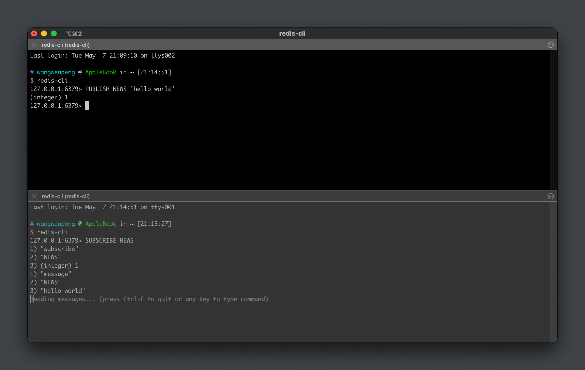
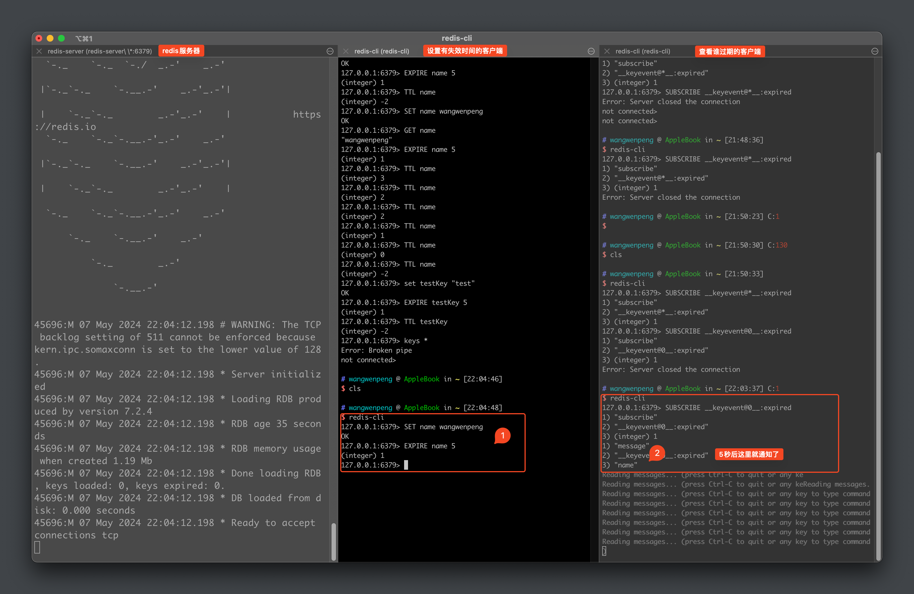
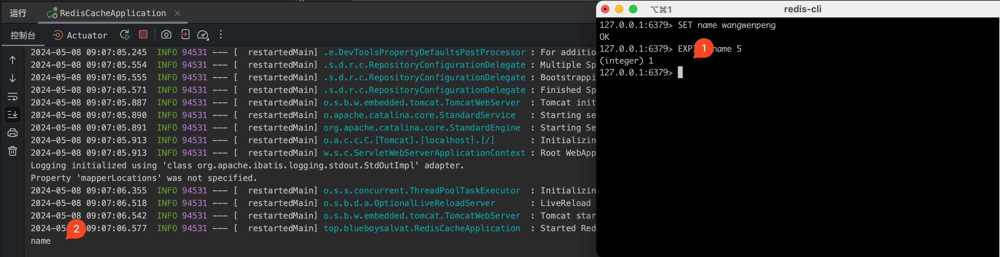

## 过期问题
解决方式：
- 定时任务：使用 Java 代码定时去扫描数据库，查询到的失效数据则删除

- 消息通知：通知服务器它知道哪些订单即将过期，并且会将过期的订单的订单 ID 通知给我们的 Java 代码，然后我们的 Java 代码再去数据库查询，设置失效状态。

### 前置知识：订阅/发布模式
#### 订阅发布的简单入门
就像是公众号和订阅者一样，公众号发了消息了，订阅者就能收到信息



#### Redis 过期监听(命令行)

##### 更改 redis 的配置文件
本人使用的是 macos 下的 homebrew 安装的，我的配置文件在 `/opt/homebrew/etc` 下，打开过期监听

```conf
##  The "notify-keyspace-events" takes as argument a string that is composed
##  of zero or multiple characters. The empty string means that notifications
##  are disabled.
##
##  Example: to enable list and generic events, from the point of view of the
##           event name, use:
##
##  notify-keyspace-events Elg
##
##  Example 2: to get the stream of the expired keys subscribing to channel
##             name __keyevent@0__:expired use:
##
##  notify-keyspace-events Ex
##
##  By default all notifications are disabled because most users don't need
##  this feature and the feature has some overhead. Note that if you don't
##  specify at least one of K or E, no events will be delivered.
##  notify-keyspace-events ""
notify-keyspace-events Ex

################################ ADVANCED CONFIG ###############################
```
##### 重启 redis 服务器
>注意：这里是要重启服务器，而不是使用 ctrl+c 退出服务器命令行....我在这里硬是卡了半个小时才解决

- `ctrl+c` 退出服务网的命令界面
- `brew services restart redis`

##### 测试
- 启动 redis-server
- 在客户端 监听 0 号数据库的过期信息 `SUBSCRIBE __keyevent@0__ :expired` 或者监听 `SUBSCRIBE __keyevent@*__ :expired`
- 在另一个客户端设置有失效时间的 key-value


### 超时订单取消
>处理思路：用户下单时，将下单信息保存到 redis 服务器中，并且设置超时时间，当这条数据失效时，会发送一条消息通知，Java 代码端可以接受到这条消息，然后作出响应处理。


package top.blueboysalvat.config;
```java
/**
 * @author wangwenpeng
 * 配置配置Redis消息监听容器
 */
@Configuration
public class RedisListenerConfig {

    @Bean
    RedisMessageListenerContainer container(RedisConnectionFactory connectionFactory) {

        //创建一个消息监听容器
        RedisMessageListenerContainer container = new RedisMessageListenerContainer();
        //让消息监听容器知道如何链接容器
        container.setConnectionFactory(connectionFactory);
        return container;
    }
}
```

package top.blueboysalvat.config;
```java
/**
 * 定义监听器 RedisKeyExpirationListener，实现KeyExpirationEventMessageListener，
 * 查看源码发现，该父类监听所有 db 的过期事件 __keyevent@*__:expired".
 *
 * @author wangwenpeng
 */
@Component
public class RedisKeyExpirationListener extends KeyExpirationEventMessageListener {

    //传入一个消息监听容器，构造RedisKeyExpirationListener对象
    public RedisKeyExpirationListener(RedisMessageListenerContainer listenerContainer) {
        super(listenerContainer);
    }

    /**
     * onMessage是一个回调方法，在收到键过期事件消息时被调用
     * 可以针对 redis 数据失效事件，进行数据处理
     */
    @Override
    public void onMessage(Message message, byte[] pattern) {

        // 获取到失效的 key，进行取消订单业务处理
        String expiredKey = message.toString();
        System.out.println(expiredKey);
    }
}
```

启动运行类 `RedisCacheApplication`





一个具体的实现的例子：

```java
package top.blueboysalvat.applemall.front.listener;

/**
 * 定义监听器 RedisKeyExpirationListener，实现KeyExpirationEventMessageListener，
 * 查看源码发现，该父类监听所有 db 的过期事件 __keyevent@*__:expired".
 *
 * @author wangwenpeng
 */
@Component
public class RedisKeyExpirationListener extends KeyExpirationEventMessageListener {

    @Autowired
    private OrderMapper orderMapper;

    //传入一个消息监听容器，构造RedisKeyExpirationListener对象
    public RedisKeyExpirationListener(RedisMessageListenerContainer listenerContainer) {
        super(listenerContainer);
    }

    /**
     * onMessage是一个回调方法，在收到键过期事件消息时被调用
     * 可以针对 redis 数据失效事件，进行数据处理
     */
    @Override
    public void onMessage(Message message, byte[] pattern) {

        // 获取到失效的 key，进行取消订单业务处理
        String expiredKey = message.toString();
        if (expiredKey.startsWith("order")) {
            String id = expiredKey.split(":")[1];

            //修改订单状态为删除(状态ID为7)
            Order order = new Order();
            order.setId(id);
            order.setStatus(7);
            orderMapper.update(order);
        }
    }
}
```

```java
package top.blueboysalvat.applemall.common.service.impl;

/**
 * @author wangwenpeng
 */
@Service
public class OrderServiceImpl implements OrderService {
    @Autowired
    private OrderMapper orderMapper;
    @Autowired
    private OrderDetailMapper orderDetailMapper;
    @Autowired
    private AddrMapper addrMapper;
    @Autowired
    private CartMapper cartMapper;
    @Autowired
    private GoodsMapper goodsMapper;
    @Autowired
    UserMapper userMapper;

    @Autowired
    private RedisTemplate<String, String> redisTemplate;


    //添加订单与订单详情 - 事务
    //order 中携带 用户ID、地址ID
    //cartIds 中是从购物车中选中的购物信息ID
    @Transactional(rollbackFor = MsgPromptException.class)
    @Override
    public void add(Order order, Integer[] cartIds) throws MsgPromptException {
        //生成订单ID
        String orderId = IdUtil.getSnowflakeNextIdStr();
        order.setId(orderId);
        //验证地址是否属于当前用户
        //根据传入的地址ID查询出该地址中的相关信息
        Addr addr = addrMapper.selectById(order.getAddrId());
        if (addr == null) {
            throw new MsgPromptException("该地址不存在，请重新选择！");
        }
        if (addr.getUserId() != (order.getUserId())) {
            throw new MsgPromptException("所选地址不属于当前用户，请重新选择！");
        }
        //保存order到数据库中
        orderMapper.insert(order);
        //根据cartIds查询购物车信息
        List<Cart> cartList = cartMapper.selectByIds(cartIds, order.getUserId());
        /*
        * 判断所选购物信息是否合法(cartId在数据库中是否有相关对应)
        * 若传入cartId都是合法的，则应该传入几个就应该在数据库中查出几条
        * */
        if (cartIds.length != cartList.size()) {
            throw new MsgPromptException("所选购物信息非法，请重新下单！");
        }
        ArrayList<OrderDetail> orderDetailArrayList = new ArrayList<>();
        for (Cart cart : cartList) {
            //验证购物车是否属于当前用户
            if (cart.getUserId() != order.getUserId()) {
                throw new MsgPromptException("购物信息中有不是当前用户的购物信息，请重新下单！");
            }
            //验证商品状态
            if (cart.getGood().getStatus() == 0) {
                throw new MsgPromptException("商品【" + cart.getGood().getName() + "】已下架，请确认后重新下单！");
            }
            //验证库存
            if (cart.getGood().getCount() < cart.getCount()) {
                throw new MsgPromptException("商品【" + cart.getGood().getName() + "】库存不足，请确认后重新下单！");
            }
            //修改商品库存
            Goods good = new Goods();
            good.setId(cart.getGood().getId());
            good.setCount(cart.getGood().getCount() - cart.getCount());
            goodsMapper.update(good);
            //创建订单详情
            OrderDetail orderDetail = new OrderDetail();
            orderDetail.setOrderId(orderId);
            orderDetail.setCount(cart.getCount());
            orderDetail.setPrice(cart.getGood().getPrice());
            orderDetail.setGoodsId(cart.getGoodsId());
            orderDetail.setGoodsVersion(cart.getGood().getVersion());
            orderDetailArrayList.add(orderDetail);
        }
        //新增订单详情
        orderDetailMapper.insert(orderDetailArrayList);
        //删除购物车
        for (Integer cartId : cartIds) {
            cartMapper.delete(cartId);
        }

        redisTemplate.opsForValue().set("order:" + orderId,orderId,1, TimeUnit.MINUTES);
    }
}

```

