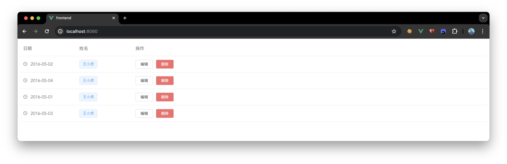
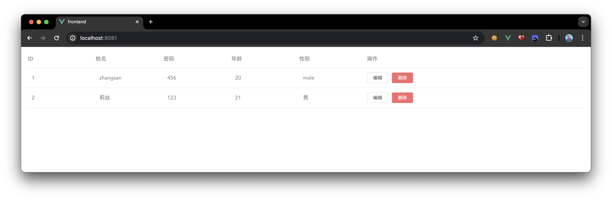
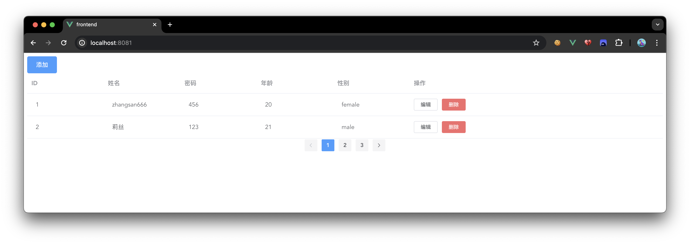

相关链接：
- ElementUI 官网： [Element - 网站快速成型工具](https://element.eleme.cn/#/zh-CN)
- Axios 中文网：[Axios中文文档 | Axios中文网](https://www.axios-http.cn/)
## 快速开始
### 安装
`npm i element-ui -S`
### 全局配置
`main.js`
```javascript
import Vue from 'vue';
import App from './App.vue';
import router from './router';
import store from './store';
// 引入Element组件
import ElementUI from 'element-ui';
// 引入elementUI的css
import 'element-ui/lib/theme-chalk/index.css';

/*
* 调用Vue.use(ElementUI)
* 作用是:
* 执行ElementUI插件内的install方法
* 注册ElementUI提供的全局组件、指令等
* */
Vue.use(ElementUI);


Vue.config.productionTip = false

new Vue({
  router,
  store,
  render: h => h(App)
}).$mount('#app')

```
### 编写页面组件
```vue
<template>
  <el-table
      :data="tableData"
      style="width: 100%">
    <el-table-column
        label="日期"
        width="180">
      <template slot-scope="scope">
        <i class="el-icon-time"></i>
        <span style="margin-left: 10px">{{ scope.row.date }}</span>
      </template>
    </el-table-column>
    <el-table-column
        label="姓名"
        width="180">
      <template slot-scope="scope">
        <el-popover trigger="hover" placement="top">
          <p>姓名: {{ scope.row.name }}</p>
          <p>住址: {{ scope.row.address }}</p>
          <div slot="reference" class="name-wrapper">
            <el-tag size="medium">{{ scope.row.name }}</el-tag>
          </div>
        </el-popover>
      </template>
    </el-table-column>
    <el-table-column label="操作">
      <template slot-scope="scope">
        <el-button
            size="mini"
            @click="handleEdit(scope.$index, scope.row)">编辑</el-button>
        <el-button
            size="mini"
            type="danger"
            @click="handleDelete(scope.$index, scope.row)">删除</el-button>
      </template>
    </el-table-column>
  </el-table>
</template>

<script>
export default {
  // 给当前Vue组件设置一个名称
  name: "UserList",
  // 给Vue中的data 属性设置值
  data() {
    return {
      tableData: [{
        date: '2016-05-02',
        name: '王小虎',
        address: '上海市普陀区金沙江路 1518 弄'
      }, {
        date: '2016-05-04',
        name: '王小虎',
        address: '上海市普陀区金沙江路 1517 弄'
      }, {
        date: '2016-05-01',
        name: '王小虎',
        address: '上海市普陀区金沙江路 1519 弄'
      }, {
        date: '2016-05-03',
        name: '王小虎',
        address: '上海市普陀区金沙江路 1516 弄'
      }]
    }
  },
  methods: {
    handleEdit(index, row) {
      console.log(index, row);
    },
    handleDelete(index, row) {
      console.log(index, row);
    }
  }
}
</script>

<style scoped>

</style>
```

### 配置路由
```js
import Vue from 'vue'
import VueRouter from 'vue-router'
import UserList from "@/views/UserList.vue";


Vue.use(VueRouter)

const routes = [
  // 配置页面组件UserList的路由
  {
    path: '/',
    name: 'UserList',
    component: UserList
  },
]

const router = new VueRouter({
  mode: 'history',
  base: process.env.BASE_URL,
  routes
})

export default router

```
### 访问页面

### 定制页面
#### Axiox
##### 安装
npm install axios
##### 配置
```js
import Vue from 'vue';
import App from './App.vue';
import router from './router';
import store from './store';
// 引入Element组件
import ElementUI from 'element-ui';
// 引入elementUI的css
import 'element-ui/lib/theme-chalk/index.css';
// 引入Axios组件
import axios from "axios";

/*
* 调用Vue.use(ElementUI)
* 作用是:
* 执行ElementUI插件内的install方法
* 注册ElementUI提供的全局组件、指令等
* */
Vue.use(ElementUI);

/*
* 自定义一个Vue实例属性
* 现在可以使用this.$axios使用了
* */
Vue.prototype.$axios = axios;


Vue.config.productionTip = false

new Vue({
  router,
  store,
  render: h => h(App)
}).$mount('#app')

```
##### 调用 Axios
```vue
<template>
  <el-table
      :data="pageInfo"
      style="width: 100%">
    <el-table-column
        label="ID"
        width="180">
      <template slot-scope="scope">
        <span style="margin-left: 10px">{{ scope.row.id }}</span>
      </template>
    </el-table-column>
    <el-table-column
        label="姓名"
        width="180">
      <template slot-scope="scope">
        <span style="margin-left: 10px">{{ scope.row.username }}</span>
      </template>
    </el-table-column>
    <el-table-column
        label="密码"
        width="180">
      <template slot-scope="scope">
        <span style="margin-left: 10px">{{ scope.row.password }}</span>
      </template>
    </el-table-column>
    <el-table-column
        label="年龄"
        width="180">
      <template slot-scope="scope">
        <span style="margin-left: 10px">{{ scope.row.age }}</span>
      </template>
    </el-table-column>
    <el-table-column
        label="性别"
        width="180">
      <template slot-scope="scope">
        <span style="margin-left: 10px">{{ scope.row.gender }}</span>
      </template>
    </el-table-column>
    <el-table-column label="操作">
      <template slot-scope="scope">
        <el-button
            size="mini"
            @click="handleEdit(scope.$index, scope.row)">编辑
        </el-button>
        <el-button
            size="mini"
            type="danger"
            @click="handleDelete(scope.$index, scope.row)">删除
        </el-button>
      </template>
    </el-table-column>
  </el-table>
</template>

<script>
export default {
  // 给当前Vue组件设置一个名称
  name: "UserList",
  // 给Vue中的data 属性设置值
  data() {
    return {
      pageInfo: [],

    };
  },
  methods: {
    //分页查询
    getByPage(pageNum) {
      this.$axios.get(`http://localhost:8080/user/page/${pageNum}`)
          .then(resp => {
            this.pageInfo = resp.data.data.list;
          });
    },
    handleEdit(index, row) {
      console.log(index, row);
    },
    handleDelete(index, row) {
      console.log(index, row);
    }
  },
  created() {
    this.getByPage(1);
  }
}
</script>

<style scoped>

</style>
```

效果：

#### 完善页面
```vue
<template>
  <div>
    <!-- 添加按钮 -->
    <el-button type="primary" style="float: left;" @click="addDialogShow = true;">添加</el-button>
    <!-- 展示表格开始 -->
    <el-table
        :data="pageInfo.list"
        style="width: 100%">
      <el-table-column
          label="ID"
          width="180">
        <template slot-scope="scope">
          <span style="margin-left: 10px">{{ scope.row.id }}</span>
        </template>
      </el-table-column>
      <el-table-column
          label="姓名"
          width="180">
        <template slot-scope="scope">
          <span style="margin-left: 10px">{{ scope.row.username }}</span>
        </template>
      </el-table-column>
      <el-table-column
          label="密码"
          width="180">
        <template slot-scope="scope">
          <span style="margin-left: 10px">{{ scope.row.password }}</span>
        </template>
      </el-table-column>
      <el-table-column
          label="年龄"
          width="180">
        <template slot-scope="scope">
          <span style="margin-left: 10px">{{ scope.row.age }}</span>
        </template>
      </el-table-column>
      <el-table-column
          label="性别"
          width="180">
        <template slot-scope="scope">
          <span style="margin-left: 10px">{{ scope.row.gender }}</span>
        </template>
      </el-table-column>
      <el-table-column label="操作">
        <template slot-scope="scope">
          <el-button
              size="mini"
              @click="getById(scope.row.id)">编辑
          </el-button>
          <el-button
              size="mini"
              type="danger"
              @click="handleDelete(scope.row.id)">删除
          </el-button>
        </template>
      </el-table-column>
    </el-table>
    <!-- 展示表格结束 -->
    <!-- 分页导航开始 -->
    <!--
     @current-change 切换页面时的监听事件
     :current-page 当前页是哪个，这样可以有对应的当前页高亮背景色
     :page-size 每页显示多少条
     :total 一共有多少条数据
     -->
    <el-pagination
        background
        layout="prev, pager, next"
        @current-change="getByPage"
        :current-page="pageInfo.pageNum"
        :page-size="pageInfo.pageSize"
        :total="pageInfo.total">
    </el-pagination>
    <!-- 分页导航结束 -->


    <!-- 添加学生的对话框开始 -->
    <el-dialog title="添加用户" width="30%" :visible.sync="addDialogShow">
      <el-form>
        <el-form-item label="姓名">
          <el-input v-model="userAdd.username" autocomplete="off"></el-input>
        </el-form-item>
        <el-form-item label="密码">
          <el-input v-model="userAdd.password" autocomplete="off"></el-input>
        </el-form-item>
        <el-form-item label="年龄">
          <el-input v-model="userAdd.age" autocomplete="off"></el-input>
        </el-form-item>
        <el-form-item label="性别">
          <el-radio-group v-model="userAdd.gender">
            <el-radio label="male"></el-radio>
            <el-radio label="female"></el-radio>
          </el-radio-group>
        </el-form-item>
      </el-form>
      <div slot="footer" class="dialog-footer">
        <el-button @click="addDialogShow = false">取 消</el-button>
        <el-button type="primary" @click="handleAdd()">确 定</el-button>
      </div>
    </el-dialog>
    <!-- 添加学生的对话框结束 -->
    <!-- 修改学生的对话框开始 -->
    <el-dialog title="修改用户" width="30%" :visible.sync="updDialogShow">
      <el-form>
        <el-form-item label="姓名">
          <el-input v-model="userUpdate.username" autocomplete="off"></el-input>
        </el-form-item>
        <el-form-item label="密码">
          <el-input v-model="userUpdate.password" autocomplete="off"></el-input>
        </el-form-item>
        <el-form-item label="年龄">
          <el-input v-model="userUpdate.age" autocomplete="off"></el-input>
        </el-form-item>
        <el-form-item label="性别">
          <el-radio-group v-model="userUpdate.gender">
            <el-radio label="male"></el-radio>
            <el-radio label="female"></el-radio>
          </el-radio-group>
        </el-form-item>
      </el-form>
      <div slot="footer" class="dialog-footer">
        <el-button @click="addDialogShow = false">取 消</el-button>
        <el-button type="primary" @click="handleEdit()">确 定</el-button>
      </div>
    </el-dialog>
    <!-- 修改学生的对话框结束 -->
  </div>
</template>

<script>
export default {
  // 给当前Vue组件设置一个名称
  name: "UserList",
  // 给Vue中的data 属性设置值
  data() {
    return {
      // 添加对话框的展示标志位
      addDialogShow: false,
      // 修改对话框的展示标志位
      updDialogShow: false,
      // 分页信息
      pageInfo: {},
      // 用于存储添加信息的对象
      userAdd: {
        username: '',
        password: '',
        age: '',
        gender: ''
      },
      // 用于存储修改信息的对象
      userUpdate: {
        id: 0,
        username: '',
        password: '',
        age: '',
        gender: ''
      }
    };
  },
  methods: {
    //  分页查询
    getByPage(pageNum) {
      this.$axios.get(`http://localhost:8080/user/page/${pageNum}`)
          .then(resp => {
            this.pageInfo = resp.data.data;
          });
    },
    // 根据ID查询
    getById(id) {
      this.$axios.get(`http://localhost:8080/user/${id}`)
          .then(resp => {
            let _data = resp.data;
            if(_data.code === 10000) {
              this.userUpdate = _data.data;
              this.updDialogShow = true;
            }
          })
    },
    // 添加方法
    handleAdd() {
      this.$axios.post("http://localhost:8080/user", this.userAdd)
          .then(resp => {
            let _data = resp.data;
            if(_data.code === 10000) {
              //弹出提示信息
              this.$message({
                message: _data.msg,
                type: 'success'
              });
              //隐藏对话框
              this.addDialogShow = false;
              //清空对话框信息
              this.userAdd = {
                username: '',
                password: '',
                age: '',
                gender: ''
              }
              //刷新表格
              this.getByPage(1);
            }
          })
    },
    // 删除方法
    handleEdit() {
      this.$axios.put("http://localhost:8080/user", this.userUpdate)
          .then(resp => {
            let _data = resp.data;
            if(_data.code === 10000) {
              //弹出提示信息
              this.$message({
                message: _data.msg,
                type: 'success'
              });
              //隐藏对话框
              this.updDialogShow = false;
              //刷新表格
              this.getByPage(1);
            }
          })
    },
    // 删除方法
    handleDelete(id) {
      this.$axios.delete(`http://localhost:8080/user/${id}`)
          .then(resp => {
            let _data = resp.data;
            if(_data.code === 10000) {
              //弹出提示信息
              this.$message({
                message: _data.msg,
                type: 'success'
              });
              //刷新表格
              this.getByPage(1);
            }
          })
    }
  },
  // Vue实例创建后
  created() {
    // 执行分页查询
    this.getByPage(1);
  }
}
</script>

<style scoped>

</style>
```
最终效果：



