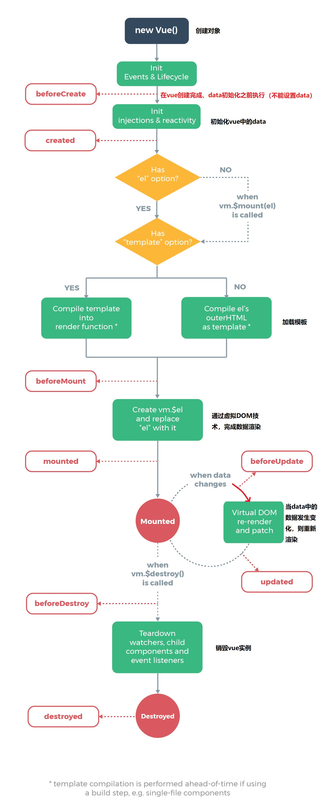
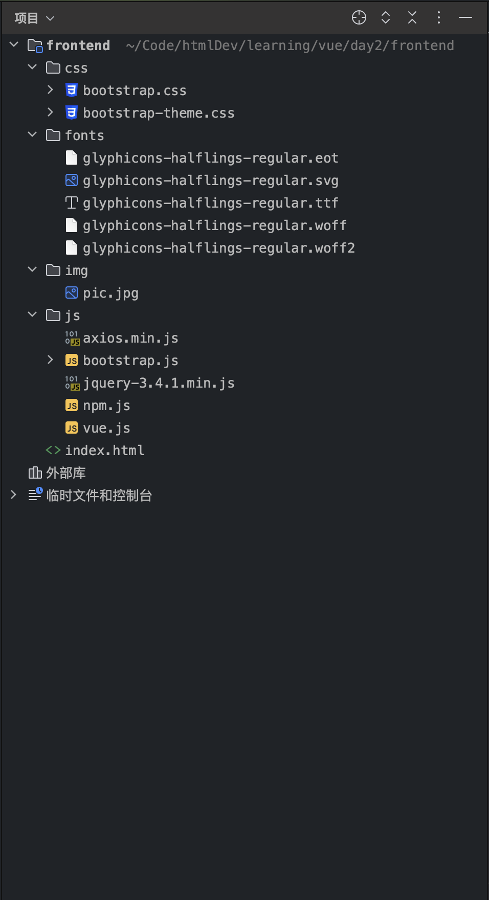
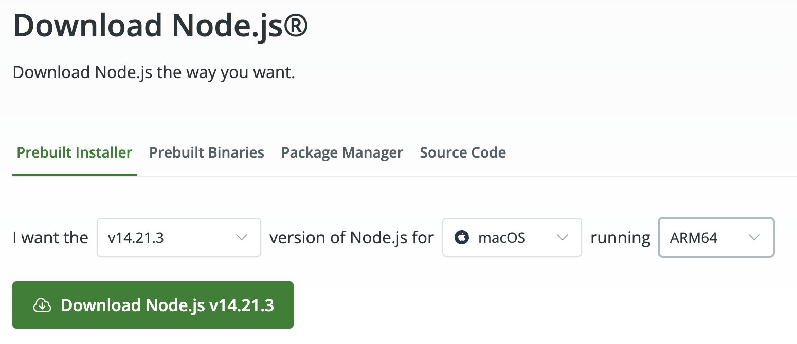
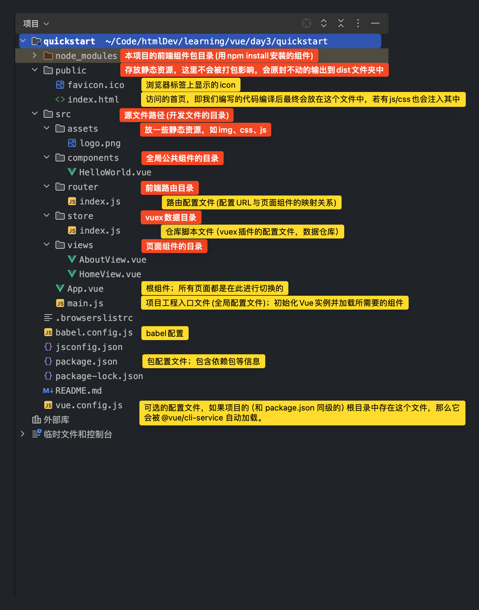
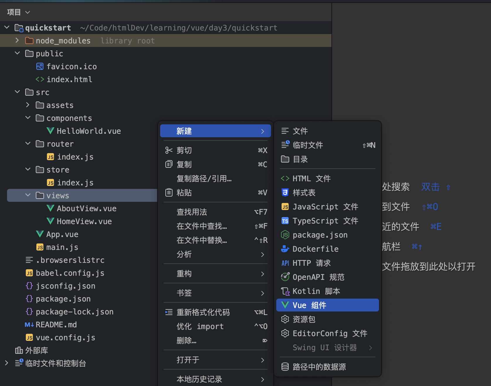
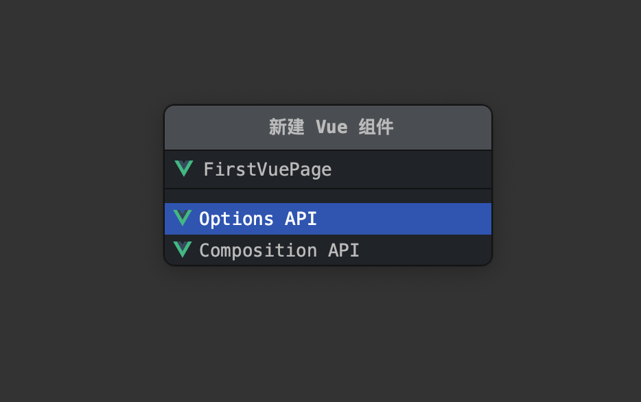
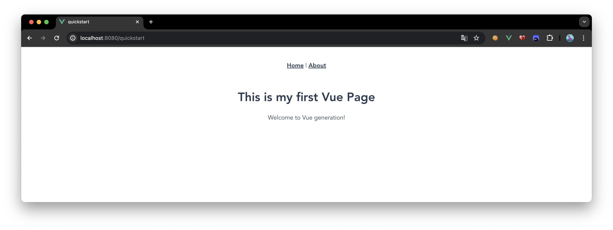
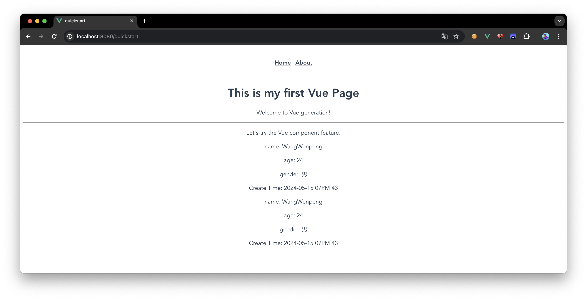

## 简介


## 前置知识
学习一下 ECMAScript 6，ECMAScript 6.0（以下简称 ES6）是 JavaScript 语言的下一代标准，已经在 2015 年 6 月正式发布了。它的目标，是使得 JavaScript 语言可以用来编写复杂的大型应用程序，成为企业级开发语言。

简单理解为 javascript 的新特性

### 解构赋值

```html
<!DOCTYPE html>
<html lang="en">
<head>
    <meta charset="UTF-8">
    <title>解构赋值</title>
</head>
<body>

</body>
<script>
    <!-- 解构赋值 -->
    let stu = {
        name: 'wangwenpeng',
        age: 24,
        gender: 'boy',
        addr: 'shandong'
    }
    //按照 name , gender 在 stu 中解构出来相关值，进行赋值
    let {name, gender} = stu;
    console.log(name, gender)
</script>
</html>
```

### 模版字符串
```html
<!DOCTYPE html>
<html lang="en">
<head>
    <meta charset="UTF-8">
    <title>模版字符串</title>
</head>
<body>

</body>
<script>
  let name = 'wangwenpeng';
  let age = 24;
  let info = `my name is ${name}, next year my age is ${age + 1}`;
  console.log('wangwenpengInfo', info);

  let printCoding = function () {
    return 'Coding';
  };
  let loveCoding = `wangwenpeng love ${printCoding()}`;
  console.log(loveCoding);
</script>
</html>
```

### 简写
```html
<!DOCTYPE html>
<html lang="en">
<head>
    <meta charset="UTF-8">
    <title>简写</title>
</head>
<body>

</body>
<script>
  let name = 'wangwenpeng'
  let age = 24;

  let stu1 = {
    name: name,
    age: age,
    sayHi: function() {
      return "stu1 hello";
    },
  }
  console.log(stu1);
  console.log(stu1.sayHi());

  let stu2 = {
    name,
    age,
    sayHi() {
      return "stu2 hello";
    },
  }
  console.log(stu2);
  console.log(stu2.sayHi());
</script>
</html>
```

### 对象扩展运算符(复制/合并对象)
```html
<!DOCTYPE html>
<html lang="en">
<head>
    <meta charset="UTF-8">
    <title>对象拓展运算符</title>
</head>
<body>

<script>
  // 1、拷贝对象
  let person1 = {name: "Amy", age: 15}
  let someone = { ...person1 }
  console.log(someone)  //{name: "Amy", age: 15}

  // 2、合并对象
  let age = {age: 15}
  let name = {name: "Amy"}
  let person2 = {...age, ...name}
  console.log(person2)  //{age: 15, name: "Amy"}
</script>
</body>
</html>
```

### 箭头函数
```html
<!DOCTYPE html>
<html lang="en">
<head>
    <meta charset="UTF-8">
    <title>箭头函数</title>
</head>
<body>
<script>
    //传统的函数写法
    let f1 = function(a){
        return a * a;
    }
    console.log(f1(5))

    //使用箭头函数的写法
    let f2 = a => a * a;
    console.log(f2(6))

    /*
    * 箭头函数的使用规则：
    * 参数列表：
    * 当箭头函数职业一个参数时，参数列表的()可以省略
    * 当箭头函数没有参数或者有多个参数时，参数列表要用 () 括起来。
    *
    * 方法体：
    * 当箭头函数函数体有多行语句，用 {} 包裹起来，表示代码块，
    * 当只有一行语句，并且需要返回结果时，可以省略 {} , 结果会自动返回。
    * */

    let f3 = (a,b) => {
        let result = a+b
        return result
    }
    console.log(f3(6,2))  // 8
    // f3代码的简略写法：
    let f4 = (a, b) => a + b;

    //定义函数
    function test1(a, f) {
        return f(a);
    }

    //使用箭头函数
    let r = test1(10, a => {
        return a * a;
    });

    //let r = test1(10, function (a) {
    //    return a * a;
    //})
    console.log(r);

    //使用箭头函数
    let r1 = test1(11, a => {
        return a + 100;
    });

    //let r1 = test1(11, function (a){
    //    return a + 100;
    //});
    console.log(r1);
</script>
</body>
</html>
```

## 快速开始
```html
<!DOCTYPE html>  
<html lang="en">  
<head>  
    <meta charset="UTF-8">  
    <title>快速开始</title>  
</head>  
<body>  
  
<div id="app">  
    {{message}}  
    <div>{{stu.name}}</div>  
    <div>{{stu.age}}</div>  
    <div>{{stu.gender}}</div>  
</div>  
  
<script src="js/vue.js"></script>  
<script>  
    new Vue({  
        el: '#app',  
        data: {  
            message: 'hello Vue',  
            stu: {  
                name: 'wangwenpeng',  
                age: 24,  
                gender: '男'  
            }  
        }  
    });  
</script>  
</body>  
</html>
```

## 绑定
```html
<!DOCTYPE html>  
<html lang="en">  
<head>  
    <meta charset="UTF-8">  
    <title>bind指令</title>  
</head>  
<body>  
  
<div id="app">  
    <a v-bind:href="href" :title="title">{{text}}</a>  
    <span>可以使用完成语法，也可以省略v-bind。</span>  
</div>  
  
<script src="js/vue.js"></script>  
<script>  
    new Vue({  
        el: '#app',  
        data: {  
            text: 'Google',  
            href: 'https://google.com',  
            title: 'goooooogle',  
        }  
    });  
</script>  
</body>  
</html>
```

## 双向绑定
```html
<!DOCTYPE html>
<html lang="en">
<head>
    <meta charset="UTF-8">
    <title>双向绑定</title>
</head>
<body>
<div id="app">

    <h1>{{text}}</h1>


    <input type="text" v-model="text">
    <span></span>
</div>

<script src="js/vue.js"></script>
<script>
    new Vue({
        el: '#app',
        data: {
            text: 'Google',
        }
    });
</script>
</body>
</html>
```

## 渲染 html
```html
<!DOCTYPE html>
<html lang="en">
<head>
    <meta charset="UTF-8">
    <title>渲染html</title>
</head>
<body>
<div id="app">

    <h1 v-html="text"></h1>

</div>

<script src="js/vue.js"></script>
<script>
    new Vue({
        el: '#app',
        data: {
            text: '<h1>Google</h1>',
        }
    });
</script>
</body>
</html>
```

## 分支
```html

<!DOCTYPE html>
<html lang="en">
<head>
    <meta charset="UTF-8">
    <title>if 和 show指令</title>
</head>
<body>
<div id="app">

    <div v-if="gender1 === 1">男</div>
    <div v-if="gender1 === 0">女</div>
    <hr>
    <div v-if="gender1 === 1">男</div>
    <div v-else-if="gender1 === 0">女</div>
    <hr>
    <div v-if="gender2 === 1">男</div>
    <div v-else-if="gender2 === 0">女</div>
    <div v-else>性别不详</div>

    <h1>-----------------------------</h1>

    <div v-show="gender1 === 1">男</div>
    <div v-show="gender1 === 0">女</div>

</div>

<script src="js/vue.js"></script>
<script>
    new Vue({
        el: '#app',
        data: {
            gender1: 1,
            gender2: '',
        }
    });
</script>
</body>
</html>
```

## 循环
```html
<!DOCTYPE html>
<html lang="en">
<head>
  <meta charset="UTF-8">
  <title>循环</title>
</head>
<body>
<div id="app">
  <ul>
    <li v-for="item in subject">{{item}}</li>
  </ul>
  <table>
    <tr>
      <th>姓名</th>
      <th>年龄</th>
      <th>性别</th>
    </tr>
    <tr v-for="stu in students">
      <td>{{stu.name}}</td>
      <td>{{stu.age}}</td>
      <td v-if="stu.gender === 'M'">男</td>
      <td v-else-if="stu.gender === 'E'">女</td>
      <td v-else>性别不详</td>
    </tr>
  </table>
</div>

<script src="js/vue.js"></script>
<script>
  new Vue({
    el: '#app',
    data: {
      subject: ['JavaSE', 'MySQL', '前端', 'JavaWeb'],
      students: [
        { name: 'zs1', age: 10, gender: 'M' },
        { name: 'zs2', age: 11, gender: 'E' },
        { name: 'zs3', age: 12, gender: '' },
        { name: 'zs4', age: 13, gender: 'E' },
        { name: 'zs5', age: 14, gender: 'M' }
      ]
    }
  });
</script>
</body>
</html>
```

## 练习 1
```html
<!DOCTYPE html>
<html lang="en">
<head>
  <meta charset="UTF-8">
  <title>非空校验</title>
</head>
<body>
<div id="app">
  <div>
    账号
    <input type="text" @blur="username()" @focus="clearMsg()" v-model="val"/>
    <br>
    密码
    <input type="text" @blur="password()" @focus="clearMsg()" v-model="val"/>
    <br>
    <input type="button" value="登录">
    <span>{{errMsg}}</span>
  </div>
</div>
<script src="js/vue.js"></script>
<script>
  new Vue({
    el:'#app',
    data:{
      val: '',
      errMsg: ''
    },
    methods :{
      username() {
        if(this.val === ''){
          this.errMsg='账号不能为空';
        }
      },
      password() {
        if(this.val ===''){
          this.errMsg='密码不能为空';
        }
      },
      clearMsg(){
        this.errMsg = '';
      },
    }
  })
</script>
</body>
</html>
```

## 事件处理

### 使用 JS 函数传值
```html
<!DOCTYPE html>
<html lang="en">
<head>
  <meta charset="UTF-8">
  <title>函数传参</title>
</head>
<body>
<div id="app">
  <!-- 方式1 -->
  <button v-on:click="doSth(stu.id)">click</button>
  <!-- 方式2: -->
  <button @click="doSth(stu.name)">click</button>
</div>

<script src="js/vue.js"></script>
<script>
  new Vue({
    el: "#app",
    data: {
      stu: {
        id: 10,
        name: 'zs'
      }
    },
    methods: {
      doSth(info) {
        console.log(info);
      }
    }
  })
</script>
</body>
</html>
```
### 事件修饰符
#### 阻止表单提交
```html
<!DOCTYPE html>
<html lang="en">
<head>
  <meta charset="UTF-8">
  <title>事件修饰符1_阻止表单提交</title>
</head>
<body>
<div id="app">
  <!-- 阻止表单提交，并且执行test方法 -->
  <form action="https://www.baidu.com" method="post" @submit.prevent="test()">
    <button type="submit">提交</button>
  </form>
</div>

<script src="js/vue.js"></script>
<script>
  new Vue({
    el: "#app",
    data: {
    },
    methods: {
      test() {
        console.log("---------------------------------------")
      }
    }
  })
</script>
</body>
</html>
```
#### 冒泡
```html
<!DOCTYPE html>
<html lang="en">
<head>
  <meta charset="UTF-8">
  <title>事件修饰符_冒泡2</title>
</head>
<body>

<div id="app">
  <div style="width: 200px; height: 200px; background: red;" @click.self="method1">
    <div style="width: 150px; height: 150px; background: green;" @click="method2">
      <button type="button" @click.stop="method3">测试</button>
    </div>
  </div>
</div>

<script src="js/vue.js"></script>
<script type="text/javascript">
  let vm = new Vue({
    el:"#app",
    data:{},
    methods:{
      method1() {
        alert("1");
      },
      method2() {
        alert("2");
      },
      method3() {
        alert("3");
      }
    }
  });
</script>
</body>
</html>
```
#### 按键修饰符
```html
<!DOCTYPE html>
<html lang="en">
<head>
  <meta charset="UTF-8">
  <title>事件修饰符3_按键修饰符</title>
</head>
<body>

<div id="container">
  <!--2.使用自定义的按键别名aaa作为修饰符-->
  <input type="text" @keyup.aaa="method4"/>
</div>

<script src="js/vue.js"></script>
<script type="text/javascript">
  //键盘码查阅表：https://developer.mozilla.org/en-US/docs/Web/API/KeyboardEvent/keyCode
  //1.为按键J定于别名为  aaa
  Vue.config.keyCodes.aaa =74;

  let vm = new Vue({
    el:"#container",
    data:{},
    methods:{
      method4:function(){
        alert("你刚刚触发了J！");
      }
    }
  });
</script>
</body>
</html>
```
#### 系统修饰符
```html
<!DOCTYPE html>
<html lang="en">
<head>
  <meta charset="UTF-8">
  <title>事件修饰符3_系统修饰符(组合键)</title>
</head>
<body>

<div id="container">
  <input type="text" @keyup.ctrl.j="method4"/>
</div>

<script src="js/vue.js"></script>
<script type="text/javascript">
  Vue.config.keyCodes.j =74;

  var vm = new Vue({
    el:"#container",
    data:{},
    methods:{
      method4:function(){
        alert("你刚刚触发了ctrl + j!");
      }
    }
  });
</script>
</body>
</html>
```
#### 计算属性
```html
<!DOCTYPE html>
<html>
<head>
  <meta charset="UTF-8">
  <title>计算属性</title>
</head>
<body>
<div id="container">
  <!-- 为str1和str2进行了属性双向绑定，当在表单中更改时data中的str1/2同步更改，并且会影响计算属性的值 -->
  <input type="text" v-model="str1"/><br/>
  <input type="text" v-model="str2"/><br/>
  {{str3}}
</div>

<script type="text/javascript" src="js/vue.js" ></script>
<script type="text/javascript">
  let vm = new Vue({
    el:"#container",
    data:{
      str1:"山东",
      str2:"青岛"
    },
    computed:{
      str3() {
        return this.str1+this.str2;
      }
    }
  });
</script>
</body>
</html>
```
#### 绑定 class
```html
<!DOCTYPE html>
<html>
<head>
  <meta charset="utf-8" />
  <title>class绑定</title>
  <style>
    .c1 {
      border: 2px solid fuchsia;
    }

    .c2 {
      text-align: center;
    }
  </style>
</head>
<body>
<div id="app">
  <!--
      class是一个属性
      v-bind:class="data当中的某个属性"
   -->
  <p class="c1">山东青岛</p>
  <p v-bind:class="myClass1">山东青岛</p>
  <!-- class有多个值绑定 -->
  <p class="c1 c2">北京海淀</p>
  <p :class="[myClass1, myClass2]">北京海淀</p>
  <!--
      通过标志控制让哪一个class生效
      三元运算符
          条件表达式 ? 表达式1 : 表达式2
   -->
  <p :class="[flag3 ? myClass1 : myClass2]">四川成都</p>
  <!--
      通过标志控制让哪一个class生效
      如果标志为true就生效
  -->
  <p :class="{c1:flag1, c2:flag2}">河南郑州</p>

</div>
<script src="./js/vue.js"></script>
<script>
  //创建vue对象 - vue的实例
  new Vue({
    el: "#app", //表示要操作的元素
    data: { //数据
      myClass1: 'c1',
      myClass2: 'c2',
      flag1: true,
      flag2: false,
      flag3: false
    }
  })
</script>
</body>
</html>
```
## Vue 实例的生命周期


```html
<!DOCTYPE html>
<html>
	<head>
		<meta charset="utf-8">
		<title>04_vue_生命周期_钩子函数</title>
		
	</head>
	<body>
		<div id="app">
			<!-- 
				v-once 只能渲染一次
			 -->
			<p v-once>{{msg}}</p>
			<p>{{msg}}</p>
			<p><input type="text" v-model="msg"></p>
		</div>
	</body>
	
    <script src="js/vue.min.js"></script>
	<script>
		new Vue({
			el: "#app",
			data: {
				msg: "hello world"
			},
			//钩子函数
			beforeCreate:function(){
				console.log("beforeCreate")
				this.msg = "0000000000"
			},
			created:function(){
				console.log("created")
				//ajax
			},
			beforeMount:function(){
				console.log("beforeMount")
				//this.msg = 1000000
				//ajax
			},
			mounted:function(){
				console.log("mounted")
				//this.msg = 2000000000
                //ajax
			},
			beforeUpdate:function(){
				console.log("beforeUpdate", this.msg);
			},
			updated:function(){
				console.log("updated", this.msg);
			},
			beforeDestroy:function(){
				
			},
			destroyed:function(){
				
			}
		})
	</script>
</html>
```

我们经常使用 `created`、`beforeMount`、`mounted` 进行数据处理(例如发送 Ajax 请求数据并设置)。

## 传统的 Vue 开发

### 目录结构


### 后端代码准备
#### mapper/service 层
在 idea 中使用 MybatisX 插件生成代码：[mybatisPlusQuickStart](../backend/java/mybatisPlusQuickStart.md)

测试代码：


#### controller 层
>特别提醒，因为前后端现在是两个不同的项目，当两个不同的项目部署在不同的服务器上时，满足 `协议`、`地址`、`端口`  `任意不同` 的时候，则称为 `源不同`，此时会触发浏览器的同源策略，同源策略是为了安全性而设置的规则。

解决方式 1: 在 controlelr 中使用 `@CrossOrigin` 注解

详情查看： [sameSrcPolicy](../knowledge/sameSrcPolicy.md)

<font color="#00b0f0">UserController.java</font>
```java
package top.blueboysalvat.controller;

import java.util.List;

/**
 * @author wangwenpeng
 */

//开启允许跨域
@CrossOrigin
@RestController()
@RequestMapping("/user")
public class UserController {
    @Autowired
    private UserService userService;

    @GetMapping("/page/{pageNum}")
    public RespBean getAllByPage(@PathVariable("pageNum") Integer pageNum) {
        PageHelper.startPage(pageNum, 2);
        List<User> userList = userService.list();
        return RespBean.ok("查询成功", new PageInfo<>(userList));
    }

    //添加
    @PostMapping
    public RespBean save(@RequestBody User user) {
        userService.save(user);
        return RespBean.ok("添加成功");
    }

    //修改 - 根据ID修改
    @PutMapping
    public RespBean update(@RequestBody User user) {
        userService.updateById(user);
        return RespBean.ok("修改成功");
    }

    //删除 - 根据ID删除
    @DeleteMapping("/{id}")
    public RespBean remove(@PathVariable("id") Integer id) {
        userService.removeById(id);
        return RespBean.ok("删除成功");
    }

    //根据ID查询
    @GetMapping("/{id}")
    public RespBean getById(@PathVariable("id") Integer id) {
        User User = userService.getById(id);
        return RespBean.ok("查询成功", User);
    }

}

```

### 传统方式编写的前端页面
>Axios 类似 AJAX，可以在浏览器中可以帮助我们完成请求的发送

```html
<!DOCTYPE html>
<html lang="en">
<head>
    <meta charset="UTF-8">
    <title>模态框</title>
    <link rel="stylesheet" type="text/css" href="css/bootstrap.min.css" />
    <style>
        .container {
            width: 800px;
        }

        th {
            text-align: center;
        }

        .opt {
            text-align: center;
        }

        .del {
            color: red;
        }
    </style>
</head>
<body>
<div id="app">
    <!-- 添加模态框开始 -->
    <div class="modal fade" id="addModal" tabindex="-1" role="dialog" aria-labelledby="myModalLabel">
        <div class="modal-dialog" role="document">
            <div class="modal-content">
                <div class="modal-header">
                    <button type="button" class="close" data-dismiss="modal" aria-label="Close"><span aria-hidden="true">&times;</span></button>
                    <h4 class="modal-title" id="myModalLabel">添加</h4>
                </div>
                <div class="modal-body">
                    <form class="form-horizontal">
                        <div class="form-group">
                            <label for="usernameAdd" class="col-sm-2 control-label">姓名</label>
                            <div class="col-sm-10">
                                <input type="text" class="form-control" id="usernameAdd" placeholder="请输入姓名" v-model="userAdd.username" />
                            </div>
                        </div>
                        <div class="form-group">
                            <label for="passwordAdd" class="col-sm-2 control-label">密码</label>
                            <div class="col-sm-10">
                                <input type="text" class="form-control" id="passwordAdd" placeholder="请输入密码" v-model="userAdd.password" />
                            </div>
                        </div>
                        <div class="form-group">
                            <label for="ageAdd" class="col-sm-2 control-label">年龄</label>
                            <div class="col-sm-10">
                                <input type="number" class="form-control" id="ageAdd" placeholder="请输入年龄" v-model="userAdd.age" />
                            </div>
                        </div>
                        <div class="form-group">
                            <label class="col-sm-2 control-label">性别</label>
                            <div class="col-sm-10">
                                <label class="radio-inline">
                                    <input type="radio" name="genderAdd" value="男" v-model="userAdd.gender"> 男
                                </label>
                                <label class="radio-inline">
                                    <input type="radio" name="genderAdd" value="女" v-model="userAdd.gender"> 女
                                </label>
                            </div>
                        </div>
                    </form>
                </div>
                <div class="modal-footer">
                    <button type="button" class="btn btn-default" data-dismiss="modal">关闭</button>
                    <button type="button" class="btn btn-primary" @click="addUser()">确认</button>
                </div>
            </div>
        </div>
    </div>
    <!-- 添加模态框结束 -->

    <!-- 修改模态框开始 -->
    <div class="modal fade" id="updateModal" tabindex="-1" role="dialog" aria-labelledby="myModalLabel">
        <div class="modal-dialog" role="document">
            <div class="modal-content">
                <div class="modal-header">
                    <button type="button" class="close" data-dismiss="modal" aria-label="Close"><span aria-hidden="true">&times;</span></button>
                    <h4 class="modal-title">修改</h4>
                </div>
                <div class="modal-body">
                    <form class="form-horizontal">
                        <div class="form-group">
                            <label for="usernameUpd" class="col-sm-2 control-label">姓名</label>
                            <div class="col-sm-10">
                                <input type="text" class="form-control" id="usernameUpd" placeholder="请输入姓名" v-model="userUpdate.username" />
                            </div>
                        </div>
                        <div class="form-group">
                            <label for="passwordUpd" class="col-sm-2 control-label">密码</label>
                            <div class="col-sm-10">
                                <input type="text" class="form-control" id="passwordUpd" placeholder="请输入密码" v-model="userUpdate.password" />
                            </div>
                        </div>
                        <div class="form-group">
                            <label for="ageUpd" class="col-sm-2 control-label">年龄</label>
                            <div class="col-sm-10">
                                <input type="number" class="form-control" id="ageUpd" placeholder="请输入年龄" v-model="userUpdate.age" />
                            </div>
                        </div>
                        <div class="form-group">
                            <label class="col-sm-2 control-label">性别</label>
                            <div class="col-sm-10">
                                <label class="radio-inline">
                                    <input type="radio" name="genderUpd" value="男" v-model="userUpdate.gender"> 男
                                </label>
                                <label class="radio-inline">
                                    <input type="radio" name="genderUpd" value="女" v-model="userUpdate.gender"> 女
                                </label>
                            </div>
                        </div>
                    </form>
                </div>
                <div class="modal-footer">
                    <button type="button" class="btn btn-default" data-dismiss="modal">关闭</button>
                    <button type="button" class="btn btn-primary" @click="updateStudent()">确认</button>
                </div>
            </div>
        </div>
    </div>
    <!-- 修改模态框结束 -->

    <div class="container">
        <div class="row" style="margin-top: 15px;">
            <div class="col-md-12">
                <h3 class="pull-left">学生管理</h3>
                <button id="addBtn" type="button" class="btn btn-primary pull-right" @click="showAddModal()">添加</button>
            </div>
        </div>
        <div class="row">
            <div class="col-md-12">
                <table class="table table-hover table-bordered">
                    <tr>
                        <th>ID</th>
                        <th>姓名</th>
                        <th>密码</th>
                        <th>年龄</th>
                        <th>性别</th>
                        <th colspan="2">操作</th>
                    </tr>
                    <tr v-for="user in pageInfo.list">
                        <td>{{user.id}}</td>
                        <td>{{user.username}}</td>
                        <td>{{user.password}}</td>
                        <td>{{user.age}}</td>
                        <td>{{user.gender}}</td>
                        <td class="opt">
                            <a href="javascript:void(0);" @click="deleteStudent(user.id)"><span class="glyphicon glyphicon-trash del"></span></a>
                        </td>
                        <td class="opt">
                            <a href="javascript:void(0);" @click="selectById(user.id)"><span class="glyphicon glyphicon-pencil"></span></a>
                        </td>
                    </tr>
                </table>
            </div>
        </div>
        <div class="row">
            <div class="col-md-12 text-center">
                <nav aria-label="Page navigation">
                    <ul class="pagination">
                        <li :class="{disabled: !pageInfo.hasPreviousPage}">
                            <a href="javascript:void(0);" v-if="pageInfo.hasPreviousPage" aria-label="Previous" @click="selectByPage(pageInfo.pageNum - 1)"><span aria-hidden="true">&laquo;</span></a>
                            <a href="javascript:void(0);" v-else aria-label="Previous"><span aria-hidden="true">&laquo;</span></a>
                        </li>
                        <li v-for="num in pageInfo.navigatepageNums" :class="{active: num == pageInfo.pageNum}">
                            <a href="javascript:void(0);" v-if="num != pageInfo.pageNum"  @click="selectByPage(num)">{{num}}</a>
                            <a href="javascript:void(0);" v-else>{{num}}</a>
                        </li>
                        <li :class="{disabled: !pageInfo.hasNextPage}">
                            <a href="javascript:void(0);" v-if="pageInfo.hasNextPage" aria-label="Next" @click="selectByPage(pageInfo.pageNum + 1)"><span aria-hidden="true">&raquo;</span></a>
                            <a href="javascript:void(0);" v-else aria-label="Next"><span aria-hidden="true">&raquo;</span></a>
                        </li>
                    </ul>
                </nav>
            </div>
        </div>
    </div>
</div>

<script src="js/jquery-3.4.1.min.js"></script>
<script src="js/bootstrap.min.js"></script>
<script src="js/vue.js"></script>
<script src="js/axios.min.js"></script>
<script>
    new Vue({
        el: "#app",
        data: {
            pageInfo: {}, //保存分页信息的对象
            userAdd: { //保存添加学生的对象
                username: '',
                password: '',
                age: '',
                gender: '男'
            },
            userUpdate: { //保存修改学生的对象
                id: 0,
                username: '',
                password: '',
                age: '',
                gender: ''
            },
        },
        methods: {
            //分页查询
            selectByPage(pageNum) {
                axios.get(`http://localhost:8080/user/page/${pageNum}`)
                    .then(resp => {
                        console.log(resp);
                        this.pageInfo = resp.data.data;
                    });
            },
            //弹出添加模态框
            showAddModal() {
                $("#addModal").modal('show');
            },
            //添加学生
            addUser() {
                axios.post('http://localhost:8080/user', this.userAdd)
                    .then(resp => {
                        if(resp.data.code === 10000) {
                            //隐藏模态框
                            $("#addModal").modal('hide');
                            alert(resp.data.msg);
                            //清空模态框
                            this.userAdd = { //保存添加学生的对象
                                name: '',
                                password: '',
                                age: '',
                                gender: ''
                            }
                            //刷新表格
                            this.selectByPage(1);
                        }
                    })
            },
            //删除学生
            deleteStudent(id) {
                if(confirm("您确认要删除该用户吗？")) {
                    axios.delete(`http://localhost:8080/user/${id}`)
                        .then(resp => {
                            if(resp.data.code === 10000) {
                                alert(resp.data.msg);
                                //刷新表格
                                this.selectByPage(1);
                            }
                        })
                }
            },
            //根据ID查询学生信息
            selectById(id) {
                axios.get(`http://localhost:8080/user/${id}`)
                    .then(resp => {
                        this.userUpdate = resp.data.data;
                        $("#updateModal").modal('show');
                    });
            },
            updateStudent() {
                axios.put('http://localhost:8080/user', this.userUpdate)
                    .then(resp => {
                        if(resp.data.code === 10000) {
                            //隐藏模态框
                            $("#updateModal").modal('hide');
                            alert(resp.data.msg);
                            //刷新表格
                            this.selectByPage(1);
                        }
                    })
            }
        },
        created() {
            this.selectByPage(1);
        }
    })
</script>
</body>
</html>
```

## 使用 Vue CLI 脚手架的开发
>类似我们之前使用的 Spring 官方/阿里巴巴脚手架，使用这个东西能帮我生成标准的项目结构

### 环境配置
#### 安装 node.js
>安装 node.js 是为了使用其中的环境，类似于安装 JDK 之后我们就有了开发 Java 程序的环境了

我这里选择的是 `14.21.3`

下载地址：[Download Node.js®](https://nodejs.org/en/download)


#### 配置 npm
>npm 会在安装 nodejs 时自动安装，npm 是一个 `包管理工具`，类似于 Java 开发中的 `Maven`，使用它可以方便的管理前端系统中使用的相关依赖
##### 设置 npm 镜像下载源
>使用国内的下载源，让 npm 在下载/更新包时速度更快！
```shell
npm config set registry https://registry.npmmirror.com
```
### 安装 vue
#### npm安装语法介绍
```shell 
## 不指定版本就是最新版本
npm install jquery
##如果安装时想指定特定的版本
npm install jquery@2.1.x
```
#### 执行安装 vuecli 命令
```shell
sudo npm install -g @vue/cli@5.0.6
```

安装成功后命令行的输出结果
```shell
/usr/local/bin/vue -> /usr/local/lib/node_modules/@vue/cli/bin/vue.js

> @apollo/protobufjs@1.2.7 postinstall /usr/local/lib/node_modules/@vue/cli/node_modules/@apollo/protobufjs
> node scripts/postinstall


> @apollo/protobufjs@1.2.6 postinstall /usr/local/lib/node_modules/@vue/cli/node_modules/apollo-reporting-protobuf/node_modules/@apollo/protobufjs
> node scripts/postinstall

+ @vue/cli@5.0.6
added 851 packages from 500 contributors in 12.942s
```

查看是否安装成功
```shell
vue --version
@vue/cli 5.0.6
```

### 快速开始
#### 创建 vue 标准项目
```shell
## wangwenpeng @ AppleBook in ~/Code/htmlDev/learning/vue/day3 [13:53:07]
$ vue create quickstart
```

```shell
Vue CLI v5.0.6
┌─────────────────────────────────────────┐
│                                         │
│   New version available 5.0.6 → 5.0.8   │
│    Run npm i -g @vue/cli to update!     │
│                                         │
└─────────────────────────────────────────┘

? Please pick a preset:
  Default ([Vue 3] babel, eslint)
  Default ([Vue 2] babel, eslint)
❯ Manually select features                <--- choose this
```


```shell
Vue CLI v5.0.6
┌─────────────────────────────────────────┐
│                                         │
│   New version available 5.0.6 → 5.0.8   │
│    Run npm i -g @vue/cli to update!     │
│                                         │
└─────────────────────────────────────────┘

? Please pick a preset: Manually select features
? Check the features needed for your project: (Press <space> to select, <a> to toggle all, <i> to invert
selection, and <enter> to proceed)
 ◉ Babel               <--- choose this（把新语法转换成旧语法，从而使得代码更具通用性）
 ◯ TypeScript
 ◯ Progressive Web App (PWA) Support
 ◉ Router              <--- choose this(路由组件)
❯◉ Vuex                <--- choose this（可用于页面之间分享数据的组件）
 ◯ CSS Pre-processors
 ◯ Linter / Formatter
 ◯ Unit Testing
 ◯ E2E Testing
```

```shell
Vue CLI v5.0.6
┌─────────────────────────────────────────┐
│                                         │
│   New version available 5.0.6 → 5.0.8   │
│    Run npm i -g @vue/cli to update!     │
│                                         │
└─────────────────────────────────────────┘

? Please pick a preset: Manually select features
? Check the features needed for your project: Babel, Router, Vuex
? Choose a version of Vue.js that you want to start the project with
  3.x
❯ 2.x             <--- choose this(使用Vue2版本)
```

```shell
Vue CLI v5.0.6
┌─────────────────────────────────────────┐
│                                         │
│   New version available 5.0.6 → 5.0.8   │
│    Run npm i -g @vue/cli to update!     │
│                                         │
└─────────────────────────────────────────┘

? Please pick a preset: Manually select features
? Check the features needed for your project: Babel, Router, Vuex
? Choose a version of Vue.js that you want to start the project with 2.x
? Use history mode for router? (Requires proper server setup for index fallback in production) Yes 
? Where do you prefer placing config for Babel, ESLint, etc.? In dedicated config files
? Save this as a preset for future projects? (y/N) N

```

- Use history mode for router?:
	- Vue Router 主要有两种模式:
		- **Hash 模式**:这是默认的模式,URL 看起来像这样: `https://example.com/#/user/123`。Hash 前面的部分是真实的路径,Hash 后面的部分是我们自己构建的路由路径,用于模拟单页面应用程序。
		- **History 模式**:这种模式下,URL 看起来像这样: `https://example.com/user/123`。没有丑陋的 Hash，更加美观和符合传统网站 URL 风格，但是需要服务器正确配置，否则会返回404错误。

- Where do you prefer placing config for Babel, ESLint, etc.?
	- In dedicated config files；每个组件有自己的单独配置文件
	- In package.json 全部放到 package.json 中

- Save this as a preset for future projects?
	- 是否把这一系列的配置当成模版供下次使用

#### 项目结构及文件介绍


`main.js`
```javascript
//引入Vue.js库，为创建实例做准备  
import Vue from 'vue'  
//引入根组件  
import App from './App.vue'  
//引入router组件  
import router from './router'  
//引入vuex组件  
import store from './store'  
  
//禁用 Vue 在启动时生成生产提示  
Vue.config.productionTip = false  
  
//创建Vue实例  
new Vue({  
  //将路由组件挂载到Vue实例上  
  router,  
  //将状态管理组件挂载到Vue实例上  
  store,  
  //渲染函数,用于渲染 App.vue 根组件  
  render: h => h(App)  
  //将渲染出来的 Vue 根实例挂载到 ID 为 app 的 DOM 元素上  
  //这个 DOM 元素通常在 public/index.html 文件中  
}).$mount('#app')
```

`App.vue`
```html
<template>  
  <div id="app">  
    <!-- 全局导航栏 -->  
    <nav>  
      <router-link to="/">Home</router-link> |  
      <router-link to="/about">About</router-link>  
    </nav>  
    <!-- 前台路由占位符  
    在路由配置文件中(router/index.js)根据URL匹配上对应的页面组件之后，这里会被不同的页面组件替换 -->  
    <router-view/>  
  </div>  
</template>  
  
<!-- 这里定义的是全局可以使用的样式 -->  
<style>  
  #app {  
    font-family: Avenir, Helvetica, Arial, sans-serif;  
    -webkit-font-smoothing: antialiased;  
    -moz-osx-font-smoothing: grayscale;  
    text-align: center;  
    color: #2c3e50;  
  }  
  
  nav {  
    padding: 30px;  
  }  
  
  nav a {  
    font-weight: bold;  
    color: #2c3e50;  
  }  
  
  nav a.router-link-exact-active {  
    color: #42b983;  
  }  
</style>
```

`index.html`
```html
<!DOCTYPE html>
<html lang="">
  <head>
    <meta charset="utf-8">
    <meta http-equiv="X-UA-Compatible" content="IE=edge">
    <!--  适应手机屏幕的大小 -->
    <meta name="viewport" content="width=device-width,initial-scale=1.0">
    <link rel="icon" href="<%= BASE_URL %>favicon.ico">
    <title><%= htmlWebpackPlugin.options.title %></title>
  </head>
  <body>
    <noscript>
      <strong>We're sorry but <%= htmlWebpackPlugin.options.title %> doesn't work properly without JavaScript enabled. Please enable it to continue.</strong>
    </noscript>
    <!-- Vue 根实例挂载点 -->
    <div id="app"></div>
    <!-- built files will be auto injected -->
  </body>
</html>

```

#### 编写
##### 创建文件


这里使用 `Options API`
>Options API 是一种更传统、面向对象的编码风格,而 Composition API 则提供了一种更现代、函数式的编码方式，它们各有优缺点。Composition API 在逻辑复用方面具有更好的优势，但会增加一些学习成本。Vue3支持两种 API 风格，开发者可根据自身需求和喜好进行选择。



##### 编写页面组件
- `script` 区：可以写 `JS` 代码
- `template` 区：写 `HTML` 标签
	- 注意：要在 `template` 下加一个父容器，例如 `div`，我们之后写的内容都放在 `div` 下
- `style` 区：可以写样式

`views/FirstVuePage.vue`
```vue
<script>
export default {
  name: "FirstVuePage"
}
</script>

<template>
  <!--
  在template下一定要写一个容器，
  所有内容均放在这个容器中，
  这里使用div做外最外层的容器
   -->
  <div>

    <h1>
      This is my first Vue Page
    </h1>
    <p>Welcome to Vue !</p>

  </div>
</template>

<style scoped>

</style>
```

##### 配置路由信息
>配置好路由信息之后，我们写的页面组件才能被正常访问到

```javascript
import Vue from 'vue';
import VueRouter from 'vue-router';
import HomeView from '../views/HomeView.vue';
// 引入页面组件FirstVuePage
import FirstVuePage from "@/views/FirstVuePage.vue";

Vue.use(VueRouter)


const routes = [
  {
    path: '/',
    name: 'home',
    component: HomeView
  },
  //  配置FirstVuePage页面的路由
  {
    path: '/quickstart',
    name: 'quickstart',
    component: FirstVuePage
  },
  {
    path: '/about',
    name: 'about',
    component: () => import(/* webpackChunkName: "about" */ '../views/AboutView.vue')
  }
]

const router = new VueRouter({
  mode: 'history',
  base: process.env.BASE_URL,
  routes
})

export default router

```

##### 访问页面

##### 编写自定义组件
>当你需要在大量的页面中用到重复的内容时，可以使用自定义组件，这允许你在编写好之后，在其他页面中引入显示。
###### 编写自定义组件内容
`components/MyInfo.vue`
```vue
<script>
export default {
  name: "MyInfo"
}
</script>

<template>
  <div>
    <p>name: WangWenpeng</p>
    <p>age: 24</p>
    <p>gender: 男</p>
    <p>Create Time: 2024-05-15 07PM 43</p>
  </div>
</template>

<style scoped>

</style>
```
###### 引入声明使用
```vue
<script>
// 1.引入自定义组件MyInfo
import MyInfo from "@/components/MyInfo.vue";
export default {
  name: "FirstVuePage",
  // 2.声明组件
  components: {
	  MyInfo,
  },
  
}
</script>

<template>
  <!--
  在template下一定要写一个容器，
  所有内容均放在这个容器中，
  这里使用div做外最外层的容器
   -->
  <div>

    <h1>
      This is my first Vue Page
    </h1>
    <p>Welcome to Vue generation!</p>

    <hr>
    <p>Let's try the Vue component feature.</p>
    <!-- 可以只用这种形式 -->
    <my-info></my-info>
    <!-- 也可以使用这种形式 -->
    <MyInfo></MyInfo>
  </div>
</template>

<style scoped>

</style>
```
###### 访问页面

## Router
### 基本介绍

VueRouter：路由器，根据路由请求在路由视图中动态渲染对应的视图组件
`<router-link>`：路由链接组件，浏览器会解析成`<a＞`
`<router-view>`：路由视图组件，用来展示与路由路径匹配的视图组件

```js
// 导入Vue核心库
import Vue from 'vue';
// 导入Vue路由插件
import VueRouter from 'vue-router';
// 导入首页组件
import HomeView from '../views/HomeView.vue';
// 导入FirstVuePage页面组件
import FirstVuePage from "@/views/FirstVuePage.vue";

// 安装VueRouter插件,使Vue应用具有路由功能
Vue.use(VueRouter)

// 定义路由配置数组
const routes = [
 {
   path: '/',          // 路由路径,根路径
   name: 'home',       // 路由名称
   component: HomeView // 路由对应的组件（静态加载）
 },
 {
   path: '/quickstart',    
   name: 'quickstart',     
   component: FirstVuePage 
 },
 {
   path: '/about',    // 路由路径
   name: 'about',     // 路由名称
   // 路由懒加载，访问时才加载单独的JS文件，减小首屏加载时间（动态加载）
   component: () => import(/* webpackChunkName: "about" */ '../views/AboutView.vue')
 },
 {
	path： '/404'
	component：（） => import（'../views/404View.vue'）
 },
 {
	path：'*'
	redirect：'/404'    // 重定向，实现找不到资源显示制定页面的功能
 },
]

// 创建路由实例
const router = new VueRouter({
 mode: 'history',  // 使用history模式(URL中没有#号)
 base: process.env.BASE_URL,  // 应用的基路径
 routes  // 路由配置数组
})

// 导出路由实例
// - 使路由配置可以被其他文件导入使用，组件内可以使用 `this.$router` 和 `this.$route`
export default router
```

路由跳转的第二种方式：
```js
this.$router.push('/employee/add')
```

### 嵌套路由
`router/index.js`
```js
const routes = [
  {
    path: '/',
    name: 'home',
    component: HomeView
  },
  //  配置FirstVuePage页面的路由
  {
    path: '/quickstart',
    component: FirstVuePage,
    children: [
    	{
    		path: '/quickstart/view1',
		    component: () => import(/* webpackChunkName: "about" */ '../views/viewPage1.vue')
    	},
    	{
    		path: '/quickstart/view2',
		    component: () => import(/* webpackChunkName: "about" */ '../views/viewPage2.vue')
    	},
    	{
    		path: '/quickstart/view3',
		    component: () => import(/* webpackChunkName: "about" */ '../views/viewPage3.vue')
    	},
    ]
  },
  {
    path: '/about',
    name: 'about',
    component: () => import(/* webpackChunkName: "about" */ '../views/AboutView.vue')
  }
]
```

`FirstVuePage.vue`
```vue
<template>
  <!--
  在template下一定要写一个容器，
  所有内容均放在这个容器中，
  这里使用div做外最外层的容器
   -->
  <div>

    <h1>
      This is my first Vue Page
    </h1>
    <p>Welcome to Vue generation!</p>

    <hr>
    <p>Let's try the Vue component feature.</p>
    <!-- 可以只用这种形式 -->
    <my-info></my-info>
    <!-- 也可以使用这种形式 -->
    <MyInfo></MyInfo>
    <h1>----------------------</h1>
    <router-view></router-view>          <!-- 这里使用占位符号，以指明子路由页面的显示位置  -->

  </div>
</template>
```

## Vuex
### 基本介绍
vuex 是一个专为 Vue.js 应用程序开发的状态管埋库
vuex 可以在多个组件之间共享数据，并且共享的数据是响应式的，即数据的变更能及时渲染到模板
vuex 采用集中式存储管理所有组件的状态

### 基本概念
state：状态对象，集中定义各个组件共享的数据
Mutations
• 作用: 修改 state 的唯一方法。
• 特点: 必须是同步的，方便调试和追踪状态变化。

Actions
• 作用: 处理业务逻辑和异步操作，调用 mutations 来修改 state。
• 特点: 支持异步，用于分发复杂任务。

### 例子
`components/userPage.vue`
```vue
<template>
    <div class="user-page">
        <!-- 显示vuex中的name -->
        <h2>当前用户: {{ $store.state.name }}</h2>

        <!-- 使用计算属性显示name -->
        <h3>Hello, {{ userName }}</h3>

        <!-- 修改name的表单 -->
        <div class="change-name">
            <input v-model="newName" placeholder="请输入新用户名">
            <button @click="changeName">修改用户名</button>
        </div>
    </div>
</template>

<script>
export default {
    name: 'UserPage',
    data() {
        return {
            newName: ''
        }
    },
    computed: {
        // 计算属性获取name
        userName() {
            return this.$store.state.name
        }
    },
    methods: {
        changeName() {
            // 通过mutation修改name
            this.$store.commit('SET_NAME', this.newName)
        }
    }
}
</script>

<style scoped>
.user-page {
    padding: 20px;
}

.change-name {
    margin-top: 20px;
}
</style>
```
`store/index.js`
```js
import Vue from 'vue'
import Vuex from 'vuex'

Vue.use(Vuex)
// 集中管理各个组件的共享数据
export default new Vuex.Store({
  state: {
    name: "未识别用户",
  },
  getters: {
  },
  // 修改共享数据只能通过mutation实现，必须是同步操作
  mutations: {
    // 添加修改name的mutation
    SET_NAME(state, newName) {
      state.name = newName
    }
  },
  // 通过actions可以调用到mutations，在actions中可以进行异步操作
  actions: {
  },
  modules: {
  }
})
```

如果涉及到异步操作，可使用在`store/index.js`中的action完成
```js
actions: {
  setNameByAxios(context) { // 通过context可以调用到mutations中的方法
    axios({
      url: '/api/employee/login',
      method: 'post',
      data: {
        username: 'admin',
        password: '123456'
      }
    }).then(res => {
      if (res.data.code == 1) {
        // 调用mutations中定义的SET_NAME函数
        context.commit('SET_NAME', res.data.data.name)
      }
    })
  }
}
```

使用dispatch函数调用 action中定义的函数。
```js
//调用actions中定义的函数，setNareByAxios为函数名称
this.$store.dispatch（'setNameByAxios'）
```

补充：axios发起请求时会涉及到跨域的问题，我们这里可以使用代理：
`vue.config.js`
```js
const { defineConfig } = require('@vue/cli-service')
module.exports = defineConfig({
  transpileDependencies: true,
  devServer: {
    port: 7777, // Vue 开发服务器的端口号
	proxy: {
	  '/api': { // 匹配以 /api 开头的请求
	    target: 'http://localhost:8080', // 目标服务器的地址（后端服务）
	    pathRewrite: { // 路径重写规则
	      '^/api': '' // 将请求路径中开头的 /api 替换为空
	    }
	  }
	}
  }
})
```

## JWT
### 引入
传统的基于 Session 认证，前后端分离项目中，由于浏览器的同源策略，不进行特殊设置，Cookie 不进行特殊设置，无法在不同的应用间传递，这也限制了传统的基于 Session 认证的使用。
### 基本知识
>JWT 是 Token 机制的一种实现，Token 即令牌，在古代令牌就是一种认证身份的标识。

`JWT` 简称 `JSON Web Token`，也就是通过 `JSON` 形式作为 `Web` 应用中的令牌，用于在各方之间安全地将信息作为 `JSON` 对象传输。在数据传输过程中还可以完成数据加密、签名等相关处理。

#### 使用 JWT 后的流程：
1. 前端通过`Web`表单将自己的用户名和密码发送到后端的接口。这一过程一般是一个`HTTP POST`请求。建议的方式是通过`SSL`加密的传输（`https`协议），从而避免敏感信息被嗅探；
2. 后端核对用户名和密码成功后，根据特定规则生成`Jwt`；
3. 后端将`Jwt`字符串作为登录成功的返回结果返回给前端。前端可以将返回的结果保存在`localStorage`或`sessionStorage`上，退出登录时前端删除保存的`Jwt`即可；
4. 后续前端每次请求时将`Jwt`放入`HTTP Header`中；
5. 后端检查是否存在，如存在则验证 `Jwt` 的有效性；
6. 验证通过后后端使用`Jwt`中包含的用户信息进行其他逻辑操作，返回相应结果。

#### JWT 能做什么
- 认证
这是使用Jwt的最常见方案。一旦用户登录，每个后续请求将包括Jwt，从而允许用户访问该令牌允许的路由，服务和资源。单点登录是当今广泛使用Jwt的一项功能，因为它的开销很小并且可以在不同的域中轻松使用。
- 信息交换
在各方之间安全地传输信息的好方法，因为可以对 Jwt 进行签名（例如，使用公钥/私钥对），所以您可以确保发件人是他们所有人，由于签名是使用标头和有效负载计算的，因此您还可以验证内容是否遭到篡改。

#### JWT 结构

生成后的 JWT，也就是一串字符串，结构看起来像是这样的`header.payload.singnature`

标头：Header
有效载荷：Payload
签名：Signature

标头通常由两部分组成：令牌的类型（即`JWT`）和所使用的签名算法，例如`HMAC`、 `SHA256`或`RSA`。它会使用`Base64`编码组成`Jwt`结构的第一部分。`Base64` 是一种编码，也就是说，它是可以被翻译回原来的样子来的。它并不是一种加密过程。
```JSON
{
 "alg": "HS256",
 "typ": "JWT"
}
```

有效负载，其中包含声明。声明是有关实体（通常是用户）和其他数据的声明。同样的，它会使用 Base64编码组成 Jwt 结构的第二部分。
```JSON
{
  "sub": "1234567890",
  "name": "John Doe",
  "admin": true
}
```


Signature，前面两部分都是使用 Base64进行编码的，即前端可以解开知道里面的信息。Signature 需要使用编码后的 header 和 payload 以及我们提供的一个密钥，然后使用 header 中指定的签名算法（例如 HS256）进行签名。签名的作用是保证 Jwt 没有被篡改过。


