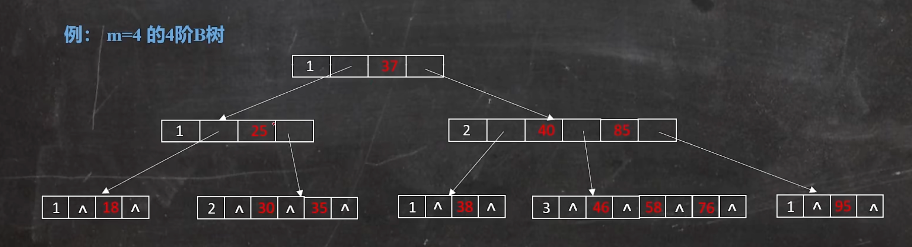

## 树

## 二叉树

## 二叉查找树 BST

## 平衡二叉树(AVL)
>解决二叉查找树在某些情况下退化成单链表的问题；规则：左子树和右子树的高度差不大于 1

有算法开销的，用插入的成本来弥补查询的效率

当插入特别少查询特别多时候，很 ok

一旦插入比查询多，avl 就很浪费时间精力

## 红黑树
>解决了二叉平衡树大量的旋转而造成的性能开销

性质：
- 根节点是黑色
- 叶节点是不存储数据的黑色空节点
- 任何相邻的两个节点不能同时为红色
- 任意节点到其可到达的叶节点间包含相同数量的黑色节点

缺点：树的深度可能会比较深，导致 IO 的次数较多，IO 次数多影响效率

## B 树
>关键字：平衡｜多路树｜中间元素向上分裂

满足下列要求的 m 叉树：
（1）树中每个结点至多有 m 个孩子结点（即至多有 m-1 个关键字）
（2）每个结点的结构为：
- 除根节点外，其他结点至少有 m/2 个孩子结点
- 若根节点不是叶子结点，则根结点至少有两个孩子结点
- 所有叶子结点都在同一层上，即 B 树是所有结点的平衡因子均等于 0 的多路查找树。

平衡因子：某结点的左子树与右子树的高度(深度)差即为该结点的平衡因子（BF,Balance Factor）。

参考视频[终于把B树搞明白了](https://www.bilibili.com/video/BV1rB4y1Q7e6/?share_source=copy_web&vd_source=5903e81d41539e9b3be309b9b3bb014f)

## B+树
>非叶子结点不存储数据，数据都放在叶子结点上

一般来说页的大小是 16k，为了不增加树的深度，所以我们得增加节点能挂的孩子数量，要想增加孩子数量就得有更多的 key，key 多了就自然有了更多分隔出来的指针域了。有了更多的指针域就可以挂更多的孩子节点了，树的宽度就扩大了。思路是这样的，所以我们干脆直接把 data 剔除，全部用来放 key，这样阶数就增大了。

阶数(order)是指一个节点最多可以有多少个孩子节点

4 阶的，最多有四个孩子节点，也就是最多有 4 个指向孩子的指针。有四个指针域时有 3 个 key。

解决了 B 树在大数据量下层级过深的情况。

参考视频:[终于把 B 树搞明白了(三)_B 树的查找，B+树的引入]( https://www.bilibili.com/video/BV1yB4y1v7Jy/?share_source=copy_web&vd_source=be43317d56c1e709887070d1c811fb5b )

## hash 索引
>哈希索引就是采用一定的 hash 算法，将键值换算成新的 hash 值，映射到对应的槽位上，然后存储在hash 表中。

查看慢日志是否开启：
SHOW GLOBAL STATUS like 'Com_______';

