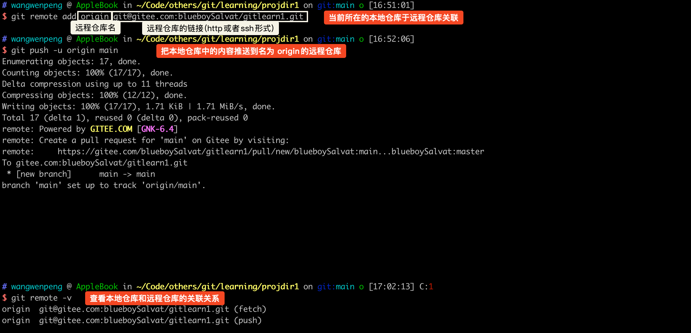

`# 简介


## 本地仓库
### 初始化本地仓库


### 提交到本地仓库并且查看日志信息

格式：`git log [选项]`

选项：
- --all 显示所有分支
- --pretty=oneline 将提交信息显示为一行
- --abbrev-commit 使得输出的commitId更简短
- --graph 以图的形式显示


### 版本回退


### 本地分支
命令： `git branch`
仓库中默认只有 main 分支


执行 `git commit` 时，默认是在 main 分支上保存版本。

命令：`git branch 分支名`

在商业项目开发过程中，我们不会轻易的在`main`分支上做操作。

我们会新建一个**开发用的分支**，在此分支上做版本的记录。

当代码确实没有问题时，才会将开发分支上成熟的代码版本添加到`main`分支上。

保证开发过程中，可以及时记录版本，又保证 `main` 分支上每个提交点都是稳健版本。


### 合并分支


### 查看分支关系
>git branch -vv

### 删除分支
命令:

git branch -d 分支名删除分支时，需要做各种检查
git branch -D 分支名不做任何检查，强制删除
不能删除当前所在分支，只能删除其他分支


### 合并冲突
>多个分支对同一个文件进行修改，最终合并时会出现冲突；git 不知道如何处理这两个文件。


简单说一下如何是出现冲突，我对此的理解是，当 dev 分支在修改时，所基于的主分支文件的版本并不是最新的时候会出现合并冲突。

举一个理解的例子：
假设现在主分支中的 flag.txt版本是 1.0
- 创建 dev 分支，基于 main 分支版本复制创建，所以现在 dev 分支中也有一份 flag.txt，版本为 1.0
	- 修改 flag.txt
	- 提交到本地仓库，flag.txt版本升级为 1.1
- main 分支修改 flag.txt，提交到本地仓库，此时 main 分支中的 flag.txt 的版本为 1.1
- main 分支想合并 dev 分支，但是一看 dev 分支中的 flag.txt 是 1.1 版本和我现在有的 flag.txt 版本一样，于是出现了冲突。系统不知道用哪个 1.1 版本。要是用 dev 的 flag.txt，可能 main 的 flat.xt 1.1 的内容都没了，要是用 main flag.txt 1.1 的内容，那 dev 的可能就没了，那就自己进行手动选择吧。


### 添加文件到忽略列表
一般我们总会有些文件无需纳入Git的管理，也不希望它们总出现在未跟踪文件列表。 通常都是些自动生成的文件，比如日志文件，或者编译过程中创建的临时文件等。 在这种情况下，我们可以在工作目录中创建一个名为 .gitignore的文件（文件名称固定），列出要忽略的文件模式。

通常开发工具会帮我们生成。


## 远程仓库

### 注册 gitee/github
### 配置 SSH
#### 在本地生成密钥
```shell
ssh-keygen -t rsa -C "your email@example.com" 
//引号里面填写你的邮箱地址，比如我的是 ssh-keygen -t rsa -C "blueboysalvat@163.com" 
```
```shell
## wangwenpeng @ AppleBook in ~/.ssh [16:46:18]
$ cd ~/.ssh

## wangwenpeng @ AppleBook in ~/.ssh [16:47:54]
$ pwd
/Users/wangwenpeng/.ssh

## wangwenpeng @ AppleBook in ~/.ssh [16:47:55]
$ ls
id_rsa          id_rsa.pub
```

#### 在 gitee/github 上填入密钥
把 id_rsa.pub 中的内容填入

### 操作远程仓库
#### 上传操作
##### 在 gitee/github 创建远程仓库
##### 将本地仓库关联到远程仓库并且推送

本地仓库关联远程仓库，以及推送：

在 gitee 上查看：


命令：git push [-f] [--set-upstream] [远端名称 [本地分支名][:远端分支名] ]

如果远程分支名和本地分支名称相同，则可以只写本地分支

例如： `git push origin main`，向名为 origin 的远程仓库，推送本地 main 分支到 origin 远程仓库的 main 分支。

如果远程分支名和本地分支名称不同，则需要特别指定

例如： `git push origin main:master`，向名为 origin 的远程仓库，推送本地 main 分支到 origin 远程仓库的 master 分支。

- -f 表示强制覆盖(谨慎使用，可能出现数据覆盖，致使原来数据找不回来的情况)
- --set-upstream 推送到远端的同时并且建立起和远端分支的关联关系
- git push --set-upstream origin main(推送时同时把本地 main 分支和远程 main 分支建立关联关系)
	- 如果当前分支已经和远端分支关联，则可以省略分支名和远端名
	- 下次直接使用 `git push` 。当你运行 `git push` 命令时，如果当前分支已经与远程分支建立了关联关系（使用 `--set-upstream` 或 `-u` 选项），Git 将会根据当前分支的上游分支来决定推送到哪个远程分支。

#### 下载操作
##### 从远程仓库克隆
如果已经有一个远端仓库，我们可以直接clone到本地。

命令： `git clone <仓库路径> [本地目录]`

- 本地目录可以省略，会自动生成一个目录

##### 从远程仓库抓取和拉取
远程分支和本地的分支一样，我们可以进行merge操作，只是需要先把远端仓库里的更新都下载到本地，再进行操作。

- 抓取命令：git fetch \[remote name\] \[branch name\]

抓取指令就是将仓库里的更新都抓取到本地，不会进行合并

如果不指定远端名称和分支名，则抓取所有分支。

- 拉取命令：git pull \[remote name\] \[branch name\]

拉取指令就是将远端仓库的修改拉到本地并自动进行合并，等同于fetch+merge
如果不指定远端名称和分支名，则抓取所有并更新当前分支


### 解决合并冲突
A、B用户修改了同一个文件，且修改了同一行位置的代码，此时会发生合并冲突。

A用户在本地修改代码后优先推送到远程仓库，此时B用户在本地修订代码，提交到本地仓库后，也需要推送到远程仓库，此时B用户晚于A用户，故需要先拉取远程仓库的提交，经过合并后才能推送到远端分支。

在B用户拉取代码时，因为A、B用户同一段时间修改了同一个文件的相同位置代码，故会发生合并冲突。

远程分支也是分支，所以合并时冲突的解决方式也和解决本地分支冲突相同相同。


## 开发中分支使用原则与流程
几乎所有的版本控制系统都以某种形式支持分支。使用分支意味着你可以把你的工作从开发主线上分离开来进行重大的 Bug 修改、开发新的功能，以免影响开发主线。在开发中，一般有如下分支使用原则与流程：

master （生产） 分支
线上分支，主分支，中小规模项目作为线上运行的应用对应的分支。

develop（开发）分支
是从 master 创建的分支，一般作为开发部门的主要开发分支，如果没有其他并行开发不同期上线要求，都可以在此版本进行开发，阶段开发完成后，需要是合并到 master 分支，准备上线。

feature/xxxx 分支
从 develop 创建的分支，一般是同期并行开发，但不同期上线时创建的分支，分支上的研发任务完成后合并到 develop 分支。

hotfix/xxxx 分支
从 master 派生的分支，一般作为线上 bug 修复使用，修复完成后需要合并到 master、test、 develop 分支。

还有一些其他分支，在此不再详述，例如 test 分支（用于代码测试）、pre 分支（预上线分支）等等。


